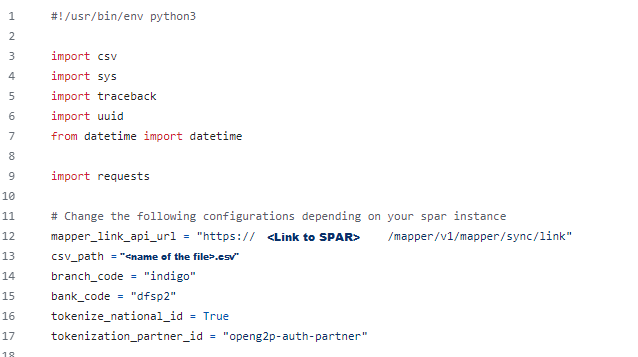

# Admin Guide to Link ID with Financial Address information

## Introduction

This document contains step-by-step instructions for the administrator to link IDs with Financial Address (FA) information. The administrator has to run the script to map the National IDs with the bulk FA of the beneficiaries.&#x20;

## Prerequisite

* Administrator must have a .csv file which contains the bulk FA data of the beneficiaries in the required format. To know the format of the .csv file, refer the [sample\_data.csv](https://github.com/OpenG2P/social-payments-account-registry/tree/develop/scripts) file available in the cloned repository. In .csv file, the mandatory columns are National ID and Account number. The optional columns are Name and Phone.&#x20;

<figure><figcaption>
sample_data.csv
</figcaption></figure>

* The administrator system must have python and its modules cryptography, requests installed

## Procedure

The administrator must follow the following sequence process:

1. The administrator must clone the repository [https://github.com/OpenG2P/social-payments-account-registry/tree/develop/scripts](https://github.com/OpenG2P/social-payments-account-registry/tree/develop/scripts)
2. Download the script.
3. Click the python script file _**link\_mapper.py**_. The script is displayed.

<figure><figcaption>
Python script
</figcaption></figure>

In the script, the _**mapper\_link\_api\_url**_  and the _**csv\_path**_ must be verified and updated.

4. Double the script _**mapper\_link\_api**_ to run the script.
5. After the administrator runs the script, the response is triggered in a cmd prompt which shows that the National IDs are linked to the FA of the beneficiaries.

<figure><figcaption>
Sample response message.
</figcaption></figure>

6. &#x20;Press Enter to exit from the cmd prompt.&#x20;

_**Note:**_

Administrator can use a JASON formatter to format the response triggered in cmd format and infer the response.
