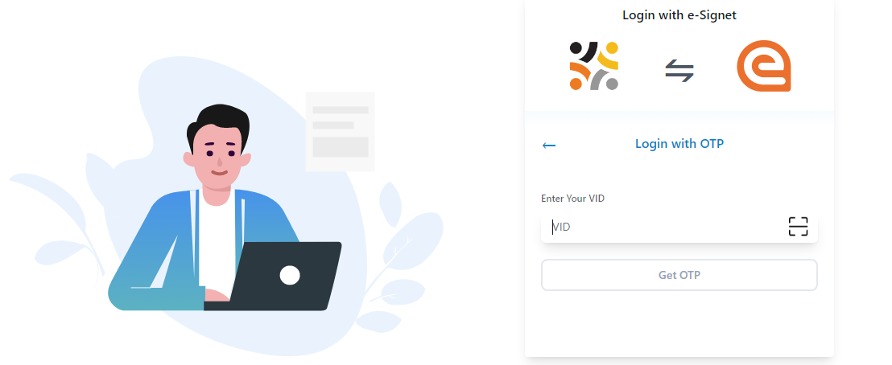
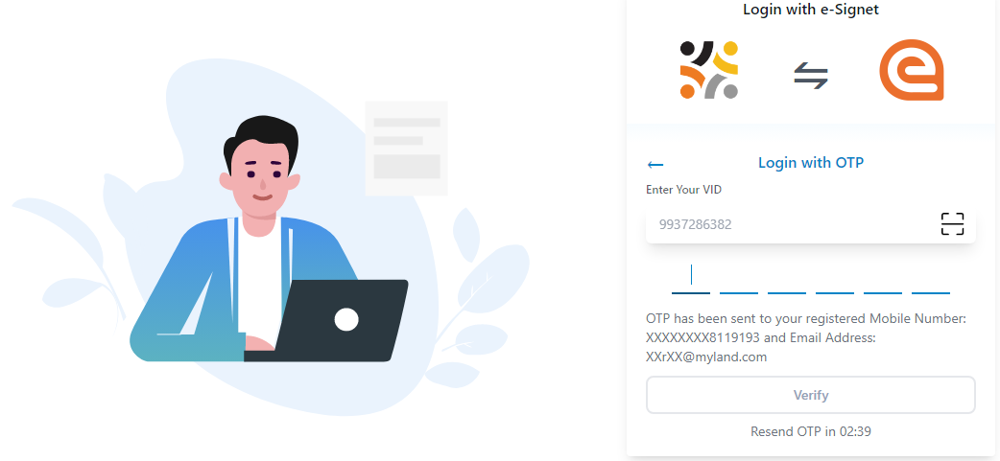
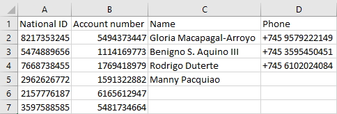

# Admin Guide to Update ID with Financial Address information

## Introduction

This document contains step-by-step instructions for administrator to login self-service portal offered by SPAR and update the .csv file to map the national ID with the respective bank account/mpesa account which are listed in the .csv file by Administrator.

## Prerequisite

* The user must have knowledge to access [SPAR](../../../deployment/openg2p-modules-deployment/spar-deployment/) via internet which is available in public portal
* The user must have administrator role
* A sample .csv file
* A script to map the national ID with the respective bank account/mpesa account which are listed in the .csv file by Administrator
* The administrator system must have python and its modules cryptography, requests installed

## Procedure

1. Open the SPAR URL on your browser,  for example, https://spar.openg2p.sandbox.net
2. \<Geo-specific portal> page is displayed.

<figure><figcaption>
Name of the portal.
</figcaption></figure>

There are two options available to login self-service portal.

* Login with your email or phone number&#x20;
* [Login with your National ID](admin-guide-to-update-id-with-financial-address-information.md#login-with-national-id)

### Login with National ID

3. Click the _**SIGNIN WITH NATIONAL ID**_ button.
4. Login with eSignet page is displayed.

<figure><figcaption>
eSignet login page.
</figcaption></figure>

You can select your preferred mode of login.

* [Login with OTP](admin-guide-to-update-id-with-financial-address-information.md#login-with-otp)
* Login with Biometrics
* Login with Inji Mobile App
* Login with Inji Mobile App1

#### Login with OTP

5. Click the _**Login with OTP**_ button.
6. _**Login with OTP**_ page pops up.

<figure><figcaption>
Login with OTP.
</figcaption></figure>

7. Enter the _**VID**_ number and click the _**Get OTP**_ button.

You receive the OTP number in your registered phone number.

8. Enter the OTP number and click the _**Verify**_ button.

<figure><figcaption>
OTP verification.
</figcaption></figure>

It redirects to the \<Geo-specific portal> Home page_**.**_

<figure><figcaption>
Home page.
</figcaption></figure>

In _**Home**_ page, the features and their descriptions are:

| Feature                                                                         | Description                                                                                                             |
| ------------------------------------------------------------------------------- | ----------------------------------------------------------------------------------------------------------------------- |
|  | It displays your name.                                                                                                  |
| Update your Linked Financial Address                                            | This tab is used to update the bank details/wallet/mpesa and map your national ID with your bank/wallet/mpesa account.  |
| Currently Linked Financial Address                                              | This tab populates the current list of linked financial address.                                                        |

### Run the script

The administrator must follow the below steps to run the script.

1. The administrator must clone the repository [https://github.com/OpenG2P/social-payments-account-registry/tree/develop/scripts](https://github.com/OpenG2P/social-payments-account-registry/tree/develop/scripts)
2. Download the _**sample\_data.csv**_ file and update the data of the beneficiaries in the respective columns

Note:

The administrator must update the columns _**National ID**_ and _**Account number**_, while columns _**Name**_ and _**phone**_ are optional.

<figure><figcaption>
sample-csv-file.
</figcaption></figure>

3. Click the python script file _**link\_mapper.py**_. The script is displayed.

<figure><figcaption>
Python script.
</figcaption></figure>

3. The mapper\_link\_api\_url  and the csv\_path must be verified and updated.&#x20;
4. Save and download the script file _**link\_mapper.py**_.
5. Double click the script link\_mapper.py from the downloaded path.

<figure><figcaption>
Python script file.
</figcaption></figure>

6. After the administrator runs the script, the response is triggered in a cmd file which shows that the National ID is linked to the FA of the beneficiaries.

<figure><figcaption>
Sample response message.
</figcaption></figure>

6. &#x20;Press Enter to exist from the cmd prmpt.&#x20;
7. Click the _**GET CURRENT FINANCIAL ADDRESS**_ button in the _**Currently Linked Finanacial Address**_ tab.

The currently linked _**FA**_ (Financial Address) is displayed.

<figure><figcaption>
Display financial address - MPesa.
</figcaption></figure>

