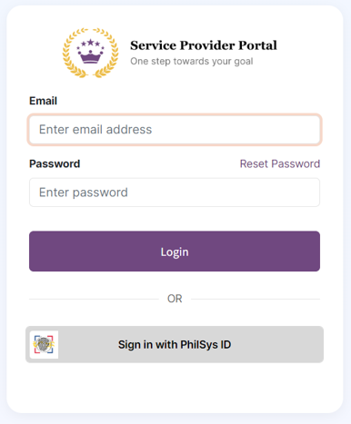
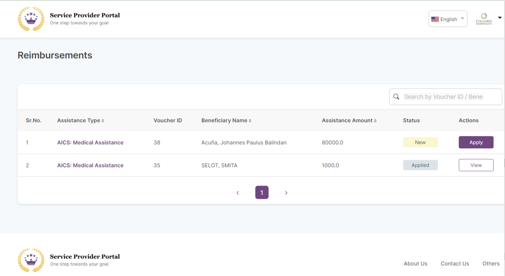
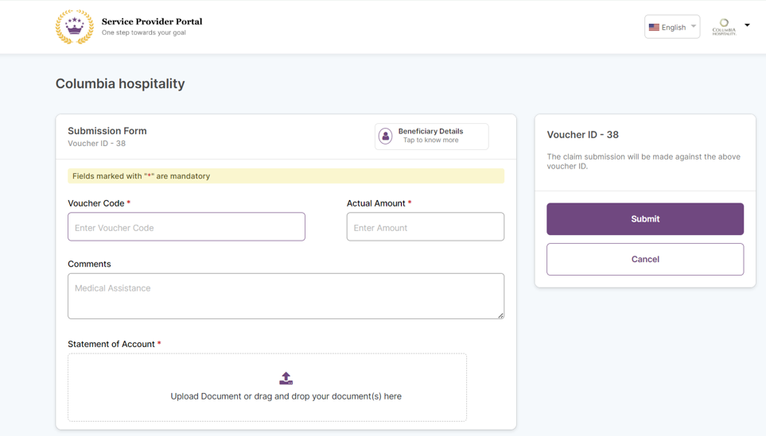
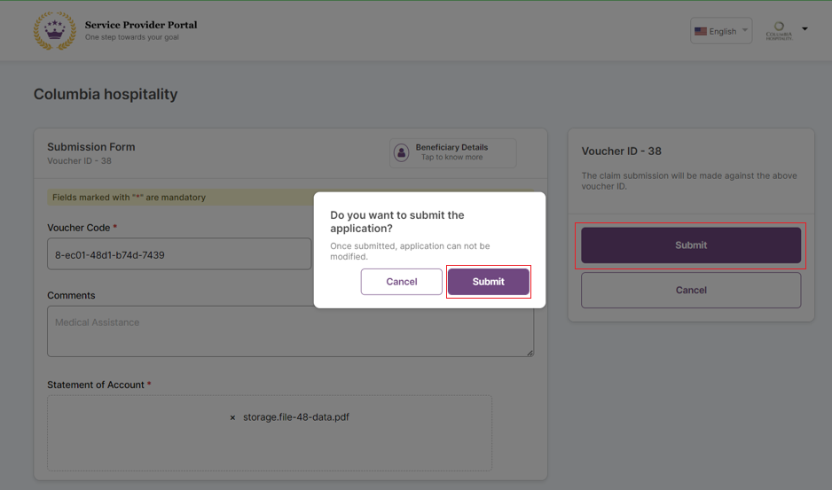
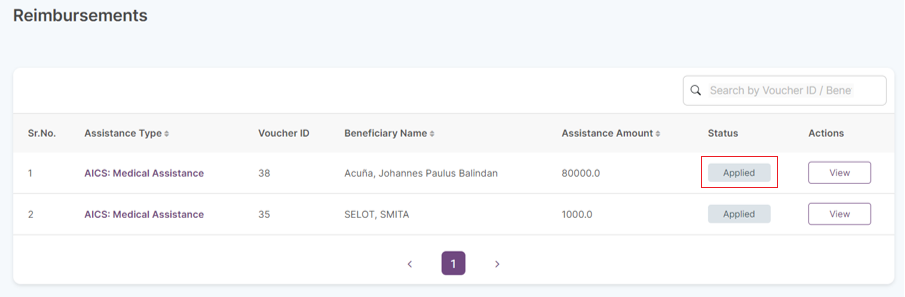

# Submit Reimbursement Using the Service Provider Portal

## Description

The guide here provides steps to submit reimbursement using Service Provider Portal.

## Pre-requisites

The Service Provider Portal user has login access to the portal using MOSIP ID/National ID. The user should be able to scan the QR code from the entitlement voucher using [SmartScanner App](install-smartscanner-app.md).

## Steps

1. Login into the Service Provider Portal using MOSIP ID/National ID. In the example below, the National ID of the Philippines (PhilSys ID) is shown.

<figure><figcaption></figcaption></figure>

2. Upon successful login, you will see the _Reimbursements_ dashboard.

<figure><figcaption></figcaption></figure>

3. Select the desired beneficiary and click on _Apply_.&#x20;
4. Applying for the reimbursement takes you to the _Submission Form_ page.

<figure><figcaption></figcaption></figure>

5. The beneficiary details are available by scanning the QR code on the entitlement voucher (also called Guarantee Letter) using the [SmartScanner app](install-smartscanner-app.md). The scan should show details similar to the format in the image below.

<figure><figcaption></figcaption></figure>

6. Enter the details from the scan into the _Submission Form and_ click _Submit_. This will show a user prompt to confirm the details. Click _Submit_.

<figure><figcaption></figcaption></figure>

7. Successful submission will show a confirmation page with details such as the application Id and submission date.

<figure><figcaption></figcaption></figure>

8. You can optionally click _Go to Home_ to view the submitted reimbursements. You should see that the status of reimbursement has changed to _Applied_.

<figure><figcaption></figcaption></figure>
