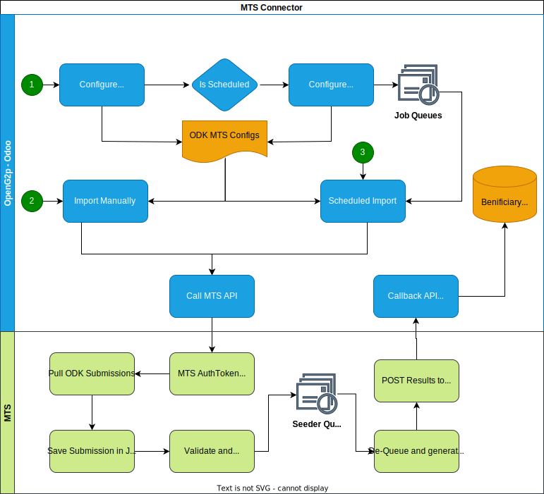

# ODK MTS Connector

## Overview 

ODK MTS Connector is an OpenG2P Odoo addon that fetches tokenised data from the ODK Central by calling the [MOSIP Token Seeder](http://localhost:5000/s/4EyCrLbFom7vj7UcMIUZ/integrations/mosip-token-seeder) (MTS) and stores it in the registry.

## Features 

* Uses callback delivery type of MTS
* Completely asynchronous execution
* OpenG2P can schedule a daily job to fetch the delta for the day
* Manual import feature (TBD)

<figure><figcaption></figcaption></figure>

## Configuration 

<table><thead><tr><th>Property</th><th width="498">Description</th></tr></thead><tbody><tr><td><code>Name</code></td><td>A string to identify the connector</td></tr><tr><td><code>URL to reach MTS</code></td><td>URL for MTS API</td></tr><tr><td><code>MTS Input type</code></td><td>MTS-C connects over "<em>ODK</em>" which is the first option in this selection. OMC option could be proceeded by selecting <em>OpenG2P Registry</em>.</td></tr><tr><td><code>Mapping</code></td><td>MTS Field mapping as required by the API. Refer to <a href="https://docs.mosip.io/1.2.0/integrations/mosip-token-seeder">MTS Documentation</a>. The format of Mapping would be JSON.</td></tr><tr><td><code>Output Type</code></td><td>MTS-C only supports JSON output type of MTS.</td></tr><tr><td><code>Output Format</code></td><td>Output format is a <a href="https://stedolan.github.io/jq/">JQ</a>string which will be used by MTS to format its output to suite the caller's requirement.</td></tr><tr><td><code>Delivery Type</code></td><td>Currently supporting only "Callback". Callback feature can be used to make MTS do a submission of results onto an API within Odoo. The output formatting will help in making the desired input for the API.</td></tr><tr><td><code>Job Type</code></td><td>MTS-C provides both recurring and one time execution. Recurring can be configured to do continuous pull from the ODK over MTS.</td></tr><tr><td><code>Interval in minutes</code></td><td>Interval at which the MTS-C job runs.</td></tr><tr><td><code>MOSIP Language</code></td><td>MOSIP language setup. The default is "<em>eng</em>".</td></tr><tr><td><code>ODK Base URL</code></td><td>Base URL or the complete domain address for the ODK central installation</td></tr><tr><td><code>ODK Odata URL</code></td><td>OData service (.svc) URL for the ODK form to fetch the submissions.</td></tr><tr><td><code>ODK User email</code></td><td>Email Id to authenticate MTS for accessing Odata URL</td></tr><tr><td><code>ODK User password</code></td><td>Password used to authenticate Odata URL</td></tr><tr><td><code>Callback URL</code></td><td>A URL endpoint which would be called upon successful processing at MTS</td></tr><tr><td><code>Callback HTTP Method</code></td><td>HTTP Method (POST/PUT/GET/PATCH) used while MTS makes the callback</td></tr><tr><td><code>Callback Timeout</code></td><td>Timeout awaited by the callback until acknowledged with a response.</td></tr><tr><td><code>Callback Auth Type</code></td><td>Type of authentication expected by callback URL. MTS-C currently support Odoo type which uses the session-based authentication implemented by Odoo.</td></tr><tr><td><code>Callback Auth Database</code></td><td>DB instance used by Odoo.</td></tr><tr><td><code>Callback auth username</code></td><td>Username to access callback API</td></tr></tbody></table>
