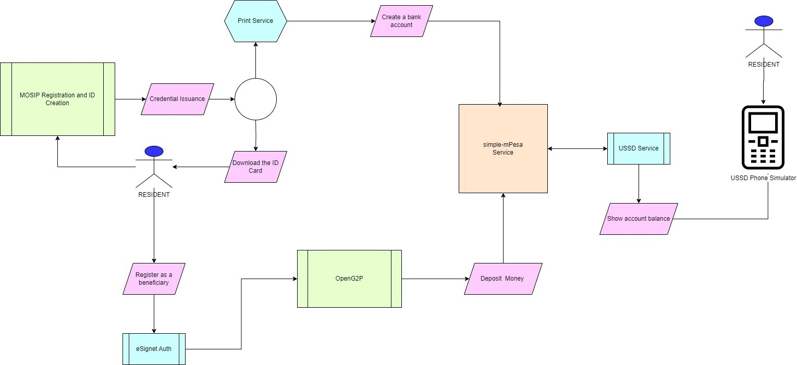

# M-PESA Integration

## Introduction

M-Pesa is a virtual banking service that allows users to participate in financial transactions using their SIM cards. Once a SIM card is entered into a mobile phone, SMS messages are used to send and receive money.

M-Pesa was first introduced in Kenya as an alternative to the traditional brick-and-mortar set up. Being a digital tool, it is widely popular in over seven African nations as it speaks to financial inclusivity for marginalized and far-flung groups.

OpenG2P, in it's interoperable and modular approach, is able to easily integrate with M-Pesa to demonstrate the ease of access for its benefit delivery mechanism. The integration is done using an _M-Pesa simulator_. Here is the link to the simulator [https://africastalking.com/](https://africastalking.com/)

More information on M-Pesa can be found here [https://www.investopedia.com/terms/m/mpesa.asp](https://www.investopedia.com/terms/m/mpesa.asp)

## Integration

An M-Pesa simulator is used for demonstration. It is a direct integration that doesn't involve a payment switch like Mojaloop.

How does the integration work? The M-Pesa account is mapped to the person's phone number. When payment is initiated from the OpenG2P system, the individual dials the USSD code from their phone, enters the mobile number to which their M-Pesa account is linked, and then checks their balance to see if they have received any money or pays their dues to a vendor who may also have an M-Pesa account.

This diagram here encapsulates the flow and components for an M-Pesa integration. It is assumed that MOSIP is the ID issuer here, and that the M-Pesa account is created at the time of issuance of ID, and is mapped to the person's phone number instantly.

<figure><figcaption>
Flow to demonstrate M-Pesa integration with OpenG2P where it begins with MOSIP ID issuance
</figcaption></figure>

## Deployment&#x20;

* How to recreated/install this setup in our environments. TBD
* Any configurations on OpenG2P and M-PESA side. TBD

## Demonstration

Here is a [link to the slides](https://docs.google.com/presentation/d/1CCk1JkUqnTcEbJeHk5au28ZLHd0SjAGYIHROuvSDkGU/edit?usp=sharing) which demonstrates payments to the M-Pesa simulator.

## Source code

* Point to all repositories, code, and utilities involved in this integration. TBD.

