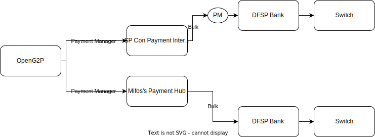

# Mojaloop Integration

## Introduction 

This page describes integration of OpenG2P with the [Mojaloop](https://mojaloop.io/) switch enabling cash transfer from one bank (treasury bank, for instance) to an individual's bank account. The connection to Mojaloop is achieved via an intermediate interoperability layer like the [Payment Hub](https://payments.mifos.org/) of Mifos.&#x20;

## Architecture

Below is the reference architecture of how the disbursements could be triggered from OpenG2P.

<figure><figcaption></figcaption></figure>

## Interoperability layer 

The payment architecture may vary from country to country. An interoperability layer like Payment Hub shields the downstream variations by offering a uniform payments API interface such that systems like OpenG2P do not have to modify the payments code, thus enabling interoperability with any payment system. Of course, customisation needs to be done on the Payment Hub, where a specific Payment Connector needs to be created specifically for the payment systems interface.&#x20;

<figure><figcaption></figcaption></figure>

Payment Hub connects to Mojaloop via the Mothe jaloop Connector.&#x20;


As part of the roadmap, OpenG2P is working towards supporting payments interfaces being defined as part of the [G2P Connect](https://g2pconnect.global/) initiative.&#x20;


## Payments demo 



For the purposes of PoC Demonstration, we have chosen [SP Convergence Payment Interoperability Layer](https://sp-convergence.github.io/payments-interoperability-layer/documentation/pocs/G2P.html), as payment manager from OpenG2P.

* OpenG2P uses the configured Payment Manager and triggers payments in the way the payment manager understands.
* In the following implementation OpenG2P sends the list of Payments to be triggered to the [SP Convergence Payment Interoperability Layer](https://sp-convergence.github.io/payments-interoperability-layer/documentation/pocs/G2P.html), which in turn calls the pre-configured DFSP with relevant Payer and Payee details. (Payer being the Government/Department/Treasury)
* The following simulators and services (from the diagram) are used in place of real systems.

<figure><figcaption></figcaption></figure>

### Usage - payment cycle guide 

(TODO: Elaborate)

#### **Prerequisites**

* The relevant registrant are registered into OpenG2P.
* The relevant Program is to be configured with the details of entitlement, eligibility etc.

#### **Procedure**

* Configure a new Payment manager on the Program, with all the required details.
* Enrol eligible registrants into the program.
* Create a new "Cycle" on the program.
* Create Entitlements.
* Approve Entitlements.
* Approve Cycle.
* Prepare Payments. Payment Batches are created based on the configurations.
* Send Payments. Payment Batches will be disbursed based on the configurations.
