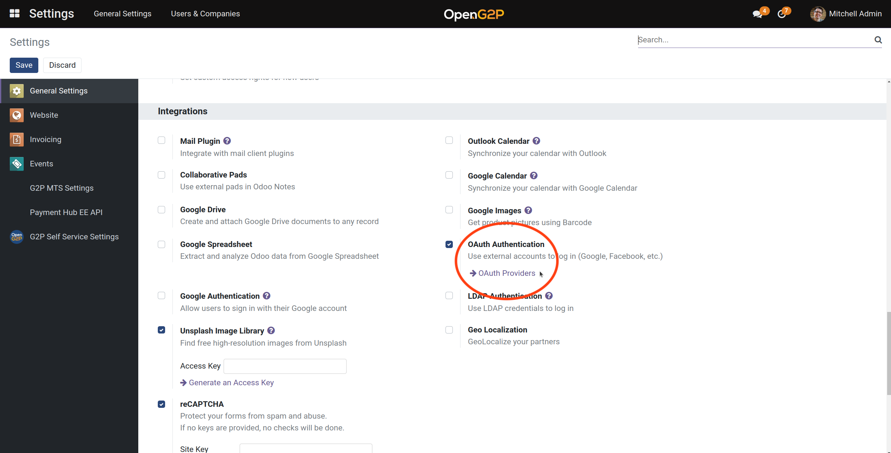

# 📔 Integrate with MOSIP e-Signet

## Description

This guide provides steps to integrate [OpenG2P with e-Signet with MOSIP](https://github.com/OpenG2P/openg2p-documentation/blob/1.2.1/integrations/integration-with-mosip/integration-with-e-signet.md) as the authentication provider.

## Prerequisites

1. MOSIP IDA is installed
2. The e-Signet server is installed and configured to connect to MOSIP IDA
3. MOSIP IDA APIs are accessible from the machine running the e-Signet server
4. Both Yes/No and KYC APIs are enabled on MOSIP IDA
5. e-Signet APIs are accessible from machines running OpenG2P
6. Biometric auth devices (already onboarded on MOSIP) are available for authentication
7. Email and SMS are enabled on MOSIP IDA for OTP authentication
8. MOSIP Partner Management Services (PMS) Portal or APIs must be accessible to both MOSIP Partner Admin and OpenG2P Admin
9. MOSIP Partner Specific User Token (PSUT) ID type is configured. See [Configure ID Types](../../pbms/functionality/beneficiary-management/beneficiary-registry-configurations/user-guides/configure-id-types.md).

## Steps

### Configure OpenG2P as a partner on MOSIP

1. Create an **Auth Partner** for OpenG2P on MOSIP.
   * [Guide](https://docs.mosip.io/1.2.0/modules/partner-management-services/auth-credential-partner) for MOSIP 1.2.0
   * Guide for MOSIP 1.1.5 (TBD)
2. Create a **MISP Partner** for OpenG2P on MOSIP.
3. Note down the following from the above steps:
   1. Auth Partner ID
   2. Auth Policy ID
   3. Auth API Key
   4. MISP License Key
   5. Auth partner signed certificate
   6. IDA Partner certificate (App id: IDA, Ref Id: PARTNER)

### Configure OpenG2P as relying party on e-Signet

#### Using PMS API

This method is applicable if MOSIP Partner Management APIs are available. These steps are executed by MOSIP Partner Admin

1. Create an e-Signet OIDC client using PMS OIDC API:


[pms-api-docs.json](../../.gitbook/assets/pms-api-docs.json)


* `authParnterId:` Partner ID in [this](integrate-mosip-e-signet.md#configure-openg2p-as-a-partner-on-mosip) step.
* `policyId` : Policy ID in [this](integrate-mosip-e-signet.md#configure-openg2p-as-a-partner-on-mosip) step.
* `publicKey:` Generate [JWK](https://openid.net/specs/draft-jones-json-web-key-03.html).
* `logoUri`: URL of your logo accessible publicly.
* `grantTypes` = `["authorization_code"]`
* `clientAuthMethods`= `["private_key_jwt"]`
* `redirectUris`: URLs of the form `https://<your web portal>/auth_oauth/signin`

Note down the Client ID as an output of the above step.

#### Using e-Signet API

This method is applicable if MOSIP Partner Management APIs are **not** available.

1. Create an e-Signet OIDC client using the following API:


[esignet-api-docs.json](../../.gitbook/assets/esignet-api-docs.json)


* `clientId:` Arbitrary string.
* `clientName:` Arbitrary string.
* `relyingParnterId:` Partner ID in [this](integrate-mosip-e-signet.md#configure-openg2p-as-a-partner-on-mosip) step.
* `publicKey:` Generated [JWK](https://openid.net/specs/draft-jones-json-web-key-03.html).
*   `authContextRefs`:

    ```
    ["mosip:idp:acr:biometrics","mosip:idp:acr:generated-code"]
    ```
*   `userClaims`:

    ```
    ["birthdate","address","gender","name","phone_number","email","picture"]
    ```
* `logoUri`: URL of your logo accessible publicly.
* `grantTypes` = `["authorization_code"]`
* `clientAuthMethods`= `["private_key_jwt"]`
* `redirectUris`: URLs of the form `https://<your web portal>/auth_oauth/signin`

### Enable e-Signet on OpenG2P

These steps are executed by OpenG2P Admin on the OpenG2P Admin interface.

1. Go to _Settings -> General Settings (Menu) -> General Settings (Panel) -> Integrations (Section) -> Oauth Providers_

<figure><figcaption></figcaption></figure>

<figure><figcaption></figcaption></figure>

2. Create a new OIDC Provider with the following details:

| Parameter                                | Value                                                                                                                                    |                                                                                                                                               |
| ---------------------------------------- | ---------------------------------------------------------------------------------------------------------------------------------------- | --------------------------------------------------------------------------------------------------------------------------------------------- |
| Client ID                                | The output of the [previous section](integrate-mosip-e-signet.md#configure-openg2p-as-relying-party-on-e-signet).                        |                                                                                                                                               |
| Auth Flow                                | `OpenID Connect (authorization code flow)`                                                                                               |                                                                                                                                               |
| Token map                                | `sub:user_id`                                                                                                                            |                                                                                                                                               |
| Client Authentication Method             | `Private Key JWT`                                                                                                                        |                                                                                                                                               |
| Private Key Method                       | Private key used for JWK creation in the [previous section](integrate-mosip-e-signet.md#configure-openg2p-as-relying-party-on-e-signet). |                                                                                                                                               |
| Assertion Type                           | `JWT Bearer`                                                                                                                             |                                                                                                                                               |
| Authorization URL                        | e-Signet's authorize endpoint.                                                                                                           | Example: [https://esignet.mec.mosip.net/authorize](https://esignet.mec.mosip.net/authorize)                                                   |
| Userinfo URL                             | e-Signet's userinfo API                                                                                                                  | Example: [https://api.mec.mosip.net/v1/esignet/oidc/userinfo](https://api.mec.mosip.net/v1/esignet/oidc/userinfo)                             |
| Token URL                                | e-Signet's token API                                                                                                                     | Example: [https://api.mec.mosip.net/v1/esignet/oauth/token](https://api.mec.mosip.net/v1/esignet/oauth/token)                                 |
| JWKS URL                                 | e-Signet's JWKS API                                                                                                                      | Example: [https://api.mec.mosip.net/v1/esignet/oauth/.well-known/jwks.json](https://api.mec.mosip.net/v1/esignet/oauth/.well-known/jwks.json) |
| Use G2P Reg ID                           | `True`                                                                                                                                   |                                                                                                                                               |
| G2P Registrant ID Type                   | MOSIP PSUT ID Type                                                                                                                       | As configured in step 9 of [Prerequisites](integrate-mosip-e-signet.md#prerequisites).                                                        |
| Partner Creation Call Validate URL       | `True`                                                                                                                                   | Specifies whether to call the MOSIP e-KYC API to fetch data into OpenG2P                                                                      |
| Partner Creation Validate Response       | `name:name email:email phone:phone_number birthdate:birthdate gender:gender address:address`                                             |                                                                                                                                               |
| Default Group User Creation              | `User types / Portal`                                                                                                                    | Specifies all users signing up through this OIDC Provider (e-Signet) are only going to be portal users                                        |
| Login Attribute Mapping On User Creation | `email`                                                                                                                                  | To allow users to sign in with their email and password after initial signup with e-Signet.                                                   |
