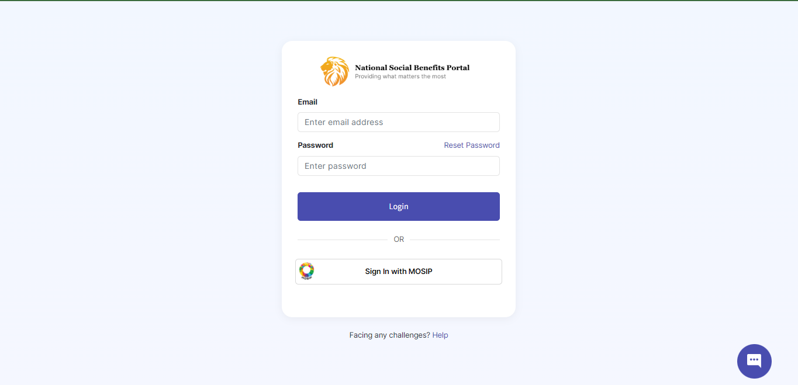

# Self Service Portal

## Introduction

Self Service Portal is a resident facing portal that lets a person log in to the portal using a national ID or other IDs, and perform the following functions:

* View enrolled programs
* View all the demographic information submitted across programs
* Update demographic information
* Apply for a new program
* View a list of all programs offered by the government/ministry/department.

## OpenID Connect integration

Users can log in via any OpenID Connect (OIDC) Auth provider. Any ID system that implements ODIC specification can be integrated with Self Service Portal for user login.&#x20;

### Login using MOSIP ID

The Self Service Portal integrates with [e-Signet](https://docs.esignet.io/) to provide user login via MOSIP ID.&#x20;

<figure><figcaption></figcaption></figure>

## Detailed features&#x20;


