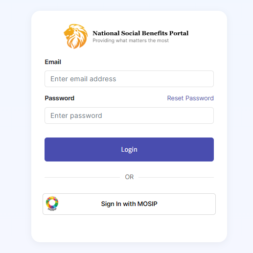

# Self Service Portal

## Introduction

OpenG2P offers a _reference implementation_ of a person facing Self Service Portal that lets a person log in to the portal using a national ID or other IDs, and perform the following functions:

* View enrolled programs
* View all the demographic information submitted across programs
* Update demographic information
* Apply for a new program
* View a list of all programs offered by the government/ministry/department.

OpenG2P offers a reference implementation of such a self service portal.

## OpenID Connect integration

Users can log in via any OpenID Connect (OIDC) Auth provider. Any ID system that implements ODIC specification can be integrated with Self Service Portal for user login.

### Login using MOSIP ID

The Self Service Portal integrates with [e-Signet](https://docs.esignet.io/) to provide user login via MOSIP ID.

<figure><figcaption></figcaption></figure>

## Program application form

## Registration demo


