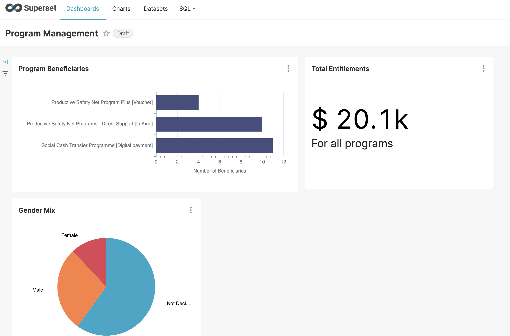

# Apache Superset

Apache Superset offers SQL query based datasets and charts for visualisation of data. OpenG2P offers pre-configured dashboards for visualisation.&#x20;

<figure><figcaption></figcaption></figure>

## Installation

Refer to the [deployment guide](../deployment/common-components/apache-superset.md).

## Add a new country map&#x20;

For geo spatial visualisation add a new GeoJSON file into Apache Superset as per the procedure given here:


