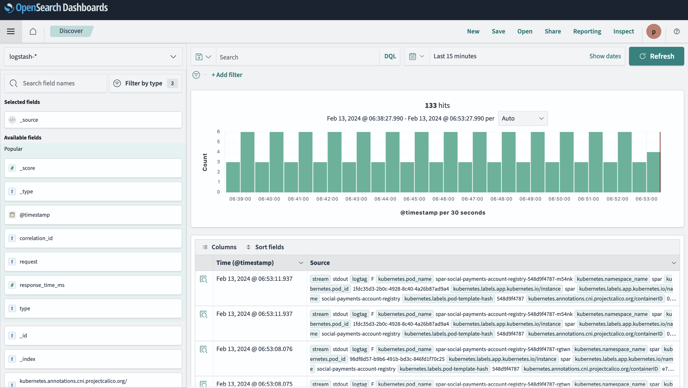

---
layout:
  title:
    visible: true
  description:
    visible: false
  tableOfContents:
    visible: true
  outline:
    visible: true
  pagination:
    visible: true
---

# Logging

**System logs** generated across all components can be monitored via the logging pipeline shown below. The logs can be searched, sliced and diced for analytics.  **Fluentd** and **OpenSearch** are used to collect, parse, display and search logs.

## Logging pipeline


Logging Pipeline


## Dashboards

Several dashboards can be created using OpenSearch Dashboards. Some default dashboards are provided OpenG2P that may be customized

<figure><figcaption></figcaption></figure>

## Installation

Refer to [Common Components Deployment](../deployment/common-components/) for installing Fluentd and OpenSearch.
