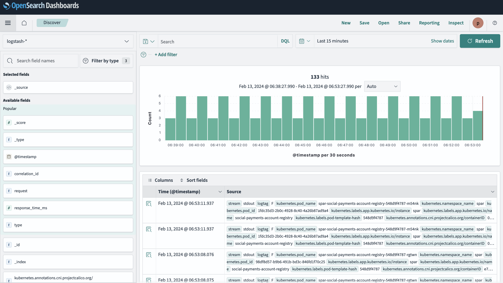

# System Logging

**System logs** generated across all components can be monitored via the logging pipeline shown below. The logs can be searched, sliced and diced for analytics.  **Fluentd** and **OpenSearch** are used to collect, parse, display and search logs.

## Logging pipeline



## Log files

This is a simple method where the Python logging module is used to write system event logs in JSON or other format in log files directly. These log files are shunted to OpenSearch for indexing, searching and querying.&#x20;

## Dashboards

Several dashboards can be created using [OpenSearch Dashboards](https://opensearch.org/docs/latest/dashboards/). Some default dashboards are provided by OpenG2P and may be customised.

<figure><figcaption></figcaption></figure>

## Installation

Refer to [Deployment->Fluentd & Opensearch](../deployment/scaling/base-infrastructure/openg2p-cluster/fluentd-and-opensearch/).
