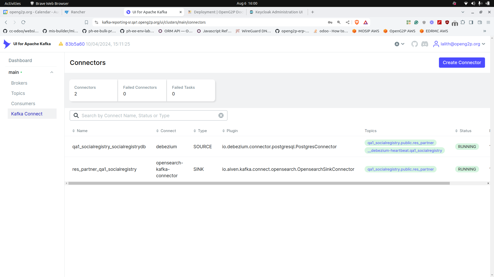

# Installation & Troubleshooting

## Installation

Reporting framework is installed as part of the modules' installation via the Helm chart that installs the respective module.  Note that during installation you need to specify the GitHub Repository URL and branch and directory that contains the Debezium and OpenSearch connectors. For example:

[https://github.com/OpenG2P/openg2p-reporting/tree/develop/scripts/social-registry](https://github.com/OpenG2P/openg2p-reporting/tree/develop/scripts/social-registry)

Follow this guide to [creating/updating connectors](connector-creation-guide.md).

#### Assigning roles to users

Create[ Keycloak client roles](https://www.keycloak.org/docs/latest/server\_admin/#con-client-roles\_server\_administration\_guide) for the following components and assign them to users:

<table><thead><tr><th width="336">Component</th><th>Role name</th></tr></thead><tbody><tr><td>OpenSearch Dashboards for <a href="../">Reporting</a> </td><td><code>admin</code></td></tr><tr><td>Kafka UI for <a href="../">Reporting</a></td><td><code>Admin</code></td></tr></tbody></table>

## Post-installation check

To ensure that all Kafka connectors are working login into Kafka UI (domain name is set during installation) and check the connectors' status. &#x20;

<figure><figcaption></figcaption></figure>

## Update Connectors

This procedure doesn't update the data present in OpenSearch, it only updates the connector configs, so only the new and incoming data is affected.

* After making changes to connectors/dashboards in your GitHub Repo, go to the Installed Apps section on Rancher and upgrade your module, SR/PBMS, etc. (without changing any helm values).
* When the upgrade finishes the new reporting connector changes are automatically applied to the connectors. Log in to Kafka UI and check whether the connector config has been updated.

## Cleanup and uninstall

This describes steps to clean up the connectors and the data so that fresh connectors can be installed again.

* Log in to Kafka UI -> Kafka Connect Section, and delete all the connectors.
* Delete all the topics related to the connectors as well.
* Log in to OpenSearch -> Index Management, and delete all the relevant indices.
* Delete _replication slots_ and _publication_ on Postgres.

If you want to install the connectors again, follow the [Update](installation-and-troubleshooting.md#update-connectors) guide.
