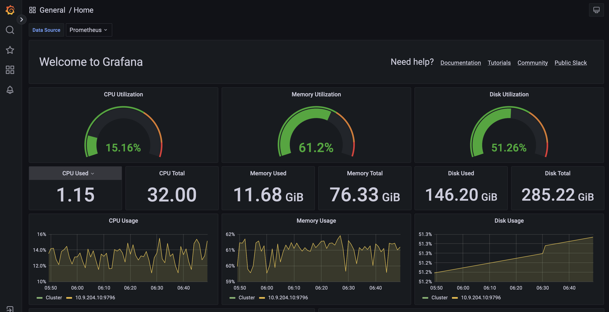

# System Health

To monitor the state of all the servers and their performance, OpenG2P recommends using  Prometheus and Grafana.  These tools may be installed using the Rancher admin console. Refer to the [deployment guide](../deployment/base-infrastructure/openg2p-cluster/prometheus-and-grafana.md).

<figure><figcaption></figcaption></figure>
