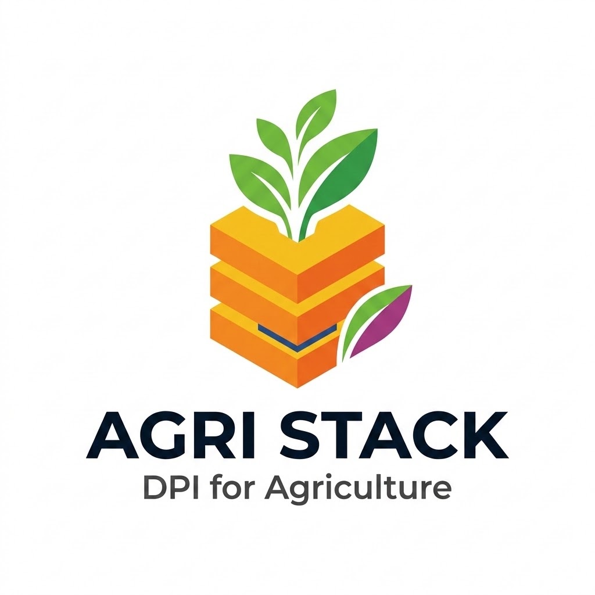

# Open Agri Stack

<figure><figcaption></figcaption></figure>


**Source code:** [github.com/openg2p/agri-stack](https://github.com/openg2p/agri-stack) (the use-case composite), [github.com/OpenG2P/crop-sown-registry](https://github.com/OpenG2P/crop-sown-registry), [github.com/OpenG2P/farmer-registry](https://github.com/OpenG2P/farmer-registry) and [github.com/OpenG2P/registry-platform](https://github.com/OpenG2P/registry-platform).


## What it is

Open Agri Stack is the digital public infrastructure (DPI) for agriculture. These pages describe its architecture for OAN Ethiopia layers 1–3:

* **Layer 1:** the functional registries (farmer, crop sown, livestock, DA);
* **Layer 2:** catalogues: the reference data every registry uses (code lists, reference entities such as seed varieties, geography);
* **Layer 3:** the shared DPI services that connect and govern them.

They also cover how service providers (banks, MFIs, agritechs: **partners**) get farmer data held across the registries: who routes a request, who decides what may be shared, and who enforces it.

## The registries (Layer 1)

Each department runs its own registry on the OpenG2P [registry platform](../products/registry/registry/README.md). Registries are sovereign: each checks the caller, asks the Consent Manager what may be released, and releases only that. Registries share **data**, never code.

| Registry | Holds | Kind | Status |
| --- | --- | --- | --- |
| **Farmer Registry (FR)** | Farmers, land parcels, households, declared main crops, livestock (until a Livestock Registry exists) | Registers and child tables (entities) | Built ([Farmer Registry](../products/registry/farmer-registry/README.md)) |
| **Crop Sown Registry (CSR)** | What each farmer plans, prepares, sows, observes and harvests, plot by plot and season by season; clusters | An activity register (occurrences) plus a Cluster register | Built ([design](design/crop-sown-registry.md), [as built](implementation/crop-sown-registry.md)) |
| **Livestock Registry** | Animals and livestock events (born, vaccinated, treated, sold) | An entity register and an activity register | Planned (design only, see [register model design](design/register-model-design.md#livestock-registry-an-entity-and-occurrences-in-one-registry)) |
| **DA Registry** | Development agents | Register | Planned |

All registries are keyed to the same Fayda-based identifier.

## Shared services (Layers 2 and 3)

| Service | Role in Open Agri Stack |
| --- | --- |
| **Catalogues** (today the [Master Data Service, MDS](../platform/platform-services/master-data-service/README.md)) | All Layer 2 reference data: code lists (the Ethiopia country pack's agriculture domain), reference entities, geography, sample people. MDS serves this role for now; proper catalogues are still to be designed and built (see [open items](open-items/README.md#catalogues)) |
| [Partner Management (PM)](../platform/platform-services/partner-management/README.md) | Trust root for every participant (partners, registries, the composite): identities and public keys |
| [Consent Manager (CM)](../consent-management/README.md) | The farmer's consent and the data-share policies; `/validate` tells each registry what it may release |
| **Use-case composite** | One generic service that serves approved use cases (e.g. `loan-profile`) by querying several registries with one consent and returning one signed response |
| [Approval Workflow Engine (AWE)](../platform/platform-services/approval-workflow-engine/README.md) | Each department approves its own policies and its registers' changes |
| [Audit Manager](../platform/platform-services/audit-manager/README.md) | Audit events from every hop, linked by the request ID |

## What is built and what is design

Besides the existing OpenG2P registries, PM and CM, the following are built (October 2026). The rest is design.

| Part | Status | Where |
| --- | --- | --- |
| Activity registers in the registry platform | Built | [Registry platform changes](implementation/registry-platform.md) |
| Register model, phase 1 (typed participants, entities first, partner corrections, Cluster register, crop-change link, verification status in DCI, shared sample data) | Built | [Register model design](design/register-model-design.md#phase-1-built) |
| Register model, phase 2 (common verification model, disputes, beneficiary API for occurrences, subscribe/notify) | Design | [Register model design](design/register-model-design.md#phase-2-proposed) |
| Crop Sown Registry | Built | [Crop Sown Registry (as built)](implementation/crop-sown-registry.md) |
| Farmer Registry: declared main crops, `FARMER_ID` in DCI, sample lands | Built | [Farmer Registry changes](implementation/farmer-registry.md) |
| One consent with a grant per registry, in CM | Built | [Consent Manager changes](implementation/consent-manager.md) |
| Use-case composite, first version | Built | [Composite as built](implementation/composite.md) |
| Consent collected in CM presented at a registry; policies held in PM; rate limits across pods and quotas; publish checks; data-blind mode | Design / TODO | [TODOs and open items](open-items/README.md) |

## Map of this section

| Part | Pages |
| --- | --- |
| **[Architecture and concepts](architecture/README.md)** | Components and who talks to whom; [request flow](architecture/request-flow.md); [policy and consent](architecture/policy-and-consent.md); [consent model](architecture/consent-model.md); [registry model](architecture/registry-model.md); [register vs activity register](architecture/register-vs-activity-register.md); [terms](architecture/terms.md) |
| **[Design](design/README.md)** | [Register model design](design/register-model-design.md); [activity register](design/activity-register.md); [Crop Sown Registry](design/crop-sown-registry.md); [use-case composite](design/use-case-composite.md); [concept notes review](design/concept-notes-review.md) |
| **[Implementation](implementation/README.md)** | What is built, per component: [registry platform](implementation/registry-platform.md), [Consent Manager](implementation/consent-manager.md), [Crop Sown Registry](implementation/crop-sown-registry.md), [Farmer Registry](implementation/farmer-registry.md), [composite](implementation/composite.md); the [standards](implementation/standards.md) used |
| **[Guides](guides/README.md)** | [Partner guide](guides/partner-guide.md); [composite configuration](guides/composite-configuration.md); [adding a data source](guides/adding-a-data-source.md); [end-to-end test from a laptop](guides/end-to-end-test.md); [deploying on a cluster](guides/deployment.md); [running the composite locally](guides/running-the-composite-locally.md) |
| **[TODOs and open items](open-items/README.md)** | Decisions and checks still pending; [service guide notes](open-items/service-guide-notes.md) |
