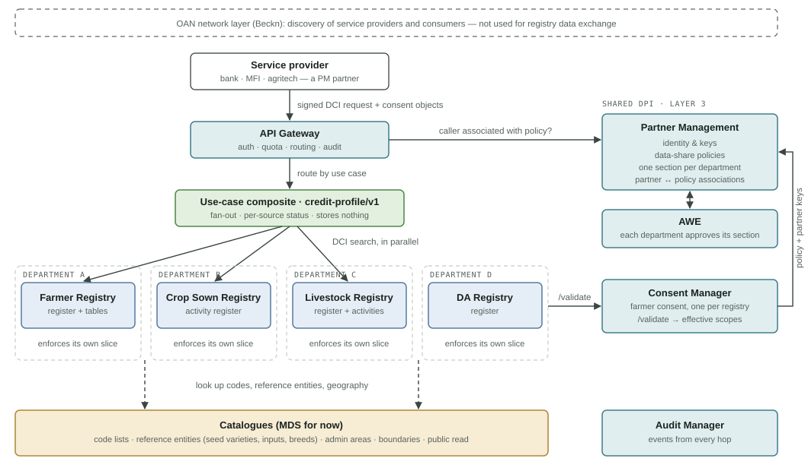

# Architecture & Concepts

## Components and who talks to whom

<figure><figcaption>
Components of Open Agri Stack
</figcaption></figure>

| Colour | Layer |
| --- | --- |
| Blue | Layer 1: functional registries (system of record) |
| Ochre | Layer 2: catalogues (reference data; MDS for now) |
| Teal | Layer 3: shared DPI |
| Green | Layer 4: use-case service |

* Every registry sends `/validate` to the Consent Manager; the single arrow in the diagram stands for all four.
* The ingress (dashed grey: OpenG2P deployment infrastructure, not an Open Agri Stack service) routes requests but never reads data. The composite checks the caller.
* The composite runs only for approved use cases and keeps nothing after it responds.
* Beckn appears only at the OAN network layer, for discovering service providers and consumers. It isn't used to exchange registry data.


The partner requests and presents **one consent**, with a grant per registry inside it (see [consent model](consent-model.md)). The diagram shows the data-share policies in PM, the target design; today they are in CM ([open items](../open-items/README.md)).


## Who does what

* **Partner Management (one instance).** The trust root for every participant: service providers, registries and composites. In the target design it also holds the **data-share policies** (moved here from CM), split into one section per department, and records which partners are associated with each policy. Today the policies are still in CM.
* **Consent Manager (one instance).** Holds the farmer's individual consent. `/validate` returns what the farmer consented to, intersected with the calling registry's policy.
* **Registries (one per department).** Each one is sovereign: it checks the caller, calls `/validate`, and releases only the effective scopes. All of them are keyed to the same Fayda-based identifier.
* **Ingress and composites.** The OpenG2P deployment's ingress is the single public entry point (see [below](#entry-point-the-openg2p-deployment-not-a-separate-api-gateway)). Data from several registries is merged only in narrow composite services built for one purpose each, such as `credit-profile`. There is no general query engine across registries. Each use case is a configuration file loaded by one generic composite service (see [use-case composite](../design/use-case-composite.md)).
* **AWE.** Each department approves its own section of a policy.
* **Audit Manager.** Receives audit events from every hop, linked by the request ID.

## Entry point: the OpenG2P deployment, not a separate API gateway

Open Agri Stack has **no API gateway product**. Partners reach it through the ingress of the [OpenG2P deployment](../../deployment/openg2p-deployment-model.md) (Nginx and Istio on Kubernetes), as for every OpenG2P service, and the jobs usually given to an API gateway are covered by that deployment and by the composite:

| Gateway job | Handled by |
| --- | --- |
| One public entry point, TLS, routing | Nginx and the Istio ingress gateway, with an Istio VirtualService per service |
| Partner authentication | The composite and each registry verify the partner's signature against [Partner Management](../../platform/platform-services/partner-management/README.md). A gateway could not do this natively anyway: the signature covers the request body |
| Who may call what | The composite's `allowed_partners` today, PM policies later. Istio `AuthorizationPolicy` can restrict the registries' partner APIs to the composite (to do) |
| Rate limits | Per pod in the composite today; across pods, with shared counters in Redis (to do). Istio global rate limiting is an alternative, but needs the partner ID in a header, since Istio cannot read the signed body |
| Daily quotas, usage reports | The composite knows the partner on every request and sends audit events, so quotas and usage reports come from there (to do) |
| mTLS between services, timeouts, retries, circuit breaking | Istio |
| Developer portal, API keys, analytics, billing | Not needed now: the [partner guide](../guides/partner-guide.md) and the composite's describe endpoints cover discovery |

A gateway product becomes worth adding only if Open Agri Stack grows many partner-facing APIs from different teams that need a common portal, keys, analytics or billing, or if a national API gateway is mandated. It would then sit in front of the composite, unchanged.

## In this part

| Page | Covers |
| --- | --- |
| [Request flow](request-flow.md) | One request, end to end |
| [Policy and consent](policy-and-consent.md) | What gets released; policy vs use case vs consent |
| [Consent model](consent-model.md) | One consent for the partner, one grant per registry |
| [Registry model](registry-model.md) | Register, table and activity-register kinds; projections; the Layer 2 split |
| [Register vs activity register](register-vs-activity-register.md) | How the two kinds differ, as built |
| [Terms](terms.md) | Validation, change, correction, void, approval of changes, verification, dispute |
