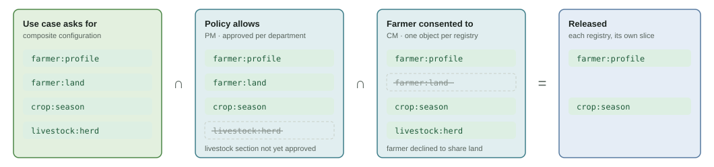

# Policy and Consent

## What actually gets released

**effective scopes = what the use case asks for ∩ what the policy allows ∩ what the farmer consented to**

Each registry computes this intersection for its own part, so a misconfigured use case can never leak more than the policy allows.

<figure><figcaption><p>Worked example of released scopes</p></figcaption></figure>

## Layers and owners

| | Owner | Defines | Changes |
| --- | --- | --- | --- |
| **Data-share policy** (PM, target) | Departments (data controllers), approved through AWE | Allowed scopes per registry, purposes, fetch type, validity ceiling, data life. A policy is reusable: many partners can be associated with one policy. | Rarely. A change that widens access goes back to the department concerned. |
| **Partner association** (PM, target) | PM administrators | Which partners may use a policy | Onboarding a new bank is one association, with no re-approval |
| **Use-case configuration** ([composite](../design/use-case-composite.md)) | Open Agri Stack platform team | Sources, query templates, requested scopes (must be ⊆ policy), response schema, merged or data-blind, timeout | Versioned like an API |
| **Consent** (CM) | The farmer | Scopes agreed for this purpose | Per farmer; revocable |


**Today** the data-share policies are held in CM, one per partner binding and registry (see [Partner policy binding & approval](../../consent-management/design/partner-onboarding-and-policy.md)), and the composite uses `allowed_partners` in each use case in place of the partner association. Moving policies to PM is an [open item](../open-items/README.md).


## Example policy (target, in PM)

```yaml
policy: credit-assessment          # version 3, status: active
purpose: credit-assessment
terms: { fetch_type: oneshot, max_validity: P90D, data_life: P1Y, subject_id_types: [fayda_token] }
sections:                           # one per data controller, each approved by that department
  - controller: farmer-registry     scopes: [farmer:profile, farmer:land]        approved_by: MoA-FR (AWE)
  - controller: crop-sown-registry  scopes: [crop:season]                        approved_by: MoA-Crop (AWE)
  - controller: livestock-registry  scopes: [livestock:herd]                     approved_by: MoLF (AWE)
```

Partner associations (also held in PM):

```
credit-assessment v3  ←  Bank A, Bank B, MFI C
```

* **Each department approves only its own section**, using its own AWE approval workflow. A section that hasn't been approved isn't in force, but the rest of the policy still applies.
* **Policies list scopes, not individual fields.** Each registry defines and versions its own mapping from scope to fields and publishes it in the developer sandbox. For example, `farmer:profile` = name, sex, date of birth, kebele.


In the registries as built, a scope is a **top-level key of the registry's DCI record** (e.g. `farmer_personal_details`, `farm_details`, `main_crops` in the Farmer Registry; `crop_season`, `measures`, `location`, `farmer_reference`, `activity` in the Crop Sown Registry). The `farmer:profile` style above is the design's notation.


## Runtime checks

1. **Gateway / composite:** is this partner associated with the policy the use case refers to? If not, reject.
2. **Registry → CM `/validate`:** CM checks the consent (valid, not revoked, right purpose), fetches that registry's policy section (from PM, cached, in the target design), and returns the intersection.
3. **Registry:** releases only the effective scopes.

## Changes needed

* **PM:** add policy, policy-section and association entities, with AWE approval per section.
* **CM:** `/validate` reads policies from PM instead of CM's own `PartnerPolicy` tables.
* **Composite service:** check each use case against its PM policy when the use case is published (see [publish checks](../design/use-case-composite.md#checks-when-a-use-case-is-published)).
* **Consent:** see the [consent model](consent-model.md).
