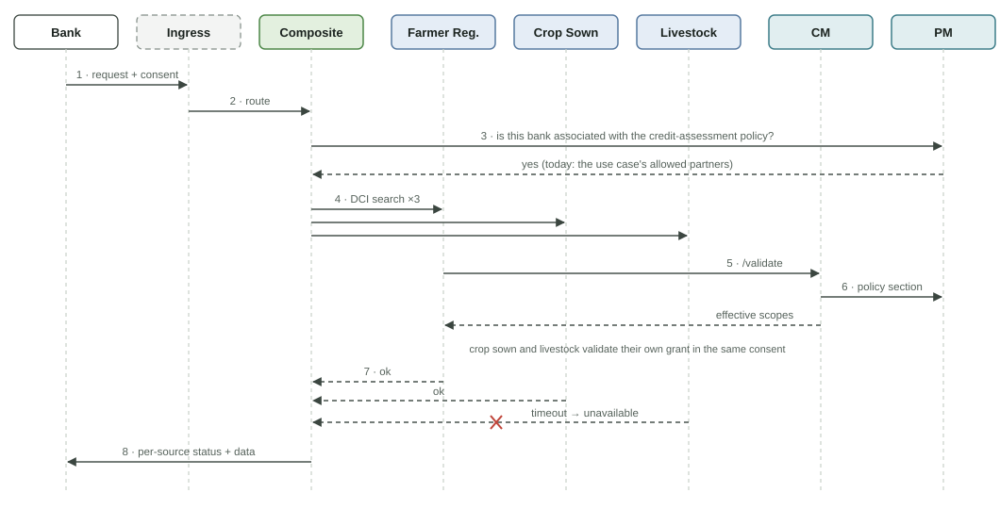

# Request Flow

The worked example is **Access to Credit**: a bank wants a farmer's credit profile, and the data comes from three registries.

<figure><figcaption>
One request, end to end
</figcaption></figure>

In this example the livestock registry is down. The bank still gets the farmer and crop data, and the response says `livestock: unavailable` rather than failing the whole request.

## Steps

1. **Bank → gateway.** The bank calls the `credit-profile` use case with the farmer's identifier and the consent, and signs the request with its PM key.
2. **Gateway → PM.** The gateway checks in PM that the bank is associated with the policy this use case refers to (`credit-assessment`).
3. **Gateway → composite.** The request is routed to the composite, which verifies the bank's signature.
4. **Composite → registries.** The composite sends a DCI `sync/search` to each source in parallel. Each call is signed with the composite's own PM key and carries the bank's consent and original request ID unchanged.
5. **Registry → CM.** Each registry calls CM `/validate`.
6. **CM → PM.** CM checks the consent, fetches that registry's policy section from PM (cached), and returns the effective scopes.
7. **Registries → composite.** Each registry releases only the effective fields and returns a status: `ok`, `no_record`, `denied` or `unavailable`.
8. **Composite → bank.** The composite assembles the response, returns it and discards everything. Every hop emits audit events linked by the request ID, and CM records the usage so the farmer can see it.


The diagram shows the earlier CM model, with one consent object per registry. Under the [consent model](consent-model.md) now built, steps 4–6 pass the **same** consent to every registry, and each registry validates only its own grant.


## How this differs in the first version

The [composite as built](../implementation/composite.md) follows this flow with these differences:

* There is no API gateway yet. The composite itself verifies the partner's signature and checks the partner against the use case's `allowed_partners`, a stand-in for the PM policy association (step 2).
* Policies are still held in CM, per partner binding and registry; CM does not read them from PM (step 6).
* The composite calls sources in dependency order: in `loan-profile` the Crop Sown Registry is called after the Farmer Registry, because it needs the farmer ID that the Farmer Registry returns.

## Use-case (composite) configuration

The `credit-profile` use case is defined by a configuration file loaded by the generic composite service. The file covers sources, query templates, response mapping, timeouts and the checks run before publishing. See [use-case composite](../design/use-case-composite.md) and the [composite configuration guide](../guides/composite-configuration.md).
