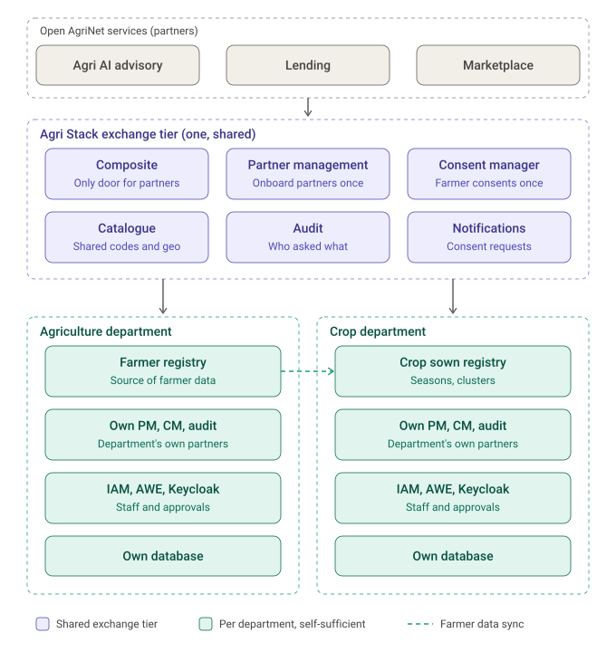
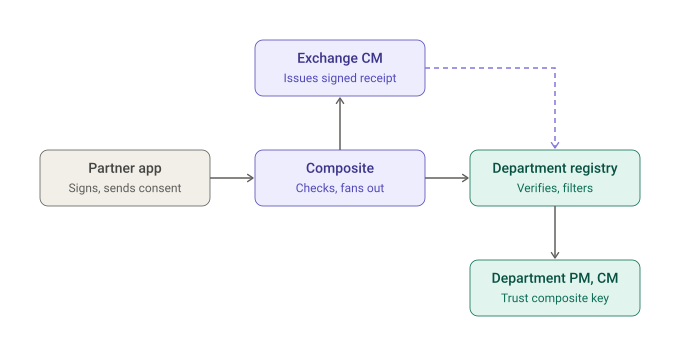

# Distributed Deployment Architecture


**Status: design, mostly to build.** This page records the agreed direction for deploying Open Agri Stack across departments. The [TODO list](#todo) at the end says what the platform and charts still need.


## The setting

Open Agri Stack is the **data layer** that Open AgriNet uses to serve farmers and others: AI-based advisory, loans, a marketplace and more. The registries behind it belong to **different departments**: the Farmer Registry (FR) to one, the Crop Sown Registry (CSR) to another, and later others (livestock, …).

Two needs pull in different directions:

* **Each department runs its own registry for its own work:** its staff, its approvals, its own partners and use cases. It cannot depend on another department being up, or on another department's partner and consent setup.
* **Open AgriNet partners need one place** to get a farmer's data from all registries, with **one onboarding** and **one consent** from the farmer.

## Two tiers

1. **Department tier: one per department, complete.** Each department installs the full stack (commons and its registries) with its **own** Partner Management (PM), Consent Manager (CM), IAM, approvals (AWE), audit, Keycloak and database. It runs its own use cases and partners without depending on anyone.
2. **Agri Stack exchange tier: one, shared, facing Open AgriNet.** A separate install of the cross-cutting pieces:
   * the **[composite](use-case-composite.md)**, the only door for Open AgriNet partners;
   * **PM**, where Open AgriNet partners onboard **once**;
   * **CM**, where the farmer gives consent **once**, for all registries;
   * the **catalogue**, shared codes and geography;
   * **audit** of who asked what through the exchange;
   * optionally **notifications** (consent requests to farmers) and **usage metering** (per-partner quotas; billing later, for a marketplace).

**To each department, the exchange is one partner.** The department's PM holds the composite's public key; the department's CM holds one standing policy for it.

### What is shared and what is per department

| Component | Where | Why |
| --- | --- | --- |
| Composite | Exchange | Single door for Open AgriNet partners |
| Partner Management, Consent Manager | **Both** | Each department's for its own partners; the exchange's for Open AgriNet partners and farmer consent |
| Catalogue | **Shared, authoritative at Agri Stack level** | Crop codes, seasons and geography (P-codes) must be identical across registries, or the composite cannot join their data. Departments read it through its API (cached, version-pinned); department-only datasets can live in it under their own publisher. |
| Audit | **Both** | Each department audits access to its data, including calls from the exchange, recorded "on behalf of" the partner. The exchange audits who asked what. A **request ID passed through every hop** ties them together for forensics. |
| Verifiable credentials | Issuer per department, verification shared | The Farmer Registry issues farmer credentials under its own issuer identity; verification is public and can be shared. |
| Farmer identity | Fayda FAN and the FR farmer ID | The join key across registries; departments resolve farmers through FR (lookups or [data sync](registry-data-sync.md)). |
| IAM, AWE, Keycloak, Kafka, Redis, object store | Per department | Internal to each |
| Data sync (WebSub) | Per publisher | FR publishes; CSR and others subscribe. See [Registry Data Sync](registry-data-sync.md). |
| Databases | Per department; the exchange's own for its services | Registry data never leaves its department except through its APIs |

## Consent and policies

### Who collects the consent

The partner (e.g. a bank) **asks** for consent; the **exchange CM issues** it. One consent object covers all registries the use case reads: a grant per registry (e.g. FR: identity, land; CSR: crop seasons), the purpose, the validity and the farmer's ID.

* **CM-originated (recommended for the exchange):** the bank requests consent; the exchange CM notifies the farmer, who approves at the CM after authenticating (e.g. Fayda OTP). The partner cannot fabricate consent.
* **Partner-embedded:** the bank collects consent in its own app and signs it. Weaker; acceptable only with proof the farmer authenticated.

### Two kinds of policy, one inside the other

| | Exchange CM | Department CM (FR, CSR, …) |
| --- | --- | --- |
| Question it answers | What may **this partner** ask farmers for? | What may **the exchange** ever get from me? |
| Binding | One per Open AgriNet partner, per registry it reads | **One standing policy** for the exchange (the composite as partner) |
| Contents | Purposes; [data scopes](../../products/registry/registry/design/data-scopes.md) per registry; subject ID types; validity; fetch type | Scopes and purposes the department agrees to share **through the exchange**, and the rule that every request must carry a valid exchange consent receipt |
| Who decides | The exchange operator | The department (its own approval workflow) |

**Rule: a partner's scopes for a registry must be a subset of that department's exchange policy.** The exchange CM checks this when a partner policy is created or widened, reading each department's published scope catalogue and exchange policy, and refuses to grant a partner more than a department allows.

### What a department registry does with the consent

The registry does **not** create or look up a per-farmer consent of its own. For each request from the exchange:

1. **Verify the caller:** the composite's signature, with the key in the department's own PM.
2. **Load the standing exchange policy** from the department's own CM.
3. **Verify the exchange consent receipt:** signed by the exchange CM (checked against its published key, offline), for this farmer, still valid, purpose allowed, and a grant **for this registry**.
4. **Compute what to return:** receipt grant for this registry ∩ department's exchange policy ∩ what was asked; filter the record to those scopes.
5. **Record it:** the receipt's ID goes into the department's audit log, so the department can show why it shared.

**Revocation:** the farmer revokes at the exchange CM. Registries learn of it through short receipt validity, with a status check against the exchange CM as a fallback.

Today a registry trusts only its own CM (`/validate`). Accepting a receipt signed by another CM is the main platform change this design needs (see [TODO](#todo)).

## Networking across departments

Today every service sits behind the **internal** Istio gateway, reachable only over WireGuard. Cross-department calls need one of:

* **Site-to-site WireGuard between departments:** each cluster becomes a peer. Simple and private; fine for a few departments, but every new department means network plumbing.
* **A separate inter-department gateway (recommended):** expose **only the service APIs** others need, protected by **mutual TLS** (a client certificate per department) on top of the signed requests, optionally with IP allowlists. Staff UIs and admin APIs stay on WireGuard. APIs to expose:
  * from the exchange: the composite's partner API, CM's receipt keys and status check, the catalogue's read API;
  * from each department: its registry partner API (the composite calls it), and its PM key lookup if the exchange verifies department signatures.

Cross-department **service-to-service trust** uses signed requests with keys registered in PM (as the partner APIs already do), not shared Keycloak tokens. Each department is a partner of the services it calls, and no secrets are exchanged.

## Operating it

* **Availability:** departments depend on the exchange's catalogue, and the exchange depends on each department's partner API. PM keys and catalogue reads are already cached; consent receipts are verified offline. Decide behaviour when a site is down: consent fails closed, catalogues serve their cached version. Add timeouts and alerts.
* **Upgrades and compatibility:** the exchange and departments upgrade on their own schedules. Shared APIs (composite, CM receipts, catalogue, registry partner API) need versioning and a compatibility promise.
* **Tracing:** a request ID passed across tiers, recorded in every audit log.
* **DNS and certificates:** public DNS names and trusted TLS for the exposed APIs; client certificates for mutual TLS.
* **Onboarding a department to the exchange:** register its keys in the exchange PM; register the composite's key in the department PM; create the department's standing exchange policy in its CM; publish its scope catalogue; issue its client certificate; set the exchange URLs in its charts.

### Simulating it on one cluster

See [Proving it: three namespaces](#proving-it-three-namespaces).

## Standalone installs are not affected

Every change below is **opt-in and off by default**. A department that installs commons and a registry without the exchange gets exactly today's behaviour:

* the registry keeps calling its **own** CM `/validate` for consent, its own PM for keys and its own catalogue;
* new settings (a trusted exchange CM, remote shared-service URLs) are **empty by default**, and while they are empty no new code path runs;
* the composite's new behaviour (obtaining consent receipts from the exchange CM) is used only in the exchange tier; a composite used inside one installation keeps passing the partner's consent through, as today.

## Proving it: three namespaces

The model is tested on one cluster with three namespaces, each installed as if it were a separate organisation:

| Namespace | Installs | Role |
| --- | --- | --- |
| `trial` | commons-base, commons-services, Farmer Registry | Agriculture department |
| `csr` | commons-base, commons-services, Crop Sown Registry | Crop department |
| `agrix` | commons-base and a slim commons-services (PM, CM, catalogue, audit, notifications, IAM for admin UIs), composite | Agri Stack exchange tier |

Each namespace has its own domain (`*.trial.openg2p.org`, `*.csr.openg2p.org`, `*.agrix.openg2p.org`) on its own `internal` gateway, as other namespaces already do; `csr` and `agrix` need DNS and TLS certificates. All calls between namespaces use these **external hostnames**, never in-cluster service names.

### What already works without code changes

* **Reaching the registries:** each registry already publishes its partner API on its gateway (`https://partner-fr.trial.openg2p.org`, `https://partner-csr.csr.openg2p.org`). The composite's registry URLs are values (`composite.registries.<name>.url`); set them to these.
* **The composite as a partner of each department:** register the composite's public key in the `trial` PM and the `csr` PM, and give it a policy in each department's CM. Each registry then verifies the composite's signature as for any partner.
* **Partner onboarding at the exchange:** the bank onboards in the `agrix` PM and CM only; the composite verifies the bank there (same namespace).
* **Catalogue, phase 1:** each department keeps its own catalogue loaded from the **same country pack version**, so codes and geography are identical. Pointing departments at the `agrix` catalogue is phase 2.

**What does not work yet:** consent. Today a registry validates the partner's consent with its **own** CM, so the bank would have to be bound in every department's CM as well: three onboardings instead of one. The phase 1 changes below remove that.

### Changes, in phases

**Phase 1: one onboarding, one consent** (needed for the three-namespace test)

| Where | Change | Default |
| --- | --- | --- |
| Consent Manager | Issue a **signed consent receipt** per registry grant (subject, partner, purpose, scopes for that registry, validity, receipt ID), verifiable offline with the key CM already publishes at `/.well-known/jwks.json`; a receipt status endpoint for revocation | Off for standalone use; no change to `/validate` |
| Composite | An **exchange mode**: validate the partner's consent with the exchange CM, then send each registry its receipt instead of the raw consent | Off: today's pass-through |
| Registry platform (partner API) | **Trusted exchange settings**: the exchange's partner ID, the exchange CM's key URL. A request from that partner carrying a receipt is verified offline; scopes = receipt grant ∩ the department's standing policy for the exchange ∩ what was asked; the receipt ID is audited | Empty: today's behaviour (own CM `/validate`) |
| Registry charts | An optional "Agri Stack exchange" question group for those settings | Hidden unless enabled |
| Commons-services | A slim **exchange profile** (values file) for `agrix` | Not used by department installs |
| Operations | DNS and TLS for `csr` and `agrix`; onboarding steps (see above) | — |

**Phase 2: shared catalogue and policy subset check**

* Departments may point at the `agrix` catalogue (a remote catalogue URL; default stays local), with read access by signed request.
* The exchange CM refuses a partner policy that grants more than a department's published exchange policy allows.

**Phase 3: production hardening**

* Inter-department gateway with mutual TLS (or WireGuard peering).
* CM-originated consent (farmer notification and approval).
* Request ID propagation across tiers; API versioning; usage metering.

## TODO

All items are opt-in and default off; see [the phases](#changes-in-phases).

* **Consent trust:** registries accept consent receipts signed by a configured *trusted* CM (the exchange CM), verified offline against its published key; status check as fallback; per-partner choice of which CM to trust. Record the receipt ID in audit.
* **Policy subset check:** the exchange CM refuses a partner policy that grants more than a department's exchange policy allows (needs departments to publish their exchange policy and scope catalogue).
* **CM-originated consent flow** in the exchange CM (farmer notification and approval, farmer authentication).
* **Exchange-tier install:** a chart profile (or helmfile) that installs only the exchange components.
* **Remote shared services in registry charts:** a "shared services" question group with external URLs (catalogue, exchange CM), back in the Rancher form; setup jobs that call service APIs instead of writing into another service's database (e.g. Certify credential configs).
* **Catalogue across departments:** read access for department registries (signed requests or an exchange-issued client), publishers per department.
* **Inter-department gateway** with mutual TLS; document the WireGuard-peering alternative.
* **Request ID propagation** across the composite, registries and CMs, recorded in audit.
* **API versioning** for the shared APIs.
* **Usage metering** per partner at the exchange (later: billing).
