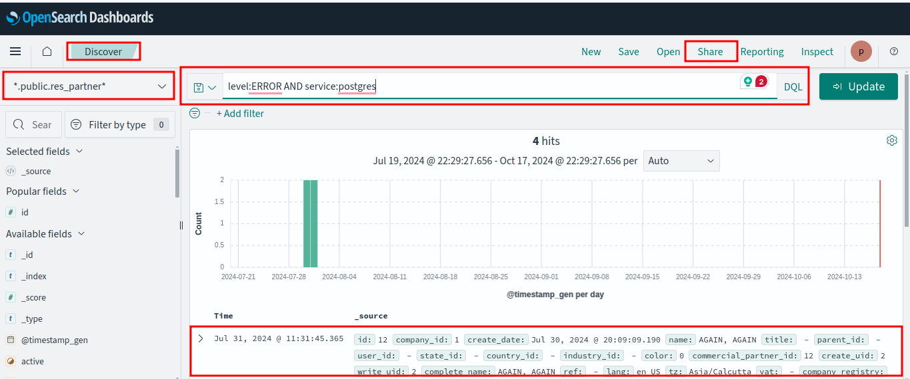

# Functional Overview

## Implementing a Social Benefit Scheme

Each social benefits delivery scheme is implemented via a program in the OpenG2P platform. A program implements these key functions for benefits delivery:

1. Beneficiary Registration: Beneficiary information is collected and authenticated by a field registration officer, agent, or self-service portal. The beneficiary can be an individual, family, or a group. The relevant beneficiary information fields are decided as part of the program configuration.&#x20;
2. Benefit Allocation: Registered beneficiaries are enrolled into a program after deduplicating the registered entries. Based on the eligibility criterion configured in the program such as age, gender, and income, the enrolled beneficiary is deemed entitled to the scheme benefits. Entitled beneficiaries are also notified through SMS/email based on the program's notification configuration.
3. Benefit Payment: The benefit can be disbursed as cash, voucher/coupon, in-account, or in-kind using an OpenG2P program. Further, accounting, reconciliation, and reports are facilitated by the program to allow the benefit issuing authorities to keep track of payouts, budgets, and other financials.
4. Monitoring and Reporting: OpenG2P platform integrates a [reporting framework](https://github.com/mosip/reporting) that lets benefit-issuing authorities create dashboards of their choice to visualize data related to the program(s).&#x20;

## Participants in a Program

A program is managed and executed by multiple participants. These participants play one or more of these key roles:

### Administrator

An administrator configures rule-based access for other participants as per their roles and may configure the default parameters in the program.

### Program Manager

A program manager creates a program and configures deduplication and eligibility parameters. A program usually has multiple disbursement cycles with a start and end date that are configured by the program manager. In brief, a program manager handles benefit allocation functions during the lifecycle of a program.

### Payment Manager

A payment manager is responsible for configuring and managing the cycles, batches, and modes of benefit for the entitled beneficiaries. This role also takes care of accounting, reconciliation, and reports related to the benefit payments. In brief, a payment manager handles benefit payment functions during the lifecycle of a program.

## Beneficiary Database

### Privacy and Security

## Functional Architecture

OpenG2P has a flexible architecture that allows governments and social benefit delivery systems to choose functionalities per their needs. The platform is built to allow inclusion and has supporting features. For example, beneficiaries in remote areas without any network connectivity can be registered offline. The platform enables bulk payments as well as on-demand payments. The payment approval can involve digital approval, multiple approvals, and manual interventions and the platform can support such disparate benefit disbursements.

<figure><figcaption></figcaption></figure>


**External System Integrations**

Digital authentication can be facilitated using MOSIP or any other ID system as the platform is agnostic of ID systems.&#x20;

The platform can integrate with payment systems other than the three payment systems shown in the diagram. &#x20;


### Technical architecture 

<figure><figcaption></figcaption></figure>
