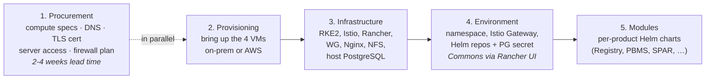

# Production

The production deployment runs OpenG2P across role-specialised VMs — **Reverse Proxy**, **Compute** (Kubernetes), and **Storage** (host PostgreSQL + NFS) — with admin tools behind a Wireguard VPN and citizen-facing services on the public channel.

<figure><figcaption></figcaption></figure>

It comes in two configurations, sharing the **same architecture** — the difference is the number of nodes:

* **Production — Minimum** (four nodes; one Reverse Proxy, one Compute, one Storage, one Backup) — pilots and small-scale production where some downtime is acceptable. The Backup node is **required for production** (installed via the separate [backup automation](../backups/)).
* **Production — High-Availability** (more nodes; HA Kubernetes control plane, redundant RPs behind a load balancer, PostgreSQL primary/replica) — large-scale or near-zero-downtime deployments. A supported scaling-up of the same architecture; manual/extension work today, not yet automated.

See [OpenG2P Deployment Architecture](../../../deployment/openg2p-deployment-model.md) for the full conceptual picture, and [Deployment](../../../deployment/) for choosing between sandbox and production.

## The five stages

A production rollout happens in five stages. Stage 1 (Procurement) can — and should — start in parallel with Stage 2 (Provisioning), since the cert and DNS items in Stage 1 typically take **2–4 weeks** to deliver. Stages 3, 4, and 5 are strictly serial.

| Stage                 | Page                                                                                                                                                                                                               | What you produce                                                                                                                                                                                                                                  |
| --------------------- | ------------------------------------------------------------------------------------------------------------------------------------------------------------------------------------------------------------------ | ------------------------------------------------------------------------------------------------------------------------------------------------------------------------------------------------------------------------------------------------- |
| **1. Procurement**    | [Prerequisites & Procurement](../prerequisites-procurement.md)                                                                                                                                                     | A confirmed shopping list — compute specs, DNS records to create, the TLS certificate, server-access plan, firewall rules. Requests have gone to your network / cert / IT team.                                                                   |
| **2. Provisioning**   | [Provisioning](provisioning.md) (with [AWS Provisioning](production-automation/aws-provisioning.md) sub-page for the AWS path)                                                                                     | Three Ubuntu 24.04 VMs running, on one private subnet, SSH-reachable from the deployer's workstation.                                                                                                                                             |
| **3. Infrastructure** | [Infrastructure Automation](production-automation/)                                                                                                                                                                | The cluster platform: RKE2, Istio, Rancher (local auth), monitoring, logging, Wireguard, Nginx with customer-provided TLS, NFS server + host PostgreSQL. Admin tools reachable over the VPN.                                                      |
| **4. Environment**    | Scaffolding via [Infrastructure Automation](production-automation/#the-environment-stage) (`openg2p-prod.sh`); Commons via **Rancher UI only** — [Environment Setup](../environment-setup-multi-node.md) | A namespace with Rancher Project, Istio Gateway, Helm repos, and `commons-postgresql` secret. Then install `openg2p-commons-base` + `openg2p-commons-services` from Rancher (Kafka, MinIO, Keycloak, Superset, eSignet, ODK, etc.). Public 80/443 opened when ready. |
| **5. Modules**        | Per-product deployment pages — [Farmer Registry](../../../products/registry/farmer-registry/deployment/README.md), [PBMS](../../../pbms/deployment/), [SPAR](../../../spar/deployment/), [G2P Bridge](../../../g2p-bridge/deployment/)    | Your chosen OpenG2P product modules installed into the environment via their own Helm charts.                                                                                                                                                     |


**Stages 3 and 4 scaffolding are one command.** Environment scaffolding runs as the `environment` stage at the tail of `openg2p-prod.sh` (SSH tunnel; Wireguard not required). **Commons is a separate step** — install from the **Rancher UI only** after connecting Wireguard. Re-run scaffolding alone with `./openg2p-prod.sh --stage environment …`. The [Environment Setup](../environment-setup-multi-node.md) page documents Commons install via Rancher and standalone scaffolding.


## Ongoing operational concerns

These are not deployment stages — they are continuous responsibilities that begin **before go-live** and continue throughout the system's lifetime.

* [**Backups**](../backups/) — configure pgBackRest, etcd snapshots, rancher-backup, and restic for NFS/configs. Set up the backup node, schedule the drills. Must be in place before go-live.
* [**Production Best Practices**](../production.md) — hardening, HA recommendations, air-gap considerations, RBAC, image-pull policy, Nginx tuning. Apply incrementally; consult per deployment context.

## Sandbox is different

For evaluation, demos, dev/QA, or small pilots, use the [Sandbox — Single-Node](single-node-automation/) path instead. Sandbox collapses all five stages into a single VM driven by the laptop orchestrator (`openg2p-single-node.sh`) — no separate procurement, provisioning, infrastructure, environment, or modules phases. The staged flow described above applies only to Production.
