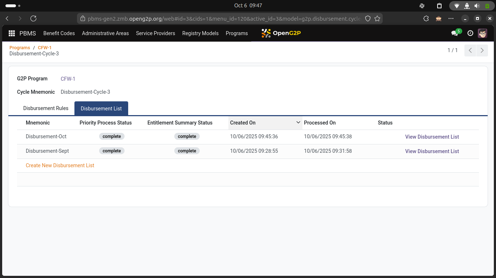
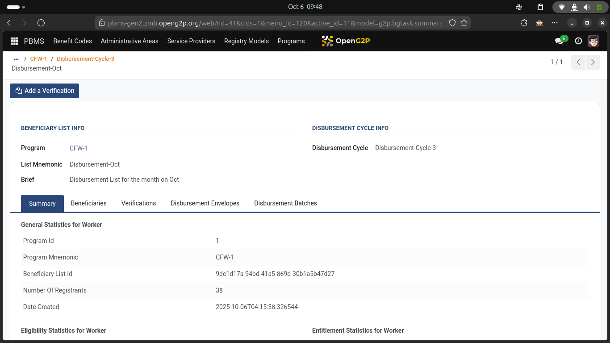
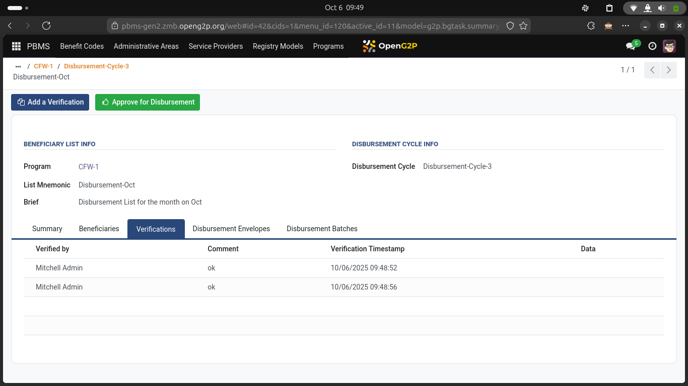
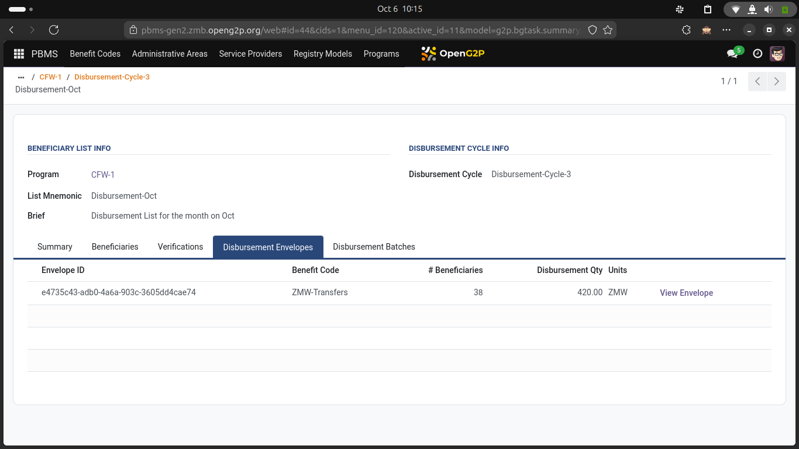
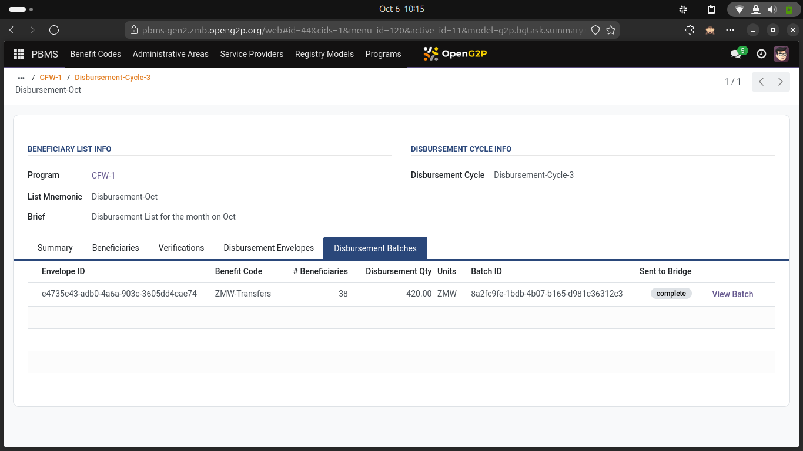

# Disbursement workflow

A disbursement cycle follows the workflow as shown in the diagram below



Once you approve a list for disbursement under a disbursement cycle, the system picks up this list and hands over this to G2P Bridge.

G2P Bridge then processes this list depending on benefit codes and geographical distribution of the beneficiaries.

The entire processing within G2P Bridge is automated and does not require any manual intervention. You can see the final status of the disbursements within the Priority List - under two distinct tabs -&#x20;

1. View Disbursement Envelopes and&#x20;
2. View Disbursement Batches

<figure><figcaption>
Screen showing Disbursement Lists prepared under a Disbursement Cycle
</figcaption></figure>

<figure><figcaption>
Screen showing summary information of a Disbursment List
</figcaption></figure>

<figure><figcaption>
Screen showing Verifications done on a Disbursement List
</figcaption></figure>

<figure><figcaption>
Screen showing - Disbursement envelopes created for an Approved Disbursement List
</figcaption></figure>

<figure><figcaption>
Screen showing Disbursement batches created for an Approved Disbursement List
</figcaption></figure>
