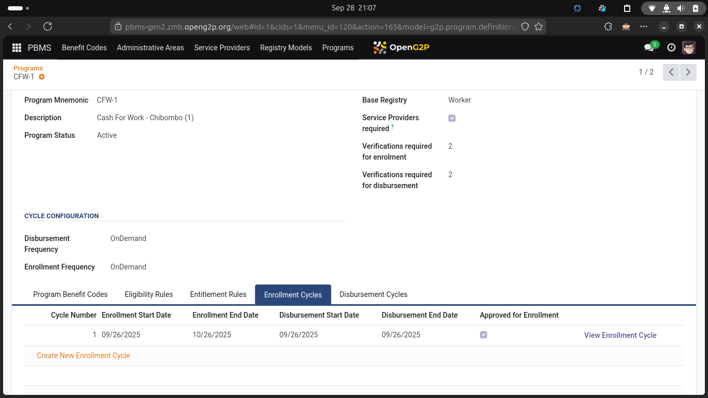
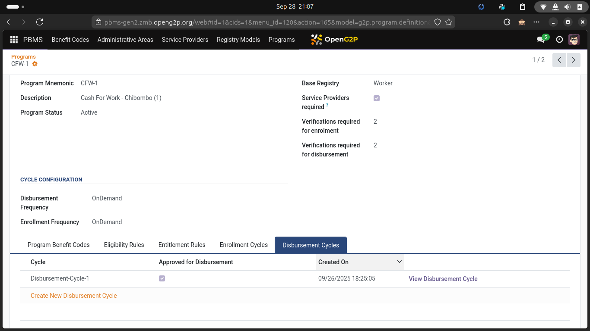

# Enrolment & Disbursement Cycles

These two cycles occur in parallel with different periodicities.


Figure showing Enrolment & Disbursement cycles in parallel with differing frequencies


The figure shows an example of a Benefit program with Enrolment Cycles occurring every six months - in January and June. Disbursement cycles are created every month. The Disbursement cycle will work on the latest approved enrolment list that's available.&#x20;

So in the example above, the disbursement cycle of Februrary will operate on the enrolment list created in January. Similary, the disbursement cycles of March, April, May and June will also operate on the enrolment list created in January.&#x20;

However the disbursement cycles starting from July onwards will start operating on the enrolment list created and approved in June, till the refreshed enrolment list is created and approved next January.

<figure><figcaption>
Program definition with Enrolment Cycle
</figcaption></figure>

<figure><figcaption>
Program definition with Disbursement Cycle
</figcaption></figure>
