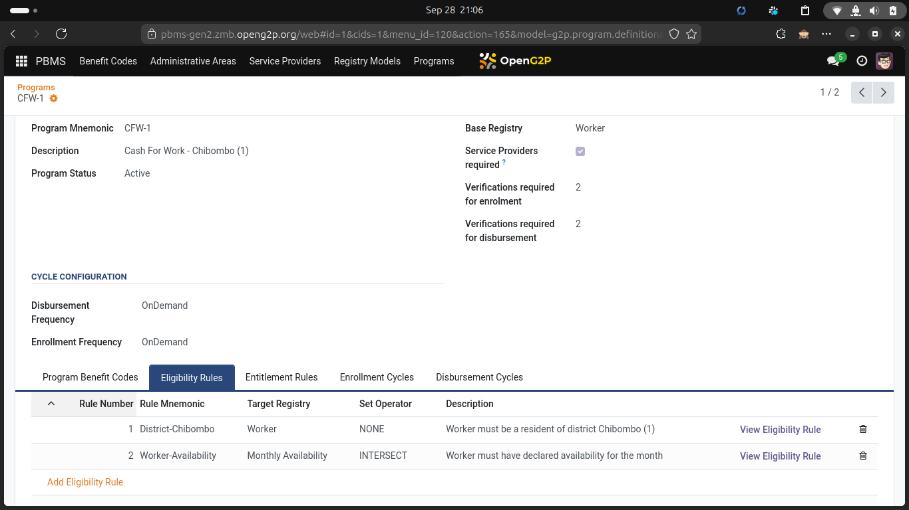
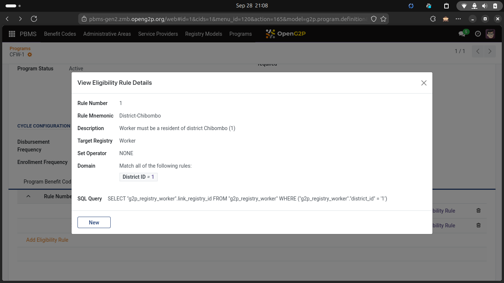
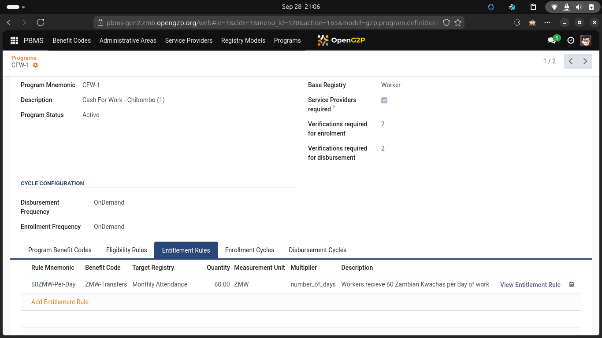

---
layout:
  width: default
  title:
    visible: true
  description:
    visible: false
  tableOfContents:
    visible: true
  outline:
    visible: true
  pagination:
    visible: true
  metadata:
    visible: true
---

# Rule definitions

### Eligibility rules

<figure><figcaption>
Screen showing Program associated with a list of Eligibility rules
</figcaption></figure>

<figure><figcaption>
Screen showing an Eligibility rule definition
</figcaption></figure>

### Entitlement rules

<figure><figcaption>
Screen showing a benefit program associated with an Entitlement rule
</figcaption></figure>

### Disbursement rules
