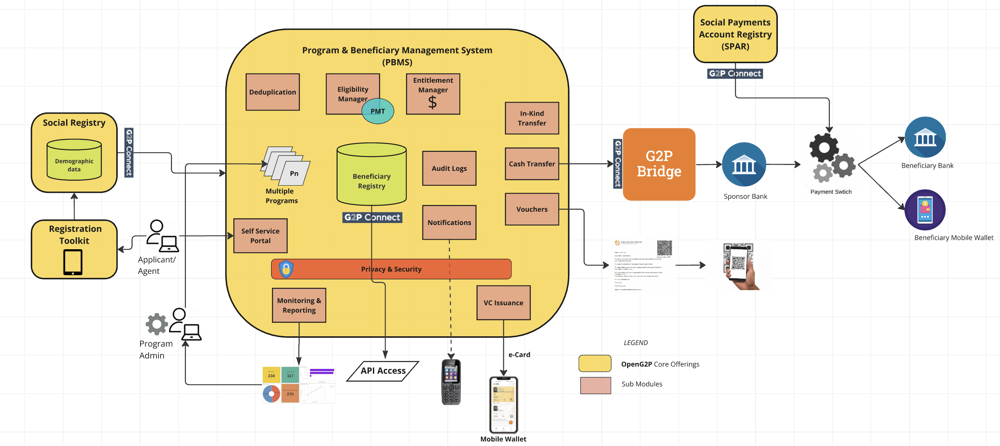
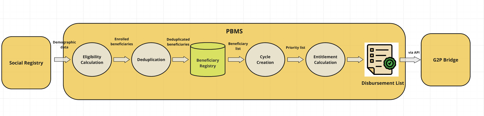

# PBMS

The **Program and Beneficiary Management System (PBMS)** of OpenG2P enables the management of multiple programs and beneficiaries.  PBMS provides user-friendly interfaces for program managers and, frontline workers, and beneficiaries to interact with a country’s social protection programs digitally. It also helps policymakers at higher levels of government get a bird’s eye view of program performance, beneficiary coverage, and public expenditure.

The PBMS is based on [Odoo ERP/MIS](https://www.odoo.com/) and leverages Odoo's strength of easily extending modules to implement new functionality. The underlying database used is [Postgres](https://www.postgresql.org/).

&#x20;Some of the key benefits for a country or an organisation using PBMS are:

* Manage **multiple** programs in one system
* Define eligibility and entitlement rules like [Proxy Means Test](features/eligibility/proxy-means-test.md) (**PMT)** to automatically create eligible beneficiaries
* Maintain[ **beneficiary registry**](functionality/beneficiary-management/beneficiary-registry/)**.**
* Enable [**digital cash transfer**](../g2p-bridge/) by seamlessly connecting to payment systems
* Offer [**self-service portal**](functionality/self-service-portal/) to residents
* Send [**notifications**](features/notifications/) to beneficiaries via SMS and email
* Issue digitally signed [**e-Vouchers**](features/disbursement-cycles/e-voucher.md) to beneficiaries
* **Share** beneficiary data with other systems/departments in an interoperable fashion
* Pull beneficiary data from other registries (departments) to avoid the collection of the same data multiple times

The functional architecture of PBMS is shown below.

<figure><figcaption></figcaption></figure>

## Benefit disbursement process flow

The visual below depicts the typical process flow from identifying beneficiaries to disbursement of benefits.  The primary demographic data resides in the Social Registry (a separate module) while the processing of this data to generate a disbursement list is carried out in the PBMS.  Notice that the PBMS holds the [Beneficiary Registry](functionality/beneficiary-management/beneficiary-registry/). &#x20;

<figure><figcaption></figcaption></figure>
