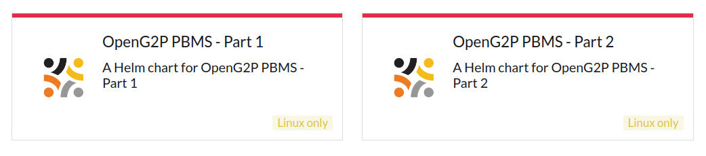

# Deployment

This document contains instructions for all the deployment of PBMS modules and their related components on the Kubernetes cluster using [Helm charts](https://docs.openg2p.org/pbms/deployment/helm-charts). All the components are installed in the same namespace. The methods used to achieve the deployment are:

* [Using Rancher UI ](./#installation-using-rancher-ui)
* [Using command line](./#installation-using-the-command-line)

## Prerequisites

Before you deploy, make sure the following are available:

* [Base infrastructure](https://docs.openg2p.org/deployment/base-infrastructure) including the domain name and certificates from Rancher and Keycloak.&#x20;
* PBMS's [Domain names and certificates](https://docs.openg2p.org/pbms/deployment/domain-names-and-certificates).&#x20;
* Nginx server configuration
  * A conf file is created under `sites-enabled` on Nginx containing the above SSL certs. See [sample conf file](https://github.com/OpenG2P/openg2p-deployment/blob/main/kubernetes/nginx/server.sample.conf).
* Rancher must have a Namespace created under a Project.
* [Project Owner](https://ranchermanager.docs.rancher.com/how-to-guides/new-user-guides/authentication-permissions-and-global-configuration/manage-role-based-access-control-rbac/cluster-and-project-roles#project-roles) permission to use the OpenG2P cluster's namespace.
* Gateways are setup for the domain as given here [Istio namespace setup](https://docs.openg2p.org/deployment/base-infrastructure/openg2p-cluster/cluster-setup/istio#namespace-setup).&#x20;

## Installation using Rancher UI

1. Log in to Rancher admin console.
2. Select your cluster.
3. Under _**Apps -> Repositories**_ click the _**Create**_ to add a repository.
4. Provide _**Name**_ as "openg2p" and target HTTPS _**Index URL**_ as [https://openg2p.github.io/openg2p-helm/rancher](https://openg2p.github.io/openg2p-helm/rancher) and click on _**Create**_.
5. Select the namespace in which you would like to install PBMS, from the namespace filter on the top-right.&#x20;
6. To display prerelease versions of OpenG2P apps, click on your user avatar in the upper right corner of the Rancher dashboard. Then click on _**Include Prerelease Versions**_ under _**Preferences**_ below the _**Helm Charts**_.
7. Navigate to **Apps->Charts** page on Rancher. You can find the _**OpenG2P PBMS**_ is listed in the dashboard.

<figure><figcaption></figcaption></figure>

7. Click the _**Part 1**_ Helm chart, select the version you want to install, and click on _**Install**_.
8. On the next screen, choose a name for installation, like `pbms.` Check the option _**Customise Helm**_ before the installation, and then click on _**Next**_.
9.  Navigate to each app's configuration page, and configure the following:

    1. Configure a hostname for each app in the following way. `<appname>.<base-hostname>` , where base hostname is the wildcard hostname chosen during [Istio namespace setup](https://docs.openg2p.org/deployment/base-infrastructure/openg2p-cluster/cluster-setup/istio#namespace-setup). Example: `pbms.dev.openg2p.org` and `odk-pbms.dev.openg2p.org` , etc. `<appname>` is arbitrary - default names have been provided.
    2. Your organization-wide Keycloak URL is _Keycloak Base Url_ . (Refer to [Keycloak installation](https://docs.openg2p.org/deployment/base-infrastructure/rancher#keycloak-installation)).
    3. Create a Keycloak client.
    4. Provide the OIDC Client details. Refer to [Keycloak Client Creation](https://docs.openg2p.org/deployment/deployment-guide/keycloak-client-creation) guide.
    5. Click on _**Next**_ to navigate to _**Helm Options**_ page. Disable `wait` flag. Click on _**Install**_.
    6. Navigate back to _**Apps->Charts**_ page on Rancher. Choose _**Part 2**_ Helm chart. Select the same version as for _**Part 1**_, and click on _**Install**_.
    7. On the next screen, give the same installation name as for _**Part 1**_ but with suffix `-p2` , like `pbms-p2`. Select the same namespace as _**Part 1**_. Check the option _**Customise Helm**_ before the installation, and click on _**Next**_.
    8. Follow the step 9 for other application installation.
    9. Watch for every pods to enter a _**Running**_ state. This may take several minutes.

    

## Installation using the command line

* Install the following utilities on your machine.
  * `kubectl`, `istioctl`, `helm`, `jq`, `curl`, `wget`, `git`, `bash`, `envsubst`.
* TBD

## Post installation

### Keycloak

**Assigning roles to users**

Create[ Keycloak client roles](https://www.keycloak.org/docs/latest/server\_admin/#con-client-roles\_server\_administration\_guide) for the following components and assign them to users.

| Component                           | Role name      |
| ----------------------------------- | -------------- |
| OpenSearch Dashboards for logging   | `admin`        |
| OpenSearch Dashboards for Reporting | `admin`        |
| Apache Superset                     | `Admin`        |
| Minio Console                       | `consoleAdmin` |
| Kafka UI for Reporting              | `Admin`        |

**Assigning roles to clients**

* Create a realm role in Keycloak with the name "KEYMANAGER\_ADMIN" and assign it as a service account role to the PBMS Keycloak client in order for PBMS to be able to access Keymanager APIs.

#### Odoo 

* Refer the [Odoo post-install guide](https://docs.openg2p.org/deployment/deployment-guide/odoo-post-install-configuration) to activate Odoo modules.
