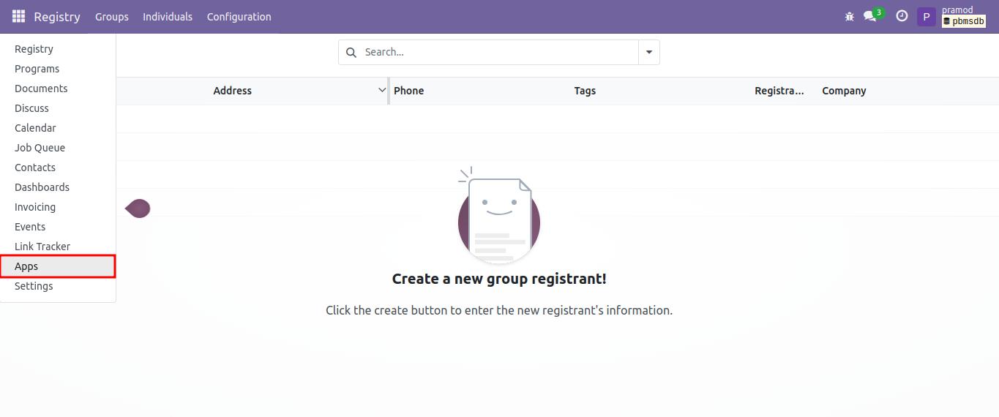
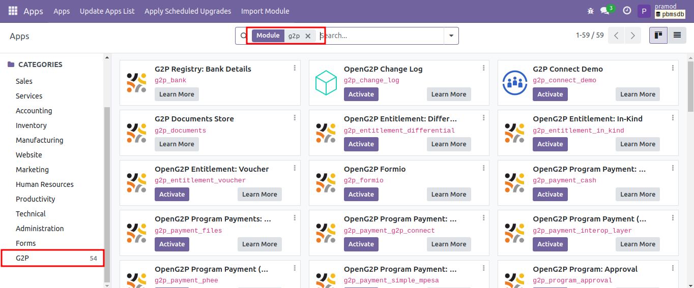

---
layout:
  title:
    visible: true
  description:
    visible: false
  tableOfContents:
    visible: true
  outline:
    visible: true
  pagination:
    visible: true
---

# Installation of Odoo Modules

This document provides instructions on installing modules applicable to PBMS from the Odoo platform.

## Procedure

1. Use the link [https://pbms.explore.openg2p.org/](https://pbms.explore.openg2p.org/web/login) and login with valid credentials to access the PBMS module.
2. Click the main menu icon  and select _**Apps**_.

<figure><figcaption></figcaption></figure>

Apps screen is displayed.

3. Click the _**G2P**_ from the _**CATEGORIES**_ menu in the left pane.

<figure><figcaption></figcaption></figure>

You can find all the modules applicable for PBMS in the right pane.

4. Choose the module, click the _**Install/Activate**_ button to install the module based on your project requirements.&#x20;


* In Odoo 15.0, click the _**Install**_ button, and in Odoo 17.0, click the _**Activate**_ button to install the module based on your project requirements.&#x20;


Or

You can enter the module name in the _**Search**_ field to choose the module to install based on your project requirements.

5. Click the _**Upgrade**_ button to upgrade to the latest version of the module.
6. Click the _**Learn More**_ button to learn about OpenG2P.
7. Click the  icon

| Feature     | Description                                |
| ----------- | ------------------------------------------ |
| Module Info | It contains the information of the module. |
| Learn More  | It navigates to the OpenG2P website page.  |

* In Odoo 15.0, after the successful installation, the status of the module is changed from Install to Installed.
* In Odoo 17.0, the _**Activate**_ button will not be available after the successful installation of the module.

Similarly, you can activate the other modules for PBMS based on your project requirements.
