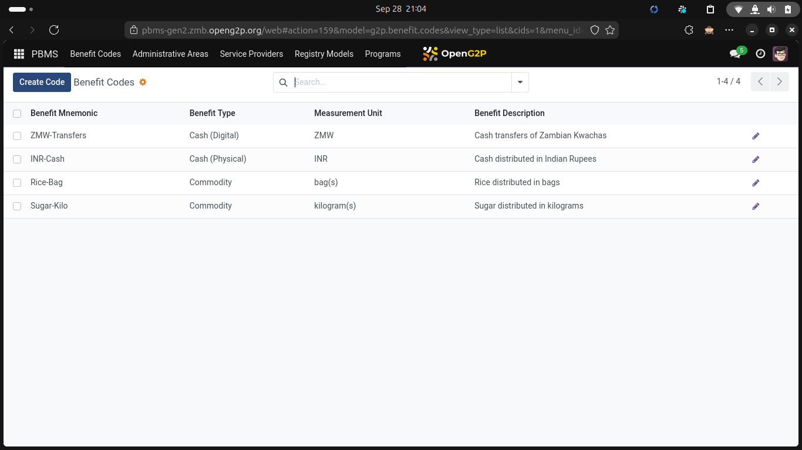
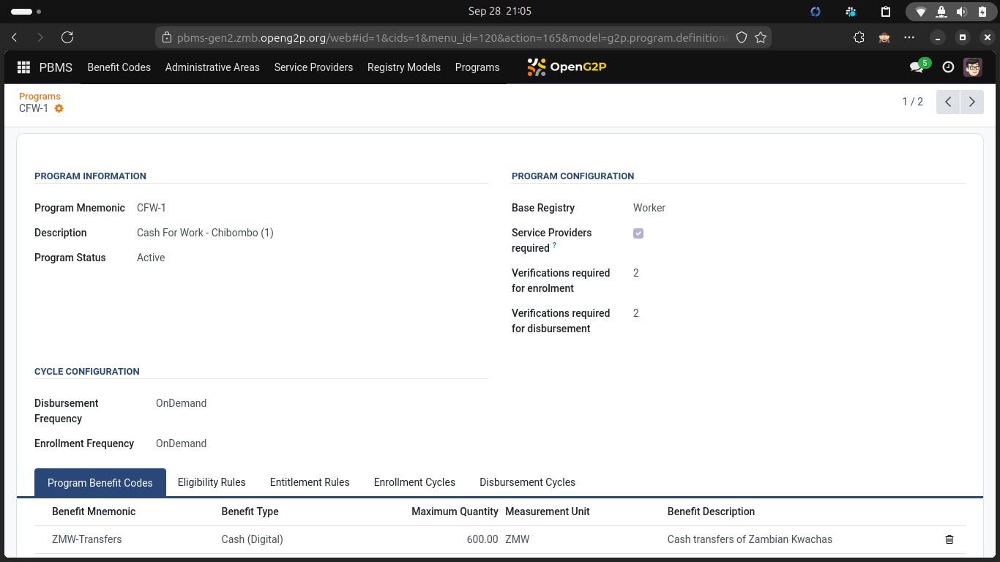
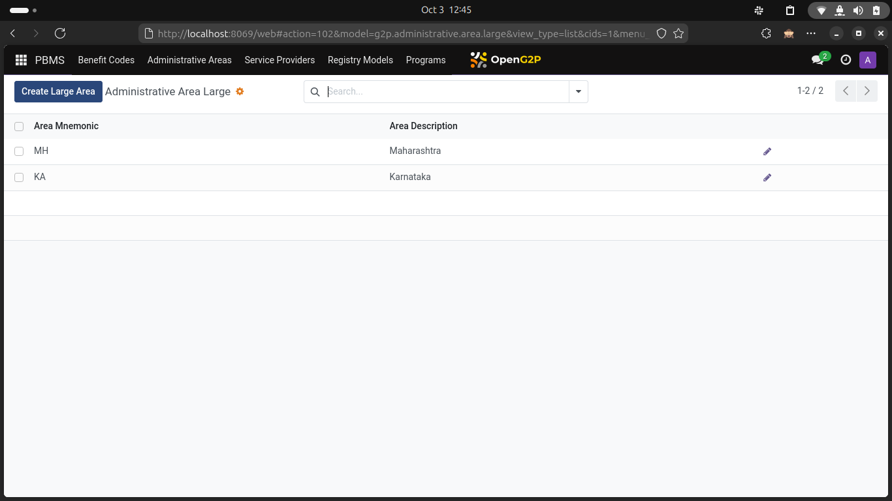
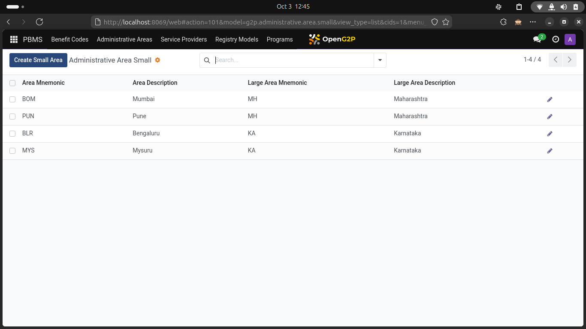
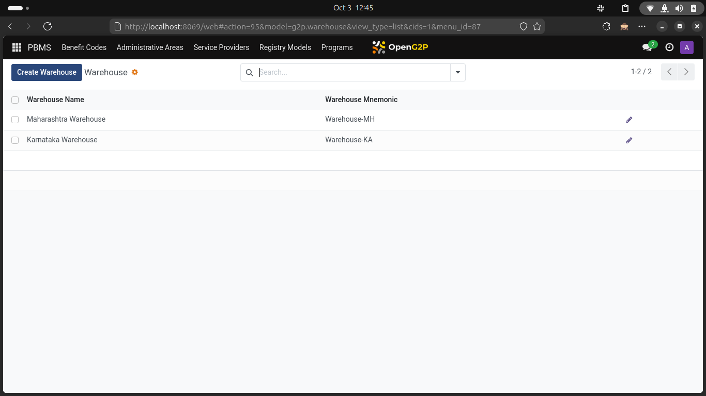
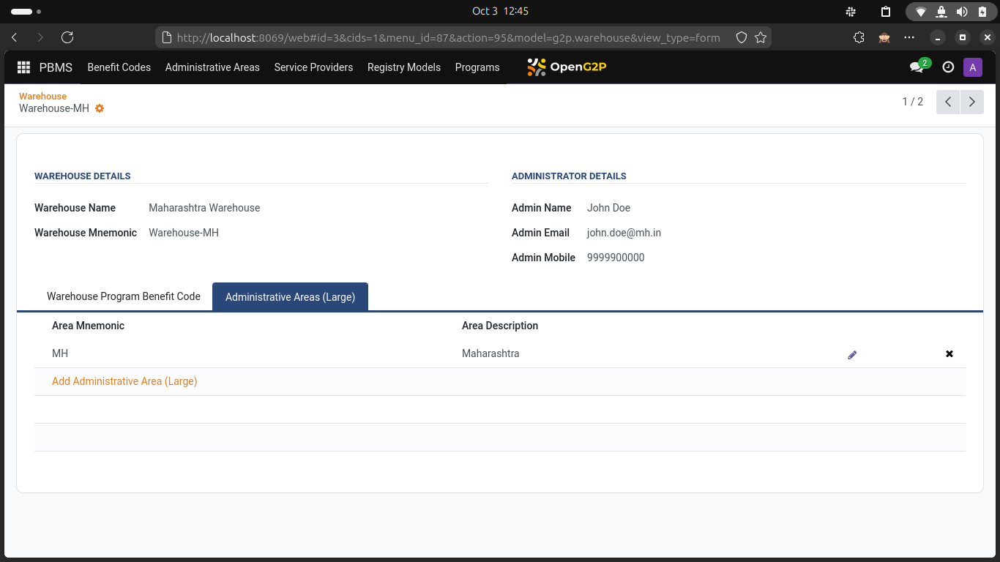
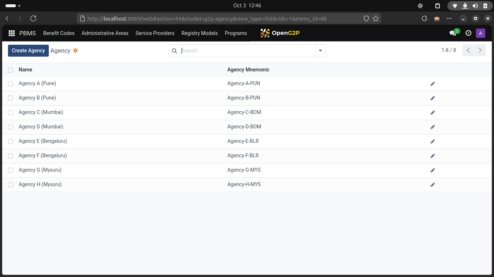
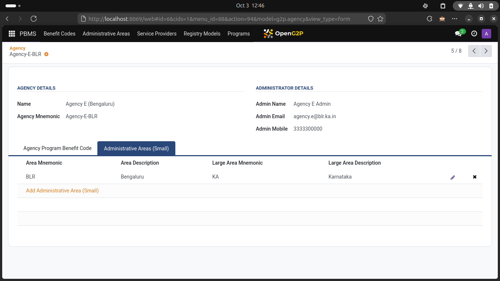

# Static definitions

### <mark style="color:blue;">Benefit Codes</mark>

Configure a list of benefit codes (products) that are disbursed by the various programs. Benefit Codes are broadly classified into the following types

* CASH\_DIGITAL — Cash benefits, distributed digitally using direct credits into beneficiary bank accounts or mobile wallets. It is mandatory for Beneficiary financial addresses to be maintained in SPAR (ID-Account Mapper) in case of CASH\_DIGITAL. The Measurement unit for CASH\_DIGITAL will be restricted to ISO Currency codes.
* CASH\_PHYSICAL - Cash benefits, distributed physically. The platform assumes that there will be an agency (service provider) involved in this chain. The Agency will have agents on the ground (field agents) who will physically distribute cash. The department will transfer the required funds to the Agencies by directly transfers into the Agencies' bank accounts. The Measurement unit for CASH\_DIGITAL will be restricted to ISO Currency codes.
* COMMODITY - All physical goods such as staples, books, grains and fuel will come under this category.
* SERVICE - Applicable when the department provides services such as health screenings to the public.
* COMBINATION - Applicable when a benefit includes both a commodity plus a service bundled. E.g. a vaccine will involve a physical vaccine vial plus the service of administering the vaccine.

<figure><figcaption>
Screen showing list of Benefit codes
</figcaption></figure>

#### Tables involved

1. g2p\_benefit\_codes

### <mark style="color:blue;">Program Definition</mark>

You configure the benefit programs which govern the benefit distribution. The key attributes that you define in a benefit program are as follows

1. Target Registry - This attribute indicates the registry from where the beneficiaries' list will be drawn. Mapping a target registry to a program will allow you to define eligibility, priority and entitlement rules using the attributes of the registry. For this, you have to ensure that the target registry is made available as an "ABSTRACT CLASS" in your PBMS Odoo instance. Detailed instructions on how to make this Abstract class available to the PBMS Odoo, can be found in here.
2. Enrolment Frequency - This specifies how frequently will you refresh the Beneficiary List under the program. New enrolments are done by creating a new enrolment cycle. New enrolments typically involve field agents verifying existing beneficiaries, striking out beneficiaries who no longer qualify and adding new beneficiaries. You can also have changes administered through self service portals or integration with Civil Registry APIs or a combination of all of these methods.
3. Disbursement Frequency - This specifies how frequently will you make disbursements under this program. Typically you will Disburse far more frequently than you Enrol. For e.g. you might have an annual enrolment frequency with a monthly disbursement frequency.
4. Benefit Codes - You need to associate a list of Benefit codes with a Program. A program can disburse one or more Benefit codes (products / services) to its beneficiaries. You also need to create entitlement rules for every benefit code associated with the Program.
5. Eligibility Rules - You need to define a set of rules that make a registrant eligible to qualify as a beneficiary under this program. You can use the Target Registry - attributes to define these eligibility rules.
6. Entitlement Rules - You need to define a set of rules that will compute an entitlement (of a benefit code) for a given beneficiary. You need distinct entitlement rules for every benefit code associated with the Program.

<figure><figcaption>
Screen showing list of Benefit codes
</figcaption></figure>

<figure><figcaption>
Screen showing Program associated with Benefit codes
</figcaption></figure>

#### Tables involved

1. g2p\_program\_definition (primary table that stores the program definition)
2. g2p\_benefit\_codes\_g2p\_program\_definition\_rel (benefit codes for a program)
3. g2p\_eligibility\_rule\_definition (eligibility rules for a program)
4. g2p\_entitlement\_rule\_definition (entitlement rules for a program)

### <mark style="color:blue;">Geographic Administrative Zones</mark>

When a benefit program involves physical distribution of goods and services, geography assumes significance. To enable the necessary configurations, the PBMS platform provides you two types of Geographic Administrative Zones

#### Geographic Administrative Zone - Large

This is a large zone (examples include - States or Districts). Depending on your situation, you can configure any of your relevant Geographic Administrative Zone as a GAZ-Large.

<figure><figcaption>
Screen showing list of Geo administrative areas - Large
</figcaption></figure>

#### Geographic Administrative Zone - Small

This is a small zone within a Large Zone. A typical Large Zone will consider a number of small zones. Examples of small zones will include - Post Codes, Localities and Streets.

A beneficiary address should necessarily consist of a Large Zone and a Small Zone.

<figure><figcaption>
Screen showing list of Geo administrative areas - Small
</figcaption></figure>

#### Tables involved

### Warehouses

When a program involves physical distribution of goods and services, the program administering department needs to liaise with a warehouse, where the goods are stored. Depending on the geographical spread of the beneficiaries, the department will likely appoint agencies who then procure the goods from these warehouses and do the actual distribution.&#x20;

You need to maintain Warehouses and also associate these warehouses to the Geography (large) and the Benefit Codes. Because you might use specific warehouses for certain geographical zones (driven by proximity and ease of transport). Similarly, there might be specific warehouses for specific goods.&#x20;

Based on these constraints, you have to map Warehouses to Geographic Administrative Zones (Large) and to one or more Benefit. Codes.

During disbursement, the PBMS platform will automatically allocate Warehouses depending on these configurations.

<figure><figcaption>
Screen showing list of Warehouses
</figcaption></figure>

<figure><figcaption>
Screen showing Warehouse associated with Geo administrative area - Large
</figcaption></figure>

#### Tables involved

### Agencies

Similar to Warehouses, when a benefit program involves physical distribution of goods and services, a government department typically empanels agencies who help with the actual delivery on the field.&#x20;

These agencies are chosen based on their presence on the field. Agencies typically have a zone of operation. Similarly, not all agencies are equipped to handle all goods and services. So based on these capabilities, you have to map agencies to GAZ-small and Benefit Codes.

During disbursement, the PBMS platform will automatically allocate Agencies depending on these configurations.

<figure><figcaption>
Screen showing list of agencies
</figcaption></figure>

<figure><figcaption>
Screen showing agency associated to Geo administrative area - Small
</figcaption></figure>

