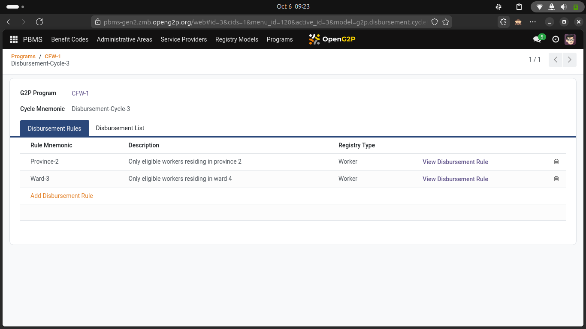
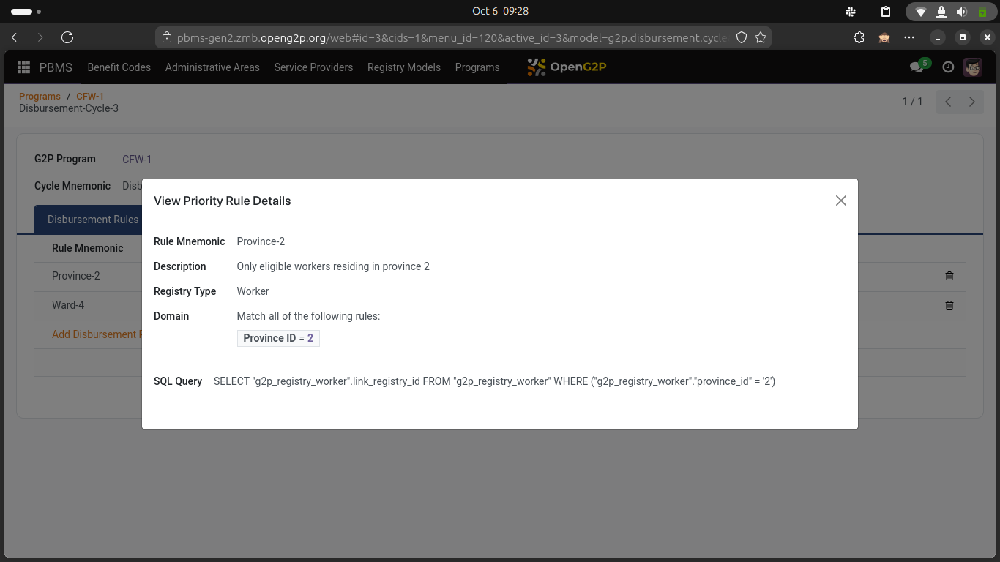

# Rule definitions

### Eligibility rules

<figure><figcaption>
Screen showing Program associated with a list of Eligibility rules
</figcaption></figure>

<figure><figcaption>
Screen showing an Eligibility rule definition
</figcaption></figure>

### Entitlement rules

<figure><figcaption>
Screen showing a benefit program associated with an Entitlement rule
</figcaption></figure>

### Disbursement rules

<figure><figcaption>
Screen showing Disbursement Rules for a Benefit Program - Disbursement Cycle
</figcaption></figure>

<figure><figcaption>
Screen showing Disbursement rule definition
</figcaption></figure>
