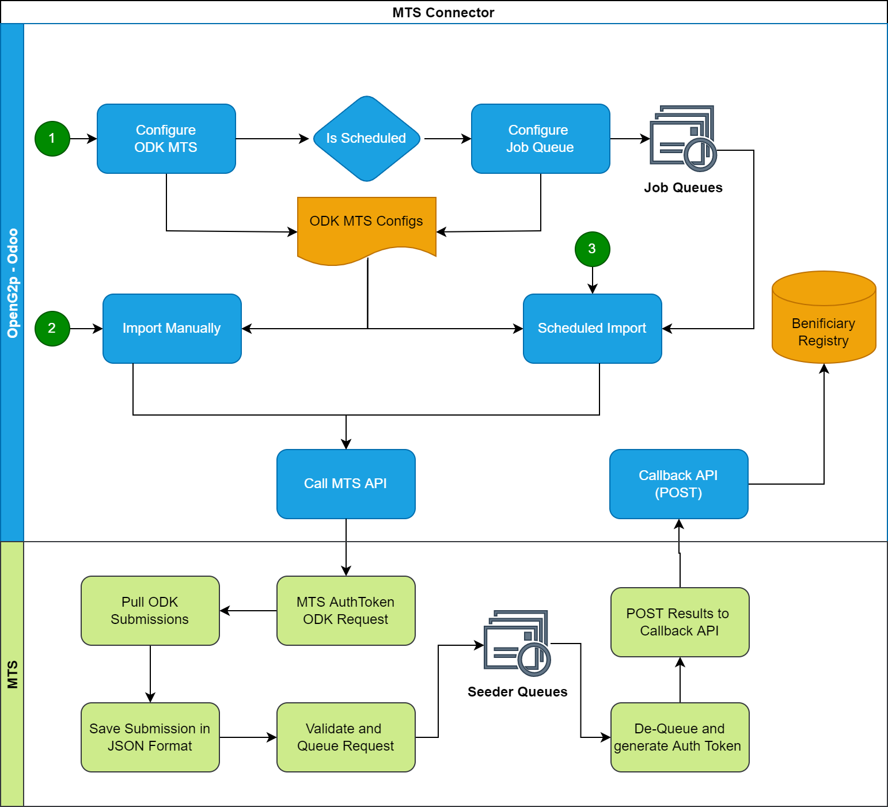

# MTS Connector

### Module name

mts\_connector

### Module title

MTS Connector

### Technology base

odoo

### Functionality

* Generates MOSIP token while fetching from the ODK
* Uses callback delivery type of MTS
* Completely asynchronous execution
* OpenG2P can schedule a daily job to fetch the delta for the day
* A manual import feature will also be provided

### Design notes

NA

### Dependencies

This module relies on the following external libraries and modules:

* base
* queue\_job
* Python : pyjq

### User interface

<figure><figcaption></figcaption></figure>

### Configuration

## Input

In OpenG2P, the user can configure for following fields to setup an interface with MTS.

**Name**: A string to identify the connector

**URL to reach MTS**: URL for MTS API

**MTS Input type**: MTS-C connects over "_ODK_" which is the first option in this selection. OMC option could be proceeded by selecting "_OpenG2P Registry_".

**Mapping**: MTS Field mapping as required by the API. Please refer [MTS Documentation\*\*.\*\* ](../../functionality/mts-connector/)Format of Mapping would be JSON.

**Output Type**: MTS-C only supports JSON output type of MTS.

**Output Format**: Output format is a [JQ ](https://stedolan.github.io/jq/)string which will be used by MTS to format its output to suite the caller's requirement.

**Delivery Type**: Currently supporting only "Callback". Callback feature can be used to make MTS do a submission of results onto an API within Odoo. The output formatting will help in making the desired input for the api.

**Job Type**: MTS-C provide both recurring and one time execution. Recurring can be configured to do continuous pull from the ODK over MTS.

**Interval in minutes**: Interval at which the MTS-C job runs.

**MOSIP Language**: Mosip language setup. Default is "_eng_".

**ODK Base URL**: Base URL or the complete domain address for the ODK central installation

**ODK Odata url** : OData service (.svc) URL for the ODK form to fetch the submissions.

**ODK User email**: Email Id to authenticate MTS for accessing Odata URL

**ODK User password**: Password used to authenticate Odata URL

**Callback URL**: A URL end point which would be called upon successful processing at MTS

**Callback HTTP Method**: HTTP Method (POST/PUT/GET/PATCH) used while MTS makes the callback

**Callback Timeout**: Timeout awaited by the callback until acknowledged with a response.

**Callback Auth Type**: Type of authentication expected by callback url. MTS-C currently support Odoo type which uses the session-based authentication implemented by Odoo.

**Callback Auth Database**: DB instance used by Odoo.

**Callback auth username**: Username to access callback api

**Callback auth password**: Password to access callback api

### Source code

[https://github.com/OpenG2P/openg2p-mts/tree/15.0-develop/mts\_connector](https://github.com/OpenG2P/openg2p-mts/tree/15.0-develop/mts\_connector)
