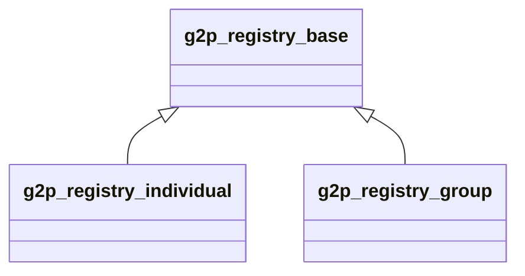

# G2P Registry: Base

### Module name

g2p\_registry\_base

### Module title

G2P Registry: Base

### Technology base

[Odoo](https://www.odoo.com/), Rest Api

### Functionality

This module is a base app to facilitate registration as an individual or group. The module establishes core fields and views applicable to registration process in general. The module in itself is not complete. It required an extension to be usable as a registration module. `res_partner` module in odoo is extended here and is used as registries or beneficiaries for OpenG2P. `g2p_registry_individual` and `g2p_registry_group` are examples of such extensions. The module adds following functionalities which are common for individual and group registries.

* ID Types
* Registrant Tags
* Relationships

### Design notes

* Module extends the `res_partner` model
* This is an abstract module extendable for specialised registries.

### Relationships with other entities

### Dependencies

NA

### User interface

Menu Added

* Registry
* Settings --> G2P Registry Settings

Views

* ID Type
* Registrant Tags
* Relationship
* G2P Registry Settings

### Configuration

G2P Registry Settings : A field to accept regex string to validate phone number.

### Error codes

NA

### Source code

[https://github.com/OpenG2P/openg2p-registry/tree/15.0-1.1.0/g2p\_registry\_base](https://github.com/OpenG2P/openg2p-registry/tree/15.0-1.1.0/g2p\_registry\_base)

### Installation

Standard odoo package installation

###
