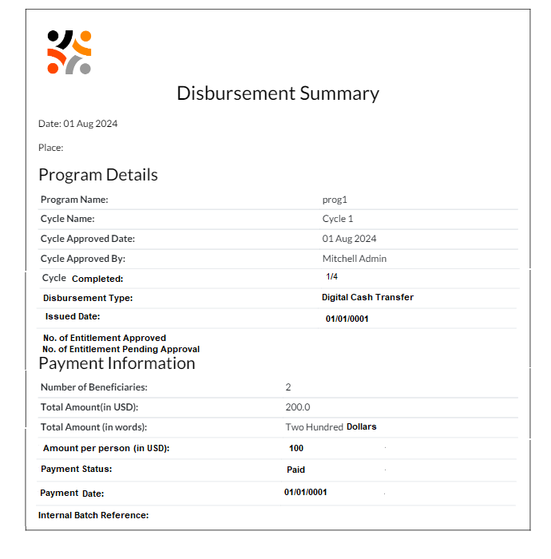

---
layout:
  title:
    visible: true
  description:
    visible: false
  tableOfContents:
    visible: true
  outline:
    visible: true
  pagination:
    visible: true
---

# Print Disbursement Summary

A disbursement summary provides information on the amount of funds/entitlements allocated to registrants/beneficiaries who meet program cycle eligibility requirements.  A _**Print Disbursement Summary**_ is a feature that allows the user to print the list of funds/entitlements allocated following the [cycle approval](https://docs.openg2p.org/pbms/functionality/disbursement-cycles/in-kind-transfer/user-guides/create-and-approve-disbursement-cycle).&#x20;

The user must have an Administrator, Program Manager, or Cycle manager role to access this functionality.

## Feature and functionality

<table><thead><tr><th width="280">Feature</th><th>Functionality</th></tr></thead><tbody><tr><td><strong>Print</strong> <strong>Summary</strong></td><td><ul><li>After the Cycle approval, a <em><strong>Print Summary</strong></em> button appears in the relevant Cycle screen.</li><li>Click the <em><strong>Print Summary</strong></em> button to print the Disbursement summary of the appropriate program cycle in PDF format.</li></ul></td></tr></tbody></table>

## Disbursement summary

The page for the Disbursement Summary is depicted in the image below. The Disbursement Summary page contains comprehensive information, including program details, payment information and disbursal amounts. This provides a clear synopsis of the total amount allocated in the relevant program cycle.

<figure><figcaption></figcaption></figure>

Notes:

Requirements may involve customising the Disbursement Summary page.&#x20;

## Benefits of the feature

* **Enhanced Transparency:** A concise, printed report provides users with insight into the program's disbursement information.
* **Efficient Verification:** Expedites the process of validating and verifying disbursal amounts, improving operational effectiveness and streamlining the management process.
* **Documentation:** It provides an official record with the beneficiary count, cycle approval date and approver's name on it.

## Related user guides
