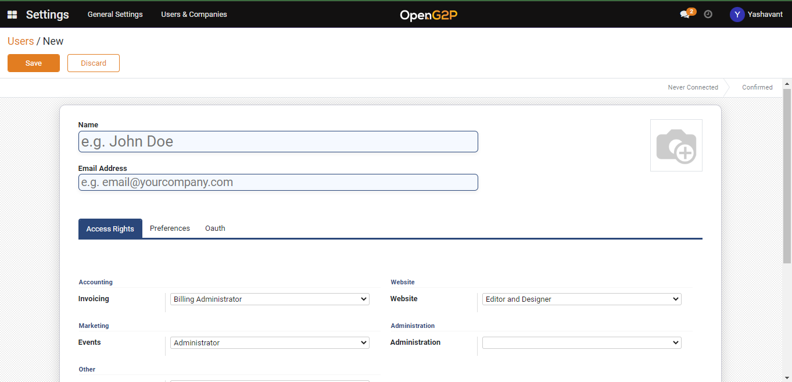
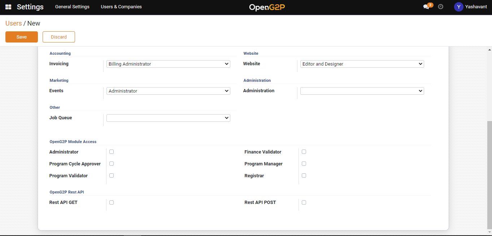
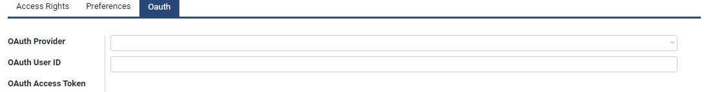

---
layout:
  title:
    visible: true
  description:
    visible: false
  tableOfContents:
    visible: true
  outline:
    visible: true
  pagination:
    visible: true
---

# Create User and Assign Role

## Description

This document contains the step-by-step instructions to create a new user and assign a role. A person who has admin access can create a new user and assign a role.

## Pre-requisites

A user should have an admin access to create a new user and assign a role.

## Procedure

1. In the menu bar, click the icon  and select _**Settings**_.
2. The _**Settings**_ screen is displayed

<figure><figcaption>
Choose Settings Screen
</figcaption></figure>

<figure><figcaption>
Settings Screen
</figcaption></figure>

3. Click the _**User & Companies**_ tab and then select _**Users**_.

<figure><figcaption>
Users Screen
</figcaption></figure>

4. The _**Users**_ screen is displayed. It is a dashboard which lists the details of all the available Users Name, Login, Language and their Latest authentication.

In _**Users**_ screen, the available features and their descriptions are:

<table><thead><tr><th width="130">Feature</th><th>Description</th></tr></thead><tbody><tr><td>Create</td><td>Click the <em><strong>Create</strong></em> button to create new user</td></tr><tr><td></td><td>Click the <em><strong>Export All</strong></em> button to download Users details in excel format</td></tr><tr><td>&#x3C;</td><td>Click the <em><strong>Left</strong></em> arrow to go the previous screen</td></tr><tr><td>></td><td>Click the <em><strong>Right</strong></em> arrow to go the next screen</td></tr><tr><td></td><td>Click the <em><strong>List</strong></em> icon to view the Users details in list view</td></tr><tr><td></td><td>Click the <em><strong>Kanban</strong></em> icon to view the Users details in kanban view</td></tr><tr><td>Filters</td><td>
Click the <em><strong>Filters</strong></em> link and select the appropriate options. 

The valid values are: 
<ul><li>Internal User</li><li>Inactive User </li><li>Two-factor authentication enabled</li><li>Two-factor authentication disabled</li><li>Add Customer Filter</li></ul>
The advanced filter option allows you to define conditions and criteria to refine the search results.
<ul><li>Select the <em><strong>Add Customer filter</strong></em> and then select the appropriate option in the first drop-down to display the specific data based on the option selected.</li><li>Select the criteria in second and third drop-down to refine the search results. </li><li>Click the <em><strong>Apply</strong></em> button to display the data based on the search</li></ul>
<em>Note: To enhance the search, click the <strong>Add a condition</strong> button and follows the steps given in <strong>Add Customer Filter</strong> option</em>
</td></tr><tr><td>Group By</td><td><ul><li>Click the <em><strong>Group By</strong></em> link, select <strong>Add Custom Group</strong> and then select the appropriate options in the drop-down to display the specific data based on the option selected.</li><li>Click the Apply button to display the data based on the search</li></ul></td></tr><tr><td>Favorites</td><td><ul><li>
Click the <em><strong>Favorites</strong></em> link, select <strong>Save current search</strong> and then check the appropriate options. The valid values are: 
<ul><li>Use by default</li><li>Share with all users</li></ul></li><li>Click the <em><strong>Save</strong></em> button to display the data based on the search</li></ul></td></tr><tr><td>Search</td><td>This field is filled when the available option are selected in Filers, Group By, Favorites</td></tr></tbody></table>

5. Click the _**Create**_ button. The **Users/New** screen is displayed.

<figure><figcaption></figcaption></figure>

In _**Users/New**_ screen, the available features and their descriptions are:

<table><thead><tr><th width="166">Feature</th><th>Description</th></tr></thead><tbody><tr><td>Name</td><td>Enter the new user name</td></tr><tr><td>Email Address</td><td>Enter the valid email Id. of the user. The invitation email will be sent to this email address.</td></tr><tr><td></td><td><ul><li>Select the icon, click the edit icon and then navigate to the user photo where it is stored</li><li>Export the user photo</li><li>Click the delete icon to delete the user photo</li></ul></td></tr><tr><td>Save</td><td>Click the <strong>Save</strong> button to save the data</td></tr><tr><td>Discard</td><td>Click the <strong>Discard</strong> button to close the Users / New screen</td></tr></tbody></table>

### **Access Right**

OpenG2P offers several modules and tools to digitize processes of social benefit delivery chain. A user who has admin rights provides access rights to an individual based on his/her role to use modules offered by OpenG2P. This allows the individual to know which module they can use based on their roles.

6. Click the _**Access Rights**_ tab.
7. The features available in _**Access Rights**_ tab are displayed.

<figure><figcaption></figcaption></figure>

8. In _**Access Rights**_ tab, the available features and their descriptions are:

<table><thead><tr><th width="280">Feature</th><th>Description</th></tr></thead><tbody><tr><td><strong>Accounting</strong></td><td>
<strong>Invoicing</strong>

Select the appropriate role in the drop-down. The valid values are:
<ul><li>Billing</li><li>Billing Administrator</li></ul></td></tr><tr><td><strong>Inventory</strong></td><td>
<strong>Inventory</strong>

Select the appropriate role in the drop-down. The valid values are:
<ul><li>User</li><li>Administrator</li></ul></td></tr><tr><td><strong>Website</strong></td><td>
<strong>Website</strong>

Select the appropriate role in the drop-down. The valid values are:
<ul><li>Restricted Editor</li><li>Editor and Designer</li></ul></td></tr><tr><td><strong>Marketing</strong></td><td>
<strong>Events</strong>

Select the appropriate role in the drop-down. The valid values are:
<ul><li>Registration Desk</li><li>User</li><li>Administrator</li></ul></td></tr><tr><td><strong>Administration</strong></td><td>
<strong>Administration</strong>

Select the appropriate role in the drop-down. The valid values are:
<ul><li>Registration Desk</li><li>User</li><li>Administrator</li></ul></td></tr><tr><td><strong>Other</strong></td><td>
<strong>Helpdesk</strong>

Select the appropriate role in the drop-down. The valid values are:
<ul><li>User: Personal tickets</li><li>User: Team ticktets</li><li>User</li><li>Helpdesk Manager</li></ul>
<strong>Job Queue</strong>

Select the appropriate role in the drop-down. The valid value is:
<ul><li>Job Queue Manager</li></ul></td></tr><tr><td><strong>OpenG2P Module Access</strong></td><td>
Check the appropriate role. The valid values are:
<ul><li>Administrator</li><li>Finance Validator</li><li>Program Cycle Approver</li><li>Program Manager</li><li>Program Validator</li><li>Registrar</li><li>Support Person</li></ul></td></tr><tr><td><strong>OpenG2P Documents Module</strong> </td><td>

Check the appropriate option. The valid values are:
<ul><li>Document Admin</li><li>Document Write</li><li>Document Read</li></ul></td></tr><tr><td><strong>OpenG2P Rest API</strong></td><td>

Check the appropriate option. The valid values are:
<ul><li>REST API GET</li><li>REST API POST</li></ul></td></tr><tr><td><strong>Other</strong></td><td>

Check the appropriate option. The valid values are:
<ul><li>View Server Environment Configuration</li></ul></td></tr><tr><td><strong>Save</strong></td><td>Click the <strong>Save</strong> button to save the data</td></tr><tr><td><strong>Discard</strong></td><td>Click the <strong>Discard</strong> button to close the Users / New screen</td></tr></tbody></table>

### **Preference**

The admin user sets the user preference in the preference section.&#x20;

9. Click the **Preference** tab.  The features in **Preference** tab are displayed.

<figure><figcaption>
Preferences
</figcaption></figure>

In Preference tab, the features and their descriptions are:

<table><thead><tr><th width="223">Feature</th><th>Description</th></tr></thead><tbody><tr><td><strong>Localization</strong></td><td></td></tr><tr><td>Language</td><td>Select the user preferred language in the drop-down.</td></tr><tr><td>Timezone</td><td>Select the user preferred timezone in the drop-down.</td></tr><tr><td>Notification</td><td>
Click the appropriate radio button. 
<ul><li>Handle by Emails</li><li>Handle in Odoo </li></ul></td></tr><tr><td>Email Signature</td><td>Enter the User Email Signature</td></tr></tbody></table>

### OAuth

OAuth is the preferred method of authentication to access the OpenG2P documents and modules. The external application gets a token which authorizes access to documents and modules of OpenG2P. All the documents and the modules are secured/protected using Standard OAuth.&#x20;

10. Click the OAuth tab. The features available in OAuth are displayed.

<figure><figcaption>
OAuth
</figcaption></figure>

In OAuth tab, the available features and their descriptions are:

<table><thead><tr><th width="213">Feature</th><th>Description</th></tr></thead><tbody><tr><td>OAuth Provider</td><td>
Select the appropriate option in the drop-down. The valid values are:
<ul><li>eSignet MOSIP Collab</li><li>Facebook Graph</li><li>Google OAuth2</li><li>Odoo.com Accounts</li><li>Start typing - Type the OAUth provider, if you have OAuth provider other than the one mentioned above </li></ul></td></tr><tr><td>OAuth User ID</td><td>Enter the OAuth user ID</td></tr><tr><td>OAuth Access token</td><td>Enter the valid Access token </td></tr><tr><td></td><td></td></tr></tbody></table>

