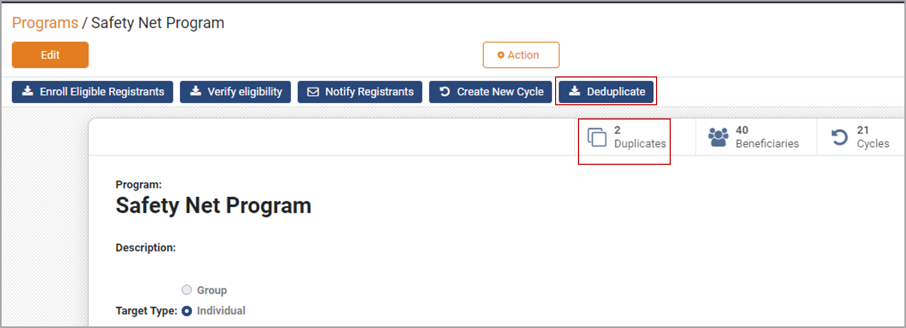

---
layout:
  title:
    visible: true
  description:
    visible: false
  tableOfContents:
    visible: true
  outline:
    visible: true
  pagination:
    visible: true
---

# Deduplication

Deduplication refers to the process of removing duplicate entries in the program, thus avoiding double-dipping, and merging all the demographic fields associated with an individual/group into a single record.

## Deduplication Manager

The OpenG2P registry allows multiple entries for the same registrant. Hence once the registrants are enrolled in the program as beneficiaries, they should be deduplicated. OpenG2P Deduplication Managers can deduplicate the beneficiaries based on foundational/functional IDs, and phone numbers.

Note:&#x20;

* Each program in the OpenG2P platform should have at least one Deduplication Manager configured
* A separate Deduplication Manager must be created and configured for a program

OpenG2P platform supports three types of Deduplication Managers.

| Deduplication Manager              | Description                                                                                                                                                                                                                                |
| ---------------------------------- | ------------------------------------------------------------------------------------------------------------------------------------------------------------------------------------------------------------------------------------------ |
| Default Deduplication Manager      | This Deduplication Manager is assigned to each program by default. The program maanger runs the Deduplication Manager if they are sure of unique registration entries, as it is mandatory to configure at least one Deduplication Manager. |
| ID Deduplication Manager           | ID Deduplication Manager deduplicates the registrants based on the their ID. The program manager should configure the ID type that will be used for deduplication.                                                                         |
| Phone number Deduplication Manager | Phone number Deduplication Manager deduplicates the registrants based on their phone numbers. This Deduplication Manager is often configured along with the ID Deduplication Manager.                                                      |

## Deduplication Manager configuration

In the OpenG2P program, the process involved to configure eligibility manager are:&#x20;

1. Program manager must create at least one Deduplication Manager for each Deduplication Manager type required.&#x20;
2. After Deduplication Manager(s) is created, program manager adds Deduplication Manager to a program.&#x20;

## Deduplicating registrants

Deduplication of registrants is a one-click operation once Deduplication Managers are added to the program. The Deduplication Manager does not distinguish between original and duplicate records, and all beneficiaries with the same field value - as configured for duplicate detection - are listed as duplicates.

For example, number of duplicate entries are recorded, as shown in the below image.

<figure><figcaption>
Duplicate entry
</figcaption></figure>

## Deduplicating individuals

The Deduplication Manager also supports deduplication for the scenario in which the program manager or the approving authorities approve the [entitlement ](../entitlement/)of a single individual. The demographics of the individual will be deduplicated against that of every enrolled beneficiary.

If the program supports multiple entitlements for the same individual, then this deduplication can be skipped. It is assumed that in such a case, there are other mechanisms to ensure that double-dipping is prevented.

On the whole, these features provide flexibility for the program manager to implement a wide variety of social protection programs.

## Related user guides

[Deduplicate Registrants](https://app.gitbook.com/o/bnTr6Kp4z4CXR4QVIPSa/s/JZcdob2emEcLMvLyIxqT/\~/changes/176/pbms/features/deduplication/user-guides/deduplicate-registrants)

[Create Deduplication Manager Types](https://app.gitbook.com/o/bnTr6Kp4z4CXR4QVIPSa/s/JZcdob2emEcLMvLyIxqT/\~/changes/176/pbms/features/deduplication/user-guides/create-deduplication-manager-types/\~/page)

[Create Deduplication Manager under Program](https://app.gitbook.com/o/bnTr6Kp4z4CXR4QVIPSa/s/JZcdob2emEcLMvLyIxqT/\~/changes/176/pbms/features/deduplication/user-guides/create-deduplication-manager/\~/page)

##
