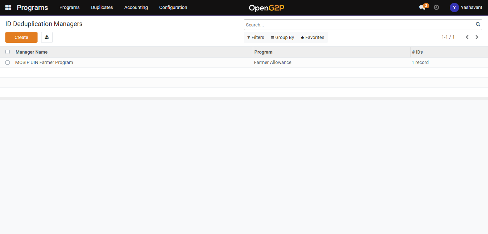
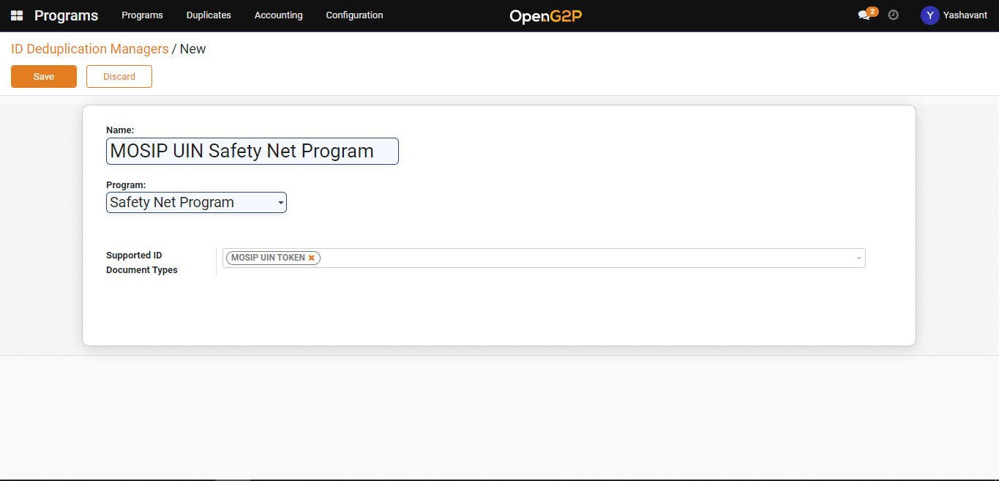
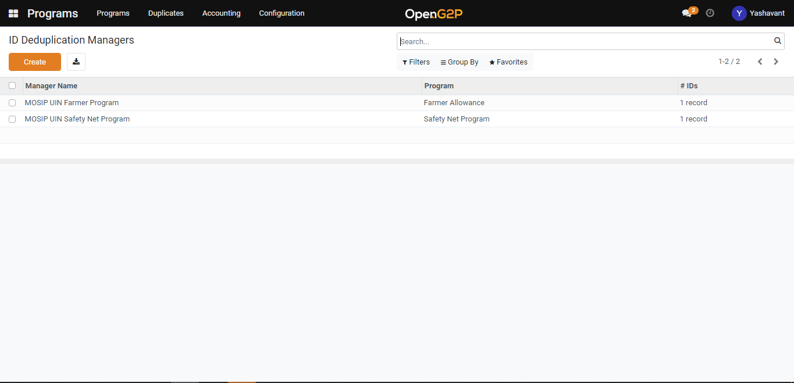

---
layout:
  title:
    visible: true
  description:
    visible: false
  tableOfContents:
    visible: true
  outline:
    visible: true
  pagination:
    visible: true
---

# 📔 Create ID Deduplication Manager

This guide provides steps to create an ID Deduplication manager.

## Prerequisites

The user should be assigned to the Program Manager role.

## Steps

1. Navigate to _Programs_ using the menu bar.

<figure><figcaption></figcaption></figure>

2. Click on _Configuration_ and then on _ID Deduplication Manager._

<figure><figcaption></figcaption></figure>

3. Click the Create button to navigate to the ID deduplication manager creation page.

<figure><figcaption></figcaption></figure>

4. In the ID deduplication manager creation page provide a name for the ID deduplication manager, and select the program name and the ID type from the Supported ID Document Types drop-down.

<figure><figcaption></figcaption></figure>

4. Once the ID deduplication manager is saved it will be listed under the ID deduplication manager list view page which can further be used under the program configuration for which it is mapped.

<figure><figcaption></figcaption></figure>
