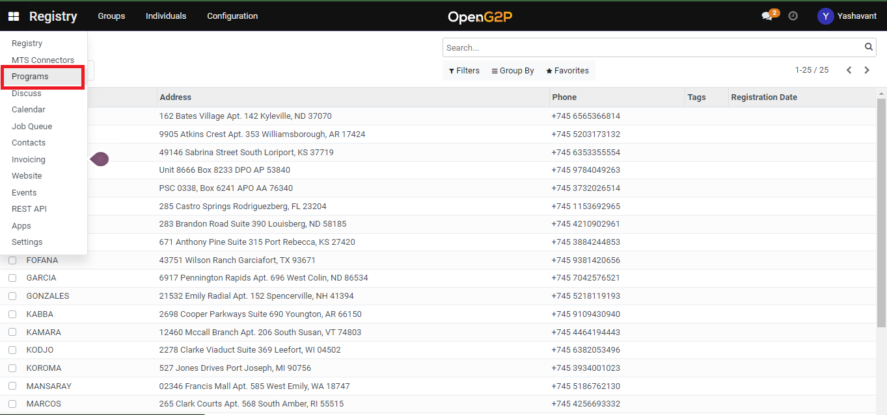
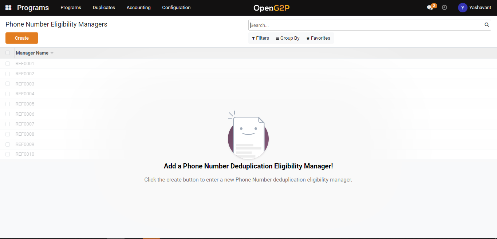

---
layout:
  title:
    visible: true
  description:
    visible: false
  tableOfContents:
    visible: true
  outline:
    visible: true
  pagination:
    visible: true
---

# Create Phone Number Deduplication

This guide provides steps to create a Phone Number Deduplication manager.

## Pre-requisites

The user should be assigned to the Program Manager role.

## Steps

1. Navigate to _Programs_ using the menu bar.

<figure><figcaption></figcaption></figure>

2. Click on Configuration and then on _ID Deduplication Manager._

<figure><figcaption></figcaption></figure>

3. Click the Create button to navigate to the Phone Number Deduplication manager creation page.

<figure><figcaption></figcaption></figure>

4. In the Phone Number Deduplication manager creation page provide a name for the Phone Number Deduplication manager, and select the program name.
5. Once the Phone Number Deduplication manager is saved it will be listed under the Phone Number Deduplication manager list view page which can further be used under the program configuration for which it is mapped.
