---
layout:
  title:
    visible: true
  description:
    visible: false
  tableOfContents:
    visible: true
  outline:
    visible: true
  pagination:
    visible: true
---

# 📔 Configure Proxy Means Test

This document provides step-by-step instructions to enable and configure the Proxy Means Test (PMT).

## Prerequisites

The user must have a Program Manager role.

_**Note:**_

Refer [_**Create User and Assign Role**_](../../administration/role-based-access-control/user-guides/assign-roles-to-users.md) user guide to know how to assign a role for a User.

## Procedure

1. Click the main menu icon  and select _**Programs**_.

<figure><figcaption></figcaption></figure>

Programs screen is displayed.

2. Click on the program name to configure PMT.

For example, here, Safety Net Program is selected.

<figure>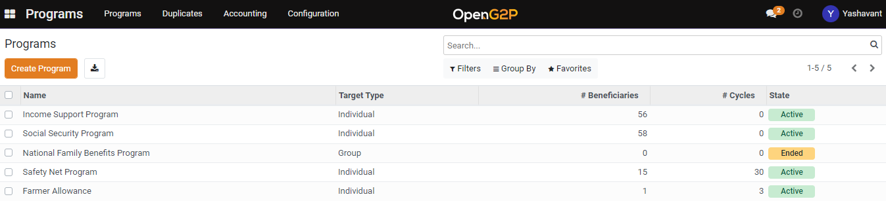<figcaption></figcaption></figure>

The _**Programs/Safety Net Program**_ screen is displayed.

3. Click the _**PMT Configuration**_ tab in the Safety Net Program section.

<figure>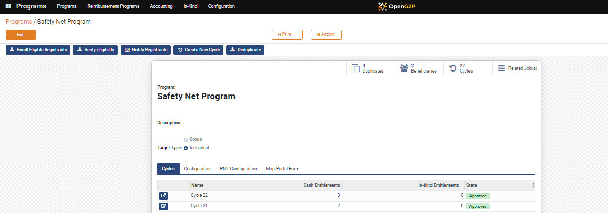<figcaption></figcaption></figure>

The PMT Configuration fields are displayed.

4. Check the _**Enable PMT**_ check box.
5. Click on _**Add a line**_ in the PMT Parameters field.

<figure>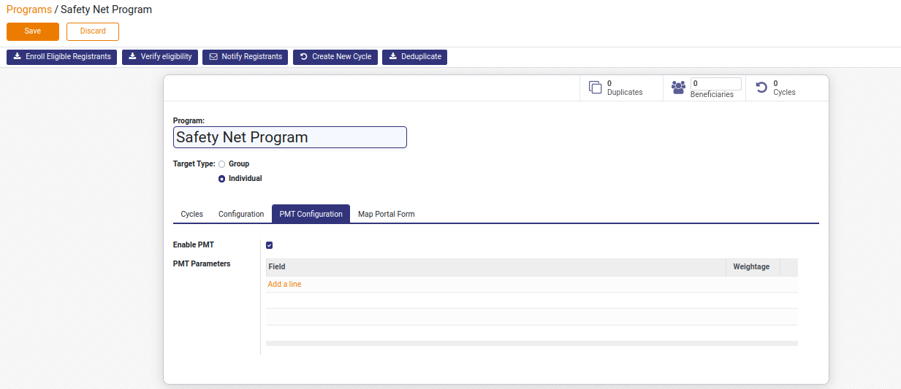<figcaption></figcaption></figure>

The _**Create PMT Parameters**_ screen is displayed.

6. Select the appropriate field in the drop-down.
7. Enter the number in the weightage field.

<figure>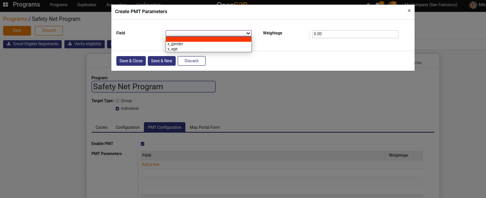<figcaption></figcaption></figure>


The above-mentioned selection fields are computed fields and can be added in the settings.


8. Click the _**Save & New**_ button to select a new field and provide its weightage or click the _**Save & Close**_ button which will save the fields and their weightage to that program under configuration.

<figure>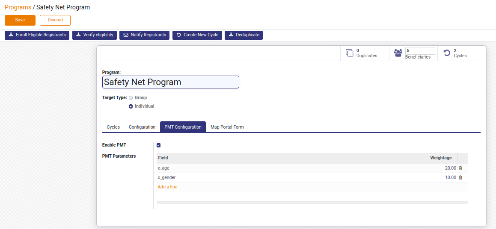<figcaption></figcaption></figure>

9. Click the _**Save**_ button.

## Procedure to add computed fields


Enable developer mode.

Settings --> Developer Tools --> 'Activate the developer mode'


1. Click the main menu icon  and select _**Settings**_.

<figure>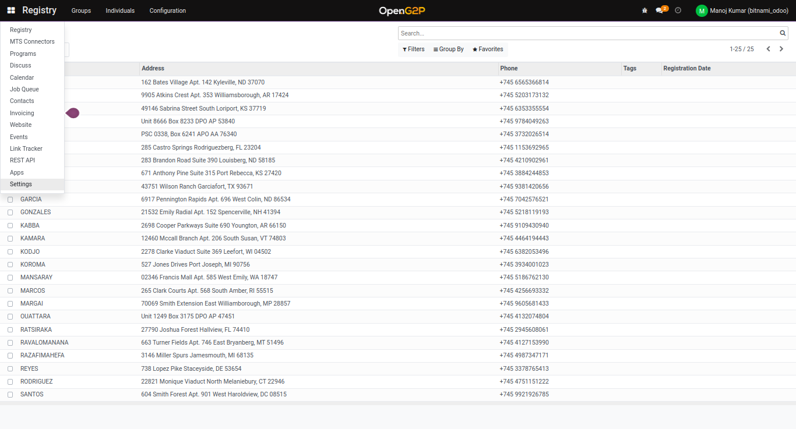<figcaption></figcaption></figure>

The _**Settings**_ screen is displayed.

2. Click the _**Technical**_ in the menu bar.

<figure><figcaption></figcaption></figure>

3. Select the _**Models**_ below the _**Database Structure**_ section.&#x20;

<figure>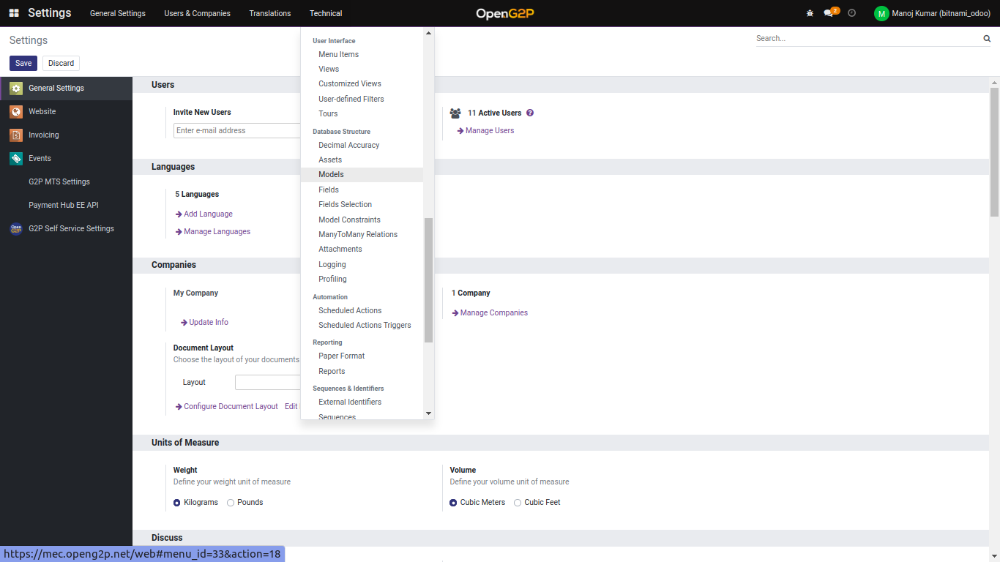<figcaption></figcaption></figure>

4. Search **Program Registrant Info** model in the search bar.

<figure>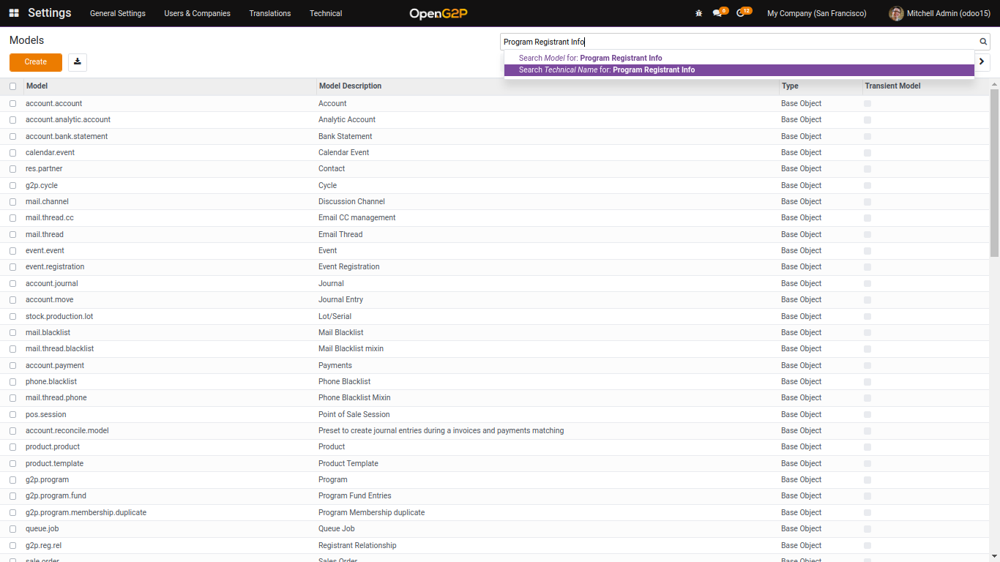<figcaption></figcaption></figure>

5. Click the _**g2p.program.registrant\_info**_ model.

<figure>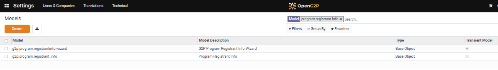<figcaption></figcaption></figure>

The _**Models/Program Registrant Info**_ screen is displayed.

6. Click the _**Fields**_ tab.
7. Click the _**add a line**_ link.

<figure>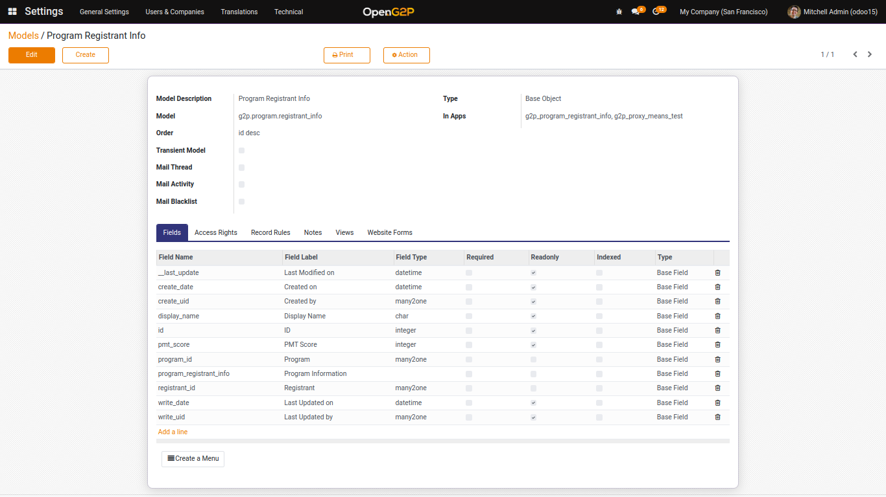<figcaption></figcaption></figure>

The _**Create Fields**_ screen is displayed.

8. Enter the _**Field Name**_, _**Field Type**_, _**Field Label**_, dependencies field and compute logic.

<figure>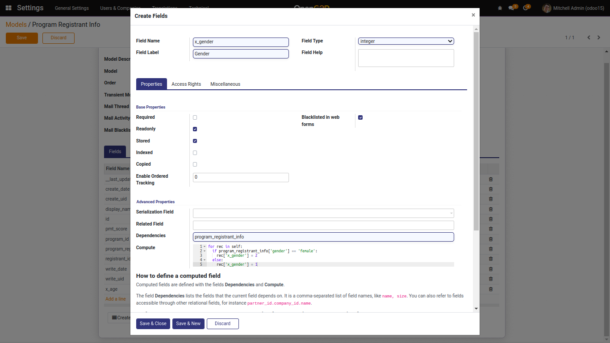<figcaption></figcaption></figure>

9. Click the _**Save & New**_ button to select a new computed field or _**Save & Close**_ button which will save the computed field in the model.

<figure>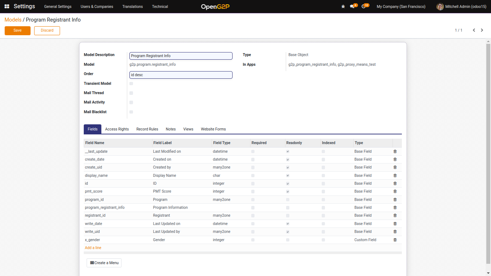<figcaption></figcaption></figure>

10. Click the _**Save**_ button.


So, these computed fields will display in the selection field of PMT Configuration.

