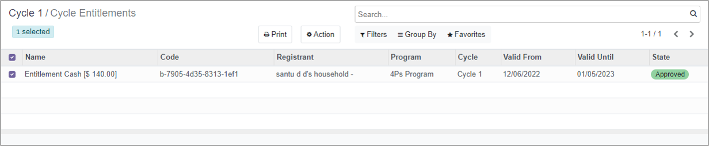

---
layout:
  title:
    visible: true
  description:
    visible: false
  tableOfContents:
    visible: true
  outline:
    visible: true
  pagination:
    visible: true
---

# Entitlement

Entitlement is the quantity of benefit that a beneficiary is entitled to receive. This is the money that a beneficiary will receive via either direct bank transfer, mobile wallet, cash at the counter, vouchers or other disbursement mechanisms. Entitlement is defined for each [cycle](../disbursement-cycles/).

## Entitlement Manager

Entitlement Manager is a software module provided by the OpenG2P platform. The module provides a human-centric design for configuring the entitlement and approval process.&#x20;

OpenG2P supports two types of Entitlement Managers.

| Entitlement Manager          | Description |
| ---------------------------- | ----------- |
| Default Entitlement Managers | TBD         |
| Voucher Entitlement Managers | TBD         |

## Entitlement Manager configuration

The process involved to configure an Entitlement Manager in a program are:

1. Each Entitlement Manager has one or more approving authority roles. The approving authority role is played by a group of users who can approve the entitlements. Hence the approving authority role is configured as a group in the OpenG2P platform.
2. Voucher Entitlement Managers configure an Entitlement Voucher Template in addition to the configurations provided by the Default Entitlement Managers.
3. After the Entitlement Managers is created, Program administrators add the Entitlement Managers to a program.

## Entitlement details

OpenG2P Entitlement Managers allow Program administrators to configure entitlement details under these broad categories.

1. Entitlement amount
2. Approving authority
3. Entitlement voucher

### Entitlement amount

These configurations include entitlement amounts, transfer fees, currency, amount per person for a group, and the maximum number of individuals in a group. These configurations allow Program administrators to set rules for entitlement amounts for individuals and groups.

### Approving authority

The Entitlement Manager can have one or more stages of approval, and the Program administrators can assign one of the approving authorities for each stage of approval. Immediate Individual Assistance On-Demand workflow describes an example involving multi-stage approval.

### Entitlement voucher

OpenG2P provides an easy-to-use UI for creating an Entitlement Voucher Template along with a QR code configuration. Once the entitlement is approved, a voucher file is generated according to the voucher template and QR code configuration.&#x20;

To understand the workflow for entitlement vouchers, [click here](../../../use-cases/case-studies/immediate-assistance-on-demand.md).

The Entitlement Manager provides an option to auto-generate the entitlement voucher file upon entitlement approval. By default, these files are stored in the cloud. Program administrators can also configure the storage type - cloud, OpenG2P storage, or external storage - for the entitlement voucher files.&#x20;

## Approval process

The approval process can be single-stage or multi-stage based on the approval settings in the Entitlement Manager. The figure below shows the entitlement approval for a program.

<figure><figcaption>
Approval process
</figcaption></figure>

The multi-stage approval typically follows this process:

* The first approving authority inspects and verifies documents, enrolls the beneficiary based on eligibility, and adds an assessment.
* Subsequent approving authorities will skip the process of enrolment. However, they also inspect and verify beneficiary documents, and add their assessments.
* The last approving authority completes the approval process and generates an entitlement voucher.

<table><thead><tr><th width="230">Configuration</th><th>Description</th></tr></thead><tbody><tr><td>Entitlement amount</td><td>Program administrators can configure entitlement amount, currency, and transfer fee. Further, the entitlement amount for each individual in a group and the maximum number of individuals in the group can be configured.</td></tr><tr><td>Entitlement vouchers</td><td>An entitlement voucher authorizes the intended beneficiary to claim the benefits at the service provider facility. The voucher has customized QR codes embedded. The QR code provides a digital signature that makes the voucher tamper-proof and establishes the authenticity of the voucher.</td></tr><tr><td>Multi-stage approvals</td><td>Program administrators can configure multiple stages and assign a role for each stage to avoid concentration of power and errors in deciding the entitlement amount</td></tr></tbody></table>

## Export beneficiaries approved entitlements

In PBMS, registered applicants are entitled to the program's benefits for which they are enrolled as eligible beneficiaries. The PBMS module is required to compile and maintain reports on the entitled beneficiaries due to the enormous number of eligible beneficiaries receiving entitlements.&#x20;

In order to provide the users with a comprehensive list of all the approved entitlements, the feature Export is used. The Export feature in Odoo makes it simple for the users to effectively print or export data in CSV/XLS format. It will only be accessible following the approval of entitlements, and it will then continue to function.

Using this feature, the Program Manager can

* View a list of beneficiaries who are entitled to the program's benefits.&#x20;
* Easily manage and verify the approved entitlements.&#x20;

To know more on export beneficiaries approved entitlements, click here.

## Related user guides

:notebook\_with\_decorative\_cover:[Create Entitlement Manager Type](user-guides/create-entitlement-manager-type/)

:notebook\_with\_decorative\_cover:[Configure Entitlement Manager in the Program](../program-management/user-guides/create-entitlement-manager-type-1.md)

:notebook\_with\_decorative\_cover:[Create Entitlement Voucher Template](../../functionality/entitlement/user-guides/create-entitlement-voucher-template.md)

:notebook\_with\_decorative\_cover:[Multi-Stage Approval](../../user-guides/eligibility-and-program-enrollment/approval/multi-stage-approval.md)
