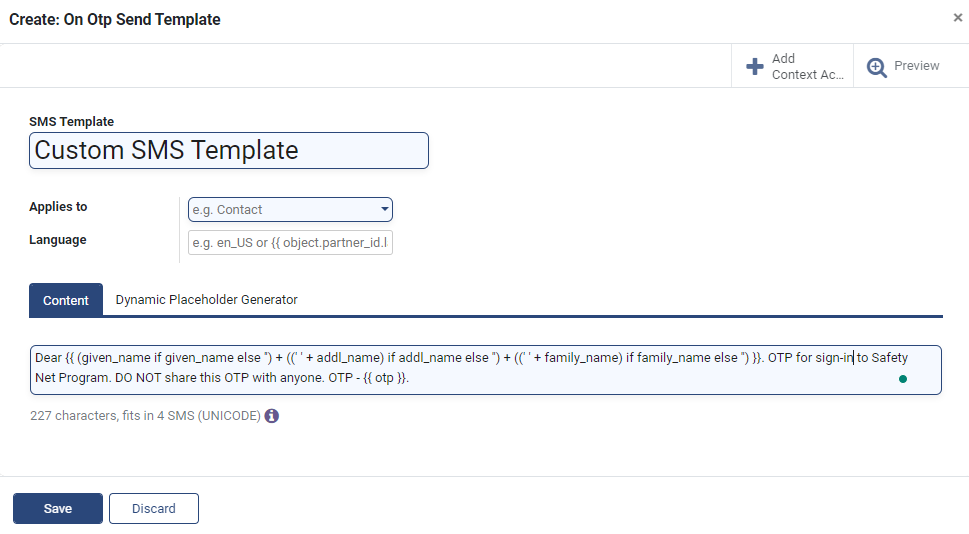

---
layout:
  title:
    visible: true
  description:
    visible: false
  tableOfContents:
    visible: true
  outline:
    visible: true
  pagination:
    visible: true
---

# 📔 Create SMS Notification Manager

## Description

This guide will provide the steps to create an SMS Notification Manager.

## Prerequisites

The user should have a Program Administrator role assigned.

## Steps

1. Navigate to _Programs_ using the menu bar.

<figure><figcaption></figcaption></figure>

2. Click on _Configuration_ and then on _SMS Notification Manager._

<figure><figcaption></figcaption></figure>

3. Click the _Create_ button to view the _SMS Notification Manager_ creation page.

<figure><figcaption></figcaption></figure>

4. Enter _Name_ and _Program_ in the _SMS Notification Managers_ view.

<figure><figcaption></figcaption></figure>

4. The view allows the configuration of a template for each of these event types:

* _On Enrolled In Program Template_
* _On Cycle Started Template_
* _On Cycle Ended Template_
* _On Otp Send Template_
* _On Generate Voucher Template_

<figure><figcaption></figcaption></figure>

There are two ways to configure a template for an event:

a. Use an existing template: Go to step#6

b. Create a new template: Go to step#7

6. Click on the dropdown button and select the template from the drop-down list. Go to step#9.

<figure><figcaption></figcaption></figure>

7. Enter a name for the new template. When a non-existing template name is entered, the option _Create and Edit_ appears. Click on this option\_.\_

<figure><figcaption></figcaption></figure>

8. A new dialogue box appears. Enter the details and click on _Save._

* _SMS Template_: Name of the template
* _Applies to_: Applicable context; For example, the option _Contact_ sends the OTP to the beneficiary contact number
* _Language:_ Language for the content
* _Content:_ Content written using the Odoo platform's [QWeb](https://www.odoo.com/documentation/16.0/developer/reference/frontend/qweb.html) templating engine

<figure><figcaption></figcaption></figure>

9. Click on _Save_.

<figure><figcaption></figcaption></figure>
