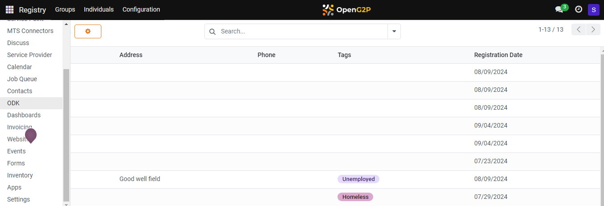
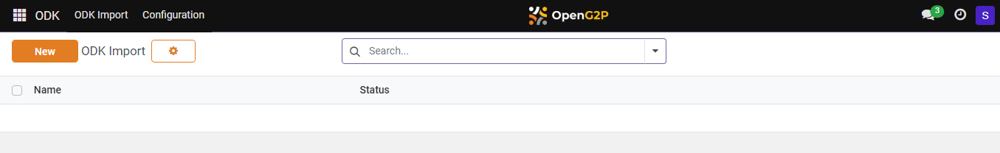
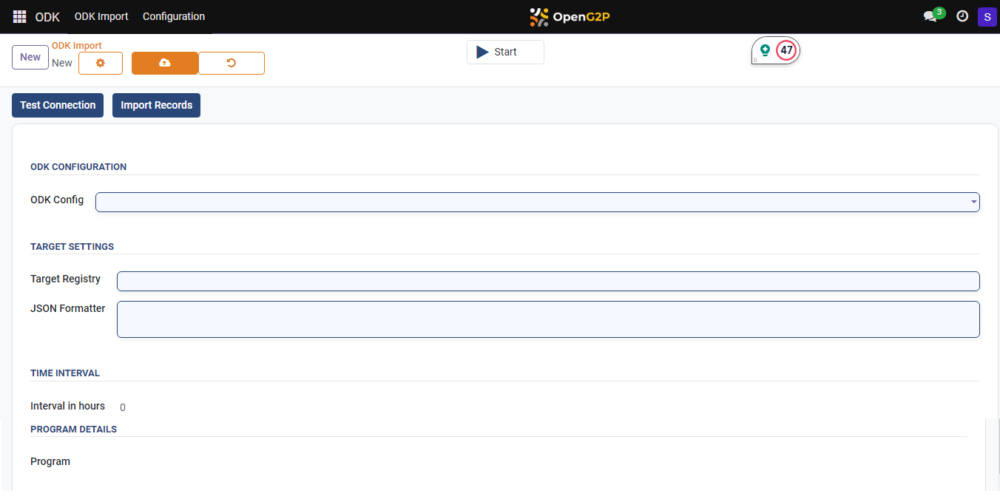
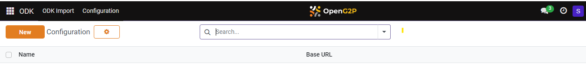
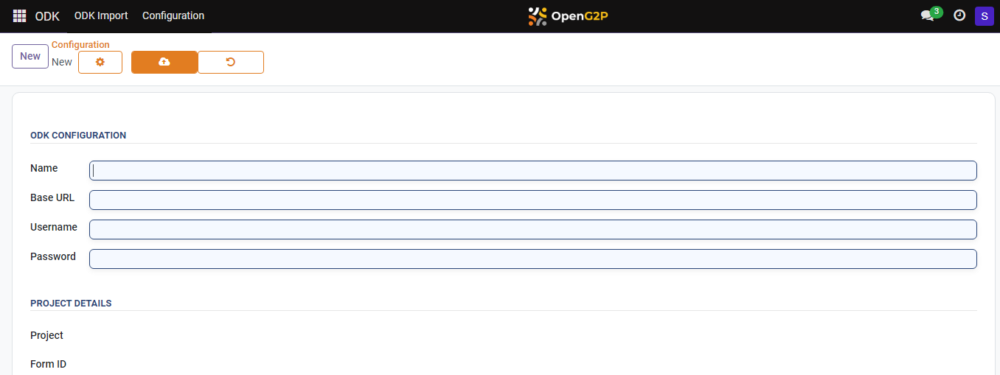
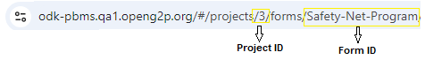
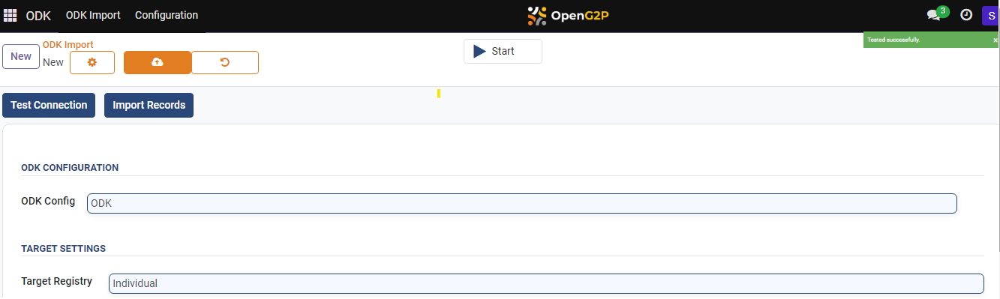
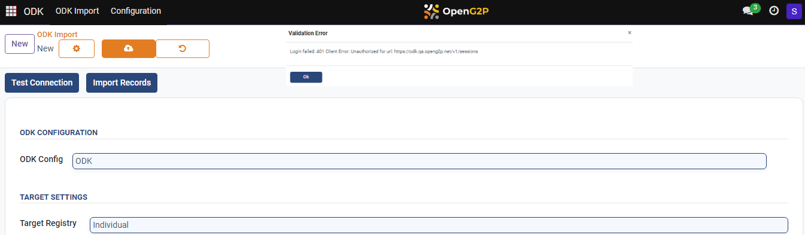
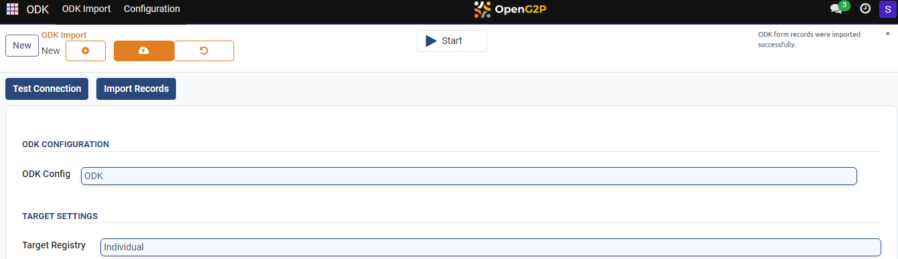
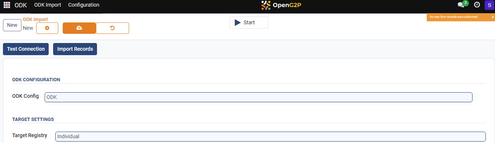

---
layout:
  title:
    visible: true
  description:
    visible: false
  tableOfContents:
    visible: true
  outline:
    visible: true
  pagination:
    visible: true
---

# 📔 Configure and Import ODK Form

This document provides step-by-step instructions for configuring the ODK central into the PBMS and importing the ODK form. After importing the ODK form, only the fields and their values customised using the JSON formatter are included in the individual/group registries of the PBMS.

Note:

Every ODK form must have its own ODK importer.

## Prerequisites

* A user must have an Administrator role to access ODK Central in OpenG2P systems.
* A user must know the pyjq syntax to customise the value in the JSON Formatter fields.

## Procedure

1. Click the main icon  and select ODK.

<figure><figcaption></figcaption></figure>

_**ODK**_ screen is displayed. You can find two tabs.

* [ODK Import](customize-the-odk-importer-configuration-based-on-the-odk-form-fields.md#odk-import)
* [Configuration](customize-the-odk-importer-configuration-based-on-the-odk-form-fields.md#odk-configuration)

### ODK Import

By default, ODK -> ODK Import page is displayed.

<figure><figcaption></figcaption></figure>

2. Click the **New** button.

_**ODK Import New**_ screen is displayed.

<figure><figcaption></figcaption></figure>

The fields and their descriptions are given below.

3. Customize the ODK Importer based on the ODK form fields

<table><thead><tr><th width="226">Parameters</th><th>Description</th></tr></thead><tbody><tr><td><strong>ODK CONFIGURATION</strong></td><td></td></tr><tr><td><strong>ODK  Config</strong></td><td>The name of the ODK configuration</td></tr><tr><td><strong>TARGET SETTINGS</strong></td><td></td></tr><tr><td><strong>Target Registry</strong></td><td>
Specifies whether imported records should be associated with individual or group registries within the PBMS.

Select the appropriate value from the drop-down. The valid values are:
<ul><li>Individual</li><li>Groups</li></ul></td></tr><tr><td><strong>JSON Formatter</strong></td><td>Enables users to define a custom JSON formatter for transforming retrieved data before importing it into the PBMS. Refer to relevant documentation for details on utilizing the JSON formatter using <a href="https://pypi.org/project/pyjq/">PYJQ library</a>.</td></tr><tr><td><strong>TIME INTERVAL</strong></td><td></td></tr><tr><td><strong>Interval in Hours (Optional)</strong></td><td>Defines the interval (in hours) at which the import process should be automatically triggered. This allows for scheduled data updates.</td></tr><tr><td><strong>PROGRAM DETAILS</strong></td><td></td></tr><tr><td><strong>Program</strong></td><td>Map the registrant into the program.</td></tr><tr><td><a href="customize-the-odk-importer-configuration-based-on-the-odk-form-fields.md#test-connection"><strong>Test Connection</strong></a></td><td><ul><li>Verifies the established connection between the ODK Importer and ODK Central.</li><li>Ensures that the ODK Importer can effectively communicate with ODK Central, the server hosting the ODK forms.</li><li>Enables seamless data transfer between the two systems</li></ul></td></tr><tr><td><a href="customize-the-odk-importer-configuration-based-on-the-odk-form-fields.md#import-records"><strong>Import Records</strong></a></td><td><ul><li>Tracks the progress of data import and identifies any errors that may occur during the process.</li><li>Provides users with real-time updates on the status of their data import, allowing them to quickly address any issues and ensure a smooth import process.</li></ul></td></tr><tr><td><strong>Start/Stop</strong></td><td>
 <em><strong>Start</strong></em> executes the scheduled job to run periodically at fixed times, dates, or intervals.

<em><strong>Stop</strong></em> terminates the scheduled job.
</td></tr></tbody></table>

| Icon                                                                                         | Click to                                                                                                                                                                                                                                     |
| -------------------------------------------------------------------------------------------- | -------------------------------------------------------------------------------------------------------------------------------------------------------------------------------------------------------------------------------------------- |
|               | 
Select the appropriate value. The available values are: 
<ul><li>Archive</li><li>Duplicate</li><li>Change Password</li><li>Disable two-factor authentication</li><li>Send Password Reset Instructions</li><li>Privacy Lookup</li></ul> |
|    | Save manually the individual data and exit from the screen.                                                                                                                                                                                  |
|  | Discard changes and exit from the screen.                                                                                                                                                                                                    |

### Configuration

4. Click the tab _**Configuration**_ in the menu bar.

_**Configuration**_ screen is displayed.

<figure><figcaption></figcaption></figure>

5. Click the _**New**_ button.

_**Configuration New**_ screen is displayed.

<figure><figcaption></figcaption></figure>

The fields and their descriptions are given below.

6. Enter the valid values to access ODK Central in OpenG2P systems.

| Field                   | Description                                                            |
| ----------------------- | ---------------------------------------------------------------------- |
| _**ODK Configuration**_ |                                                                        |
| Name                    | Enter the name for the ODK importer.                                   |
| Base URL                | Enter the URL of the ODK Central.                                      |
| Username                | Enter the username which is used to login ODK Central                  |
| Password                | Enter the password which is used to login ODK Central                  |
| _**Project details**_   |                                                                        |
| Project                 | 
Enter the project number. 

For example, 3
                 |
| Form ID                 | 
Enter the ID of the form.

For example, Safety-Net-Program
 |

**Sample ODK form URL**

<figure><figcaption></figcaption></figure>

### Test Connection

_**Test Connection**_ feature establishes the connection between _**ODK Central**_ and _**OpenG2P**_ systems.

7. Click the _**Test Connection**_ button.

If the _**Test Connection**_ feature connects the _**ODK Central**_ and _**OpenG2P**_ systems successfully, a successful message pop ups.

<figure><figcaption></figcaption></figure>

If the _**Test Connection**_ feature unable to connect the _**ODK Central**_ and _**OpenG2P**_ systems, an error  message pop ups.&#x20;

<figure><figcaption></figcaption></figure>

8. Click the _**OK**_ button to exit the dialog box.

### Import Records

_**Import Records**_ feature imports and stores the records in PBMS.

9. Click the _**Import Records**_ button.

If the ODK form is imported successfully, a success message pops up.

<figure><figcaption></figcaption></figure>

If no new ODK forms are submitted, ODK form records will not be imported.

<figure><figcaption></figcaption></figure>

You can find the configuration details in the _**ODK Configuration**_ screen and imported ODK forms' status in the _**ODK Import**_ screen.

This completes the process of importing an ODK form from ODK Central into the PBMS.

### JSON Formatter

Configure the required fields based on the ODK form field using pyjq JSON formatter.&#x20;

**Sample JSON Formatter**

<figure><figcaption>
JSON Formatter
</figcaption></figure>
