---
layout:
  title:
    visible: true
  description:
    visible: false
  tableOfContents:
    visible: true
  outline:
    visible: true
  pagination:
    visible: true
---

# 📔 Customise the ODK Importer Configuration based on the ODK Form Fields

## Description

This document provides step-by-step instructions to customise the ODK Importer configuration based on the ODK form fields to cater to the needs of the stakeholders.

Note:

Every ODK form must have its own ODK importer.

## Prerequisites

* A user must have Administrator role to access ODK Central in OpenG2P systems.
* A user must know the pyjq syntax to customise the value in the JSON Formatter fields.

## Procedure

1. Login to _**OpenG2P**_ systems.

<figure>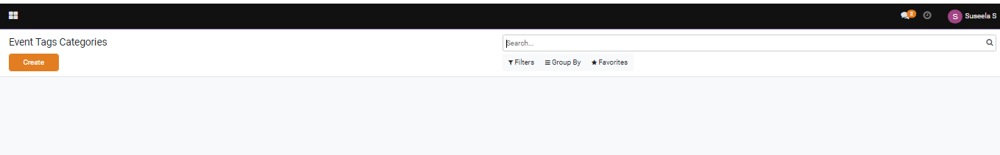<figcaption>
OpenG2P application
</figcaption></figure>

2. In the menu bar, click the icon 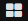 and select ODK.

<figure>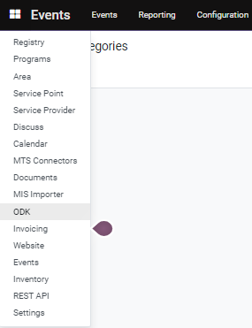<figcaption>
ODK
</figcaption></figure>

_**ODK configuration**_ screen is displayed.

<figure>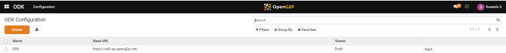<figcaption>
ODK Configuration
</figcaption></figure>

3. Click the **Create** button.

_**ODK Configuration/New**_ screen is displayed.

<figure>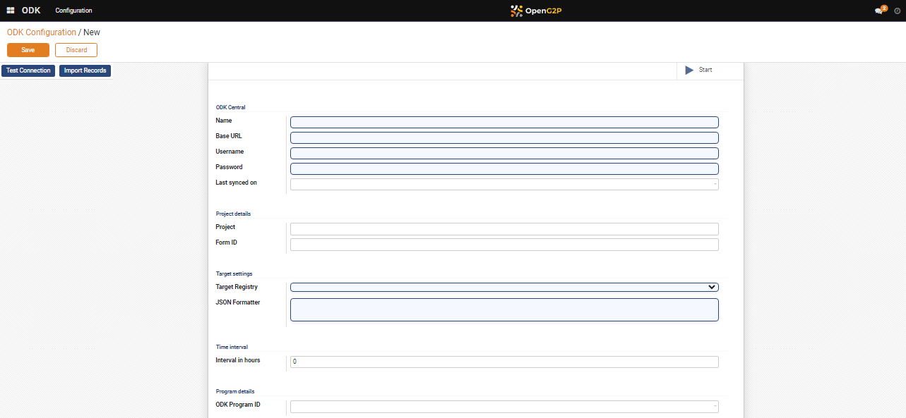<figcaption>
ODK Configuration/New
</figcaption></figure>

4. Enter the valid values to access ODK Central in OpenG2P systems and customize the ODK Importer configuration based on the ODK Form Fields

| Field                                                                                                           | Description                                                                                                          |
| --------------------------------------------------------------------------------------------------------------- | -------------------------------------------------------------------------------------------------------------------- |
| Start                                                                                                           | Click the _**Start**_ link to execute the schedule job to run periodically at fixed times, dates, or intervals.      |
| Restart                                                                                                         | Click the _**Restart**_ link to re-execute the schedule job to run periodically at fixed times, dates, or intervals. |
| Stop                                                                                                            | Click the **Stop** link to stop the execution of the  schedule job.                                                  |
| _**ODK Central**_                                                                                               |                                                                                                                      |
| Name                                                                                                            | Enter the name for the ODK importer.                                                                                 |
| Base URL                                                                                                        | Enter the URL of the ODK Central.                                                                                    |
| Username                                                                                                        | Enter the username which is used to login ODK Central                                                                |
| Password                                                                                                        | Enter the password which is used to login ODK Central                                                                |
| _**Project details**_                                                                                           |                                                                                                                      |
| \*[Project](customize-the-odk-importer-configuration-based-on-the-odk-form-fields.md#project)                   | 
Enter the project number. 

For example, 5
                                                               |
| \*\*[Form ID](customize-the-odk-importer-configuration-based-on-the-odk-form-fields.md#form-id)                 | 
Enter the ID of the form.

For example, Household_data_collection 
                                       |
| _**Target settings**_                                                                                           |                                                                                                                      |
| Target Registry                                                                                                 | 
Select the appropriate option. The valid values are:
<ul><li>Group</li><li>Individual</li></ul>                |
| \*\*\*[JSON Formatter](customize-the-odk-importer-configuration-based-on-the-odk-form-fields.md#json-formatter) | Use the pyjq library to manipulate JSON, based on the required fields in OpenG2P system.                             |
| _**Time interval**_                                                                                             |                                                                                                                      |
| Interval in hours                                                                                               | Enter the time duration in hours to run the job automatically.                                                       |
| _**Program details**_                                                                                           |                                                                                                                      |
| ODK Program ID                                                                                                  | Enter the program ID                                                                                                 |
| Save                                                                                                            | Click the _**Save**_ button to save the data                                                                         |
| Discard                                                                                                         | Click the _**Discard**_ to clear the data                                                                            |

### Test Connection

_**Test Connection**_ feature establishes the connection between _**ODK Central**_ and _**OpenG2P**_ systems.

5. Click the _**Test Connection**_ button.

If the _**Test Connection**_ feature connects the _**ODK Central**_ and _**OpenG2P**_ systems successfully, a successful message pop ups.

<figure>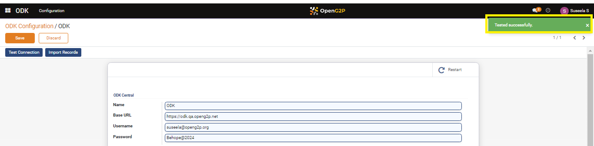<figcaption>
Test Connection - Successful
</figcaption></figure>

If the _**Test Connection**_ feature unable to connect the _**ODK Central**_ and _**OpenG2P**_ systems, an error  message pop ups.&#x20;

6. Click the _**OK**_ button to exit the dialog box.

<figure>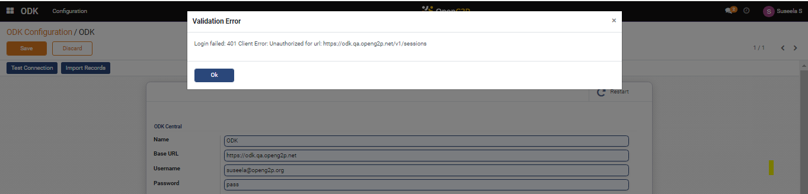<figcaption>
Test Connection - Failure
</figcaption></figure>

### Import Records

_**Import Records**_ feature imports and stores the records in Social Registry.

7. Click the _**Import Records**_ button.

If the ODK form is imported successfully, a success message pops up.

<figure>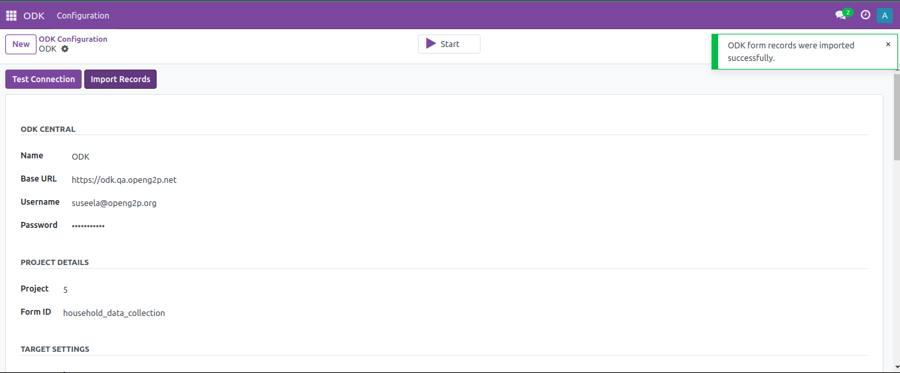<figcaption>
Import Record - Successful
</figcaption></figure>

If there is no new ODK form submitted, then ODK form records will not be imported.

<figure>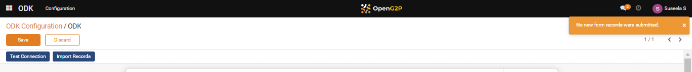<figcaption>
Import Record - No new record found.
</figcaption></figure>

A view of the ODK form recorded in Social Registry.

<figure>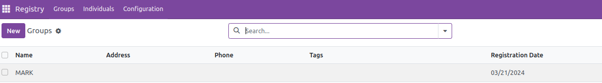<figcaption>
ODK Form recorded
</figcaption></figure>

The below image shows the specific ODK form record.

<figure>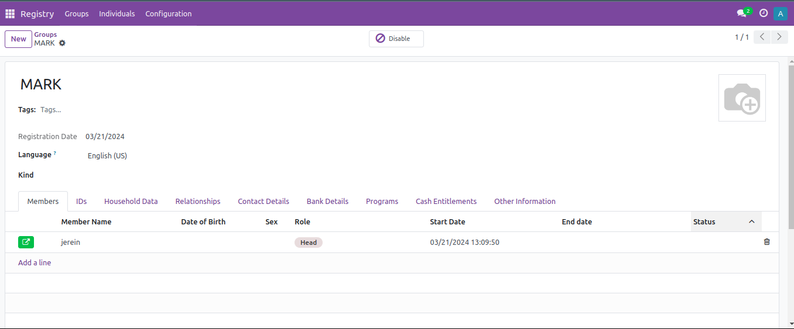<figcaption>
Specific ODK Form
</figcaption></figure>

The Household Data tab shows only the fields which are configured using pyjq JSON formatter in ODK importer. The fields are populated while the ODK form is imported to the Social Registry.

<figure>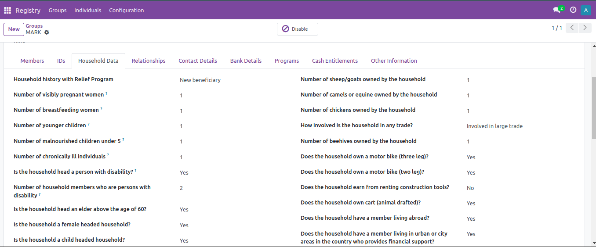<figcaption>
Populated fields
</figcaption></figure>

<figure><figcaption>
Populated fields
</figcaption></figure>

You can find the created ODK form below the name column in _**ODK Configuration**_ screen.

<figure><figcaption></figcaption></figure>

This completes process of importing a ODK form into Social registry by customizing the ODK Importer configuration based on the ODK Form Fields.

***

### Project

Follow the below steps to know the project ID taken from ODK Central.

1. Login to _**ODK Central**_.

_**ODK Central**_ home page is displayed.

<figure>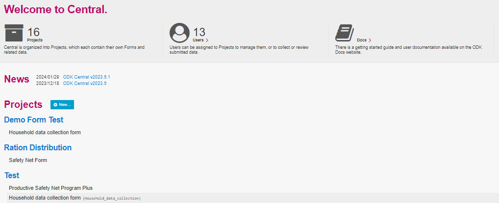<figcaption>
ODK Central
</figcaption></figure>

Here, for example, click the Household data collection form below the program Test.

The Household data collection form's  overview screen is displayed.

<figure>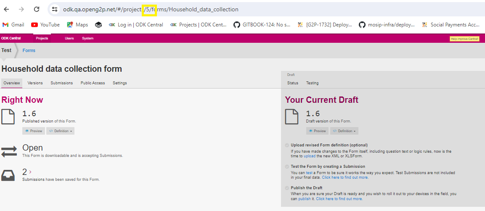<figcaption>
ODK Central - Project number
</figcaption></figure>

In the URL , the number which is after the project is the project Id (5) (highlighted in yellow).

### Form ID

Follow the below steps to know the form ID taken from ODK Central.

1. Login to _**ODK Central**_.

_**ODK Central**_ home page is displayed.

<figure><figcaption>
ODK Central
</figcaption></figure>

Here, for example, click the Household data collection form below the program Test.

The Household data collection form's overview form is displayed.

<figure>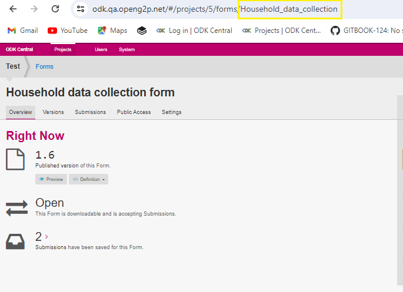<figcaption>
ODK Central - Form ID
</figcaption></figure>

In the URL , the word which is after the forms is the form Id (Household\_data\_collection) (highlighted in yellow).

### JSON Formatter

Configure the required fields based on the ODK form field using pyjq JSON formatter.&#x20;

For example, ODK importer configures the required fields from Household data collection form present in ODK central in JSON Formatter box.

<figure>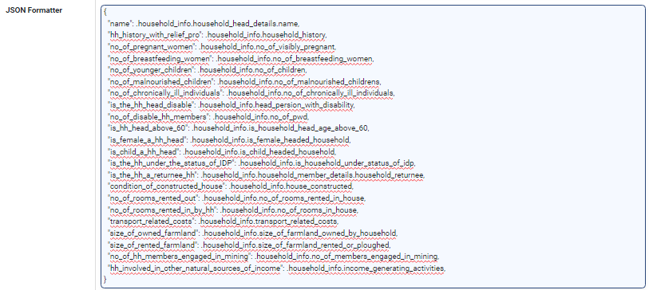<figcaption>
JSON Formatter
</figcaption></figure>
