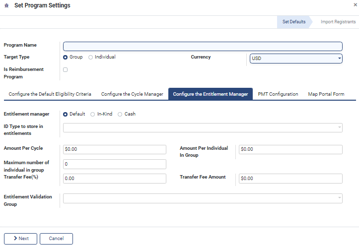

# Create Program

## Description

Create Program screen helps to create a new program. This document provides step-by-step instructions to create a new program.  The Program Manager has the rights to create a new program and administer create program screen.

## Pre-requisites

The user must have a Program Manager role to create a new program.

Note:

Refer the [Create User and Assign Role](../../administration/role-based-access-control/user-guides/assign-roles-to-users.md) guide to know how to assign role for a User.

## Procedure

## Programs

1. In the menu bar, click the icon .png>) and select _**Programs**_.
2. The _**Programs**_ screen is displayed.

<figure><figcaption>
Choose the Programs screen
</figcaption></figure>

<figure><figcaption>
Programs screen
</figcaption></figure>

_**Programs**_ screen provides dashboard view which lists all the available Program Names, Target Type, Number of Enrolled Beneficiaries against each program, State (whether active/inactive), and the Beneficiaries list.

In _**Programs**_ screen, the available features and their descriptions are:

<table><thead><tr><th width="130">Feature</th><th>Description</th></tr></thead><tbody><tr><td>Create</td><td>Click the <em><strong>Create</strong></em> button to create new program</td></tr><tr><td></td><td>Click the <em><strong>Export All</strong></em> button to download the details in excel format</td></tr><tr><td>&#x3C;</td><td>Click the <em><strong>Left</strong></em> arrow to go the previous screen</td></tr><tr><td>></td><td>Click the <em><strong>Right</strong></em> arrow to go the next screen</td></tr><tr><td>Filters</td><td>
Click the <em><strong>Filters</strong></em> link and select the appropriate options. 

The valid values are: 
<ul><li>Archived</li><li>Add Customer Filter</li></ul>
The advanced filter option allows you to define conditions and criteria to refine the search results.
<ul><li>Select the <em><strong>Add Customer filter</strong></em> and then select the appropriate option in the first drop-down to display the specific data based on the option selected.</li><li>Select the criteria in second and third drop-down to refine the search results. </li><li>Click the <em><strong>Apply</strong></em> button to display the data based on the search</li></ul>
<em>Note: To enhance the search, click the <strong>Add a condition</strong> button and follows the steps given in <strong>Add Customer Filter</strong> option</em>
</td></tr><tr><td>Group By</td><td><ul><li>Click the <em><strong>Group By</strong></em> link, select <strong>Add Custom Group</strong> and then select the appropriate options in the drop-down to display the specific data based on the option selected.</li><li>Click the <em><strong>Apply</strong></em> button to display the data based on the search</li></ul></td></tr><tr><td>Favorites</td><td><ul><li>
Click the <em><strong>Favorites</strong></em> link, select <strong>Save current search</strong> and then check the appropriate options. The valid values are: 
<ul><li>Use by default</li><li>Share with all users</li></ul></li><li>Click the <em><strong>Save</strong></em> button to display the data based on the search</li></ul></td></tr><tr><td>Search</td><td>This field is filled when the available option are selected in Filers, Group By, Favorites</td></tr></tbody></table>

### Create Program

3. Click the _**Create Program**_ button. The _**Set Program Settings**_ screen is displayed.

<figure><figcaption>
Set program settings
</figcaption></figure>

#### Set Program Settings

In _**Set Program Settings**_ screen, the features and their descriptions are:

| Feature                  | Description                                                                                             |
| ------------------------ | ------------------------------------------------------------------------------------------------------- |
| Program Name             | Enter the Program name                                                                                  |
| Target Type              | 
Choose one of the Target Type. The valid values are: 
<ul><li>Groups</li><li>Individual</li></ul> |
| Currency                 | 
Select the appropriate currency option. The valid values are: 
<ul><li>EUR</li><li>USD</li></ul>  |
| Is Reimbursement Program | Check the option if the reimbursement program is required                                               |

In _**Set Program Settings**_ screen, you can find the below tabs.

* Configure the Default Eligibility Criteria
* Configure the Cycle Manager
* Configure the Entitlement Manager&#x20;
* PMT Configuration
* Map Portal Form

**Configure the Default Eligibility Criteria**

4. Click the _**Configure the Default Eligibility Criteria**_ tab, the fields available in the tab are displayed.

<figure><figcaption>
Configure the Default Eligibility Criteria
</figcaption></figure>

<table><thead><tr><th width="185">Feature</th><th>Description</th></tr></thead><tbody><tr><td>Eligibility manager</td><td>Default option is selected by default</td></tr><tr><td>Admin Area</td><td>Enter the admin area </td></tr><tr><td>Filter</td><td></td></tr><tr><td>Match all records</td><td>Retrieves the data which matches all records</td></tr><tr><td></td><td>
Click the <em><strong>Records</strong></em> button. The <em><strong>Selected records</strong></em> screen is displayed. 

<em>Note:</em> 
<ul><li><em>By default the list of three records are listed in the <strong>Selected records</strong> screen.</em></li><li><em>Click the <strong>Cancel</strong> button to close the <strong>Selected records</strong> screen.</em></li></ul></td></tr><tr><td></td><td>Click the <em><strong>Refresh</strong></em> button to refresh the screen</td></tr><tr><td>Add filter</td><td>
Click the <em><strong>Add filter</strong></em> button to set eligibility criteria using <a href="https://github.com/OpenG2P/openg2p-documentation/blob/1.2.1/beneficiary-management/eligibility.md#domain-filters">Domain Filters</a>. You may set multiple eligibility criteria. 
<ol><li>Click the <em><strong>Add filters</strong></em> button. The multiple criteria fields are displayed.</li><li>Select the multiple criteria such as ID, condition and count.</li><li>Click the <strong>x</strong> button to remove the entry in the criteria fields.</li><li>Click the <strong>+</strong> button to add new multiple criteria field.</li><li>Click the <strong>...</strong> option to display fields in <em><strong>Any of</strong></em> section. The multiple criteria fields are displayed.</li></ol>
<em>Note: You can click the <strong>...</strong> option to add n number of <strong>Any of</strong> section</em>
<ol start="6"><li>The value chosen in the multiple criteria fields are displayed in the <em><strong>Code editor</strong></em>.</li><li>In the Match records chose one of the followings:</li></ol><ul><li>Select <em><strong>All</strong></em> to display the data belongs to <em><strong>All</strong></em> section </li><li>Select <em><strong>Any</strong></em> to display the data belongs to <em><strong>Any</strong></em> <em><strong>of</strong></em> section</li></ul></td></tr></tbody></table>

<figure><figcaption>
Selected records screen
</figcaption></figure>

**Configure the Cycle Manager**

5. Click the _**Configure the Cycle Manager**_ tab, the fields available in the tab are displayed.

<figure><figcaption>
Configure the cycle manager
</figcaption></figure>

<table><thead><tr><th width="247">Feature</th><th>Description</th></tr></thead><tbody><tr><td>Auto-approve Entitlements</td><td>
Check the option if the auto-approve entitlements is required. 

<em>Note:</em>

<em>Set entitlements via rules, without any manual approvals.</em>
</td></tr><tr><td>Approver Group</td><td>
Select the approver group in the drop-down.

<em>Note:</em>

<em>The group name of the user who has permission to approve cycles. See</em> <a href="../../administration/role-based-access-control/user-guides/assign-roles-to-users.md"><em>Create User and Assign Role</em></a><em>.</em>
</td></tr><tr><td>One-time Distribution</td><td>
Check the option if the distribution happens one-time 

Note:
<ul><li>If one-time distribution option is checked, the recurrence distribution option is not displayed.</li><li>If one-time distribution option is not checked, the recurrence distribution option is displayed.</li></ul></td></tr><tr><td>Recurrence </td><td>
You can choose recurrence option, if the time period is repeated for a cycle

Enter the number and select the appropriate option in the drop-down. The valid values are: 
<ul><li>Days</li><li>Weeks</li><li>Months</li><li>Years</li></ul></td></tr><tr><td>Day of Month</td><td>
Select the appropriate option in the drop-down. The valid values are: 
<ul><li>
Date of month
<ul><li>Enter the date of month if date of month option is selected in the drop-down</li></ul></li><li>
Day of month
<ul><li>Enter the day of month if day of month option is selected in the drop-down</li></ul></li></ul></td></tr></tbody></table>

**Configure the Entitlement Manager**&#x20;

6. Click the _**Configure the Entitlement Manager**_ tab, the fields available in the tab are displayed.

<figure><figcaption>
Configure the entitlement manager
</figcaption></figure>

| Feature                               | Description                                                                                                                                                                                                                                                                                                               |
| ------------------------------------- | ------------------------------------------------------------------------------------------------------------------------------------------------------------------------------------------------------------------------------------------------------------------------------------------------------------------------- |
| Entitlement manger                    | 
Select the parameters for entitlements. The valid values are: 
<ul><li>Default</li><li>In-Kind</li><li>Cash</li></ul>                                                                                                                                                                                               |
| ID Type to store in entitlements      | Enter the ID Type to store in entitlements                                                                                                                                                                                                                                                                                |
| Amount Per Cycle                      | Enter the amount of disbursement of a group or individual per cycle.                                                                                                                                                                                                                                                      |
| Amount Per Individual In Group        | 

Enter the amount of disbursement per individual in a group when the program target type is "group".

                                                                                                                                                                                                  |
| Maximum number of individual in group | 
Enter the maximum number of individuals who get disbursements per group. 

<em>Note:</em>

<em>It is an optional field</em>
                                                                                                                                                                              |
| Transfer Fee(%)                       | 
Enter the fee incurred for disbursement as a percentage of disbursement.

<em>Note:</em>

<em>It is an optional field</em>
                                                                                                                                                                               |
| Transfer Fee Amount                   | 
Enter the fee incurred for disbursement as an absolute amount.

<em>Note:</em>

<em>It is an optional field</em>
                                                                                                                                                                                         |
| Entitlement Validation Group          | 
Enter the group name of the user who has permission to approve entitlements. 

<em>Note:</em>

<em>See</em> <a href="../../administration/role-based-access-control/user-guides/assign-roles-to-users.md"><em>Create User and Assign Role</em></a> <em>guide to know how to assign role for a User.</em>
 |

**PMT Configuration**

7. Click the _**PMT Configuration**_ tab, the field available in the tab is displayed.

<figure><figcaption>
PMT Configuration
</figcaption></figure>

| Feature    | Description                        |
| ---------- | ---------------------------------- |
| Enable PMT | Check the option to enable the PMT |

**Map Portal Form**

8. Click the _**Map Portal Form**_ tab, the fields available in the tab are displayed.

<figure><figcaption>
Map portal form
</figcaption></figure>

| Feature                               | Description                                                                |
| ------------------------------------- | -------------------------------------------------------------------------- |
| Multiple Form Submission Program Form | Check the option if the multiple form submission program form is required. |
| Program Form                          | Enter the name of the program form                                         |

9. Click the _**Next**_ button.&#x20;
10. The _**Set Program Settings**_ dialog box is displayed.
11. Select the option _**Yes,**_ to import the matching registrants to this program
12. Select the option _**No**_, not to import the matching registrants to this program
13. Click the _**Back**_ button to go previous screen
14. Click the _**Create**_ button to create New Program
15. Click the _**Cancel**_ button to go to the Program dashboard screen

You can view newly created Program listed in the Program dashboard screen.

<figure><figcaption>
Created new program listed in program dashboard screen
</figcaption></figure>

