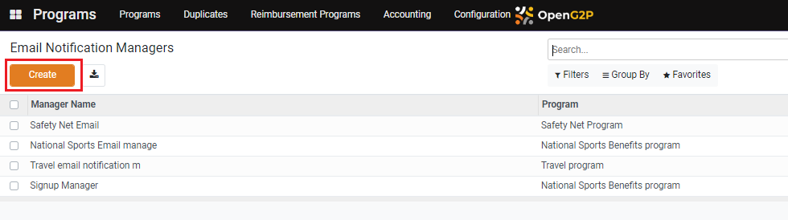
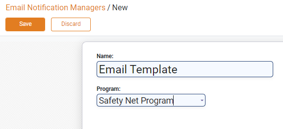
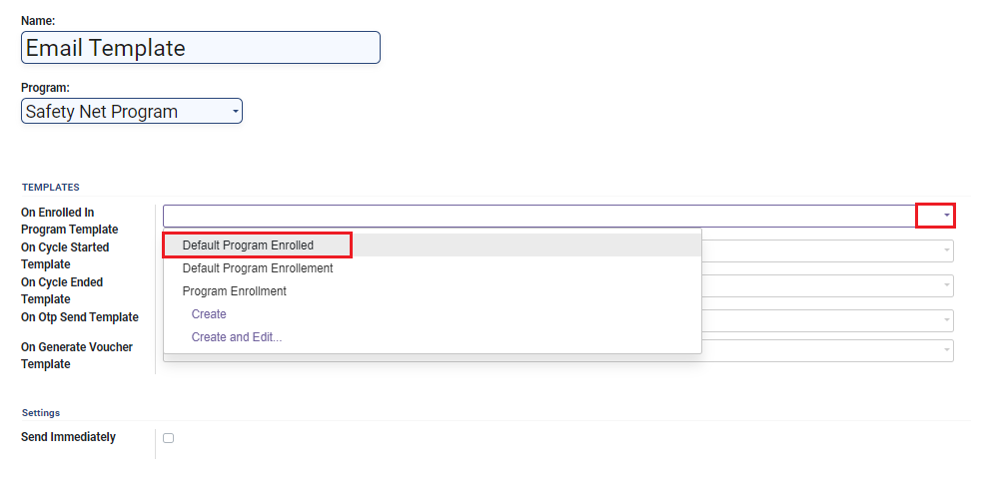
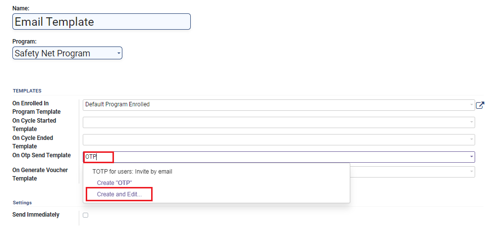
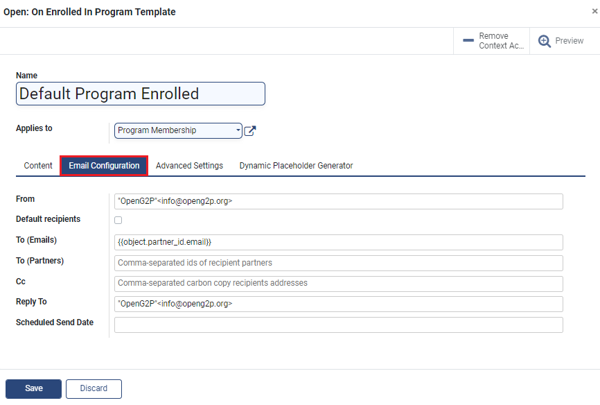
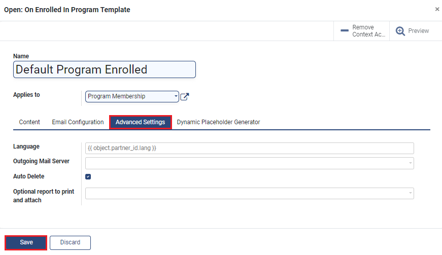

---
layout:
  title:
    visible: true
  description:
    visible: false
  tableOfContents:
    visible: true
  outline:
    visible: true
  pagination:
    visible: true
---

# Create Email Notification Manager

## Description

This guide will provide the steps to create an Email Notification Manager.

## Pre-requisites

The user should have a Program Manager role assigned.

## Steps

1. Navigate to _Programs_ using the menu bar.

<figure><figcaption></figcaption></figure>

2. Click on _Configuration_ and select _Email Notification Manager._

<figure><figcaption></figcaption></figure>

3. Click the _Create_ button to go to the Email Notification Managers view.

<figure><figcaption></figcaption></figure>

4. Enter the _Name_ and _Program_ in the _Email Notification Managers_ view.

<figure><figcaption></figcaption></figure>

5. The view allows the configuration of a template for each of these event types:

* _On Enrolled In Program Template_
* _On Cycle Started Template_
* _On Cycle Ended Template_
* _On Otp Send Template_
* _On Generate Voucher Template_

<figure><figcaption></figcaption></figure>

There are two ways to configure a template for an event:

a. Use an existing template: Go to step#6.

b. Create a new template: Go to step#7.

6. Click on the drop-down button and select the template from the drop-down list. Go to step#11.

<figure><figcaption></figcaption></figure>

7. Enter a name for the new template. When a non-existing template name is entered, the option _Create and Edit_ appears. Click on this option\_.\_

<figure><figcaption></figcaption></figure>

8. A new dialogue box appears. Enter the details.

* _Name_: Name of the template
* _Applies to_: Applicable context; For example, the option _Contact_ sends the mail to the beneficiary email
* _Content_: _Subject_ and matter for the email written using the Odoo platform's [QWeb](https://www.odoo.com/documentation/16.0/developer/reference/frontend/qweb.html) templating engine
* _Attachments_: Attachments to be sent with the email

<figure><figcaption></figcaption></figure>

9. Click on _the Email Configuration_ sub-tab.

* _From_: Author's email id
* _Default Recipients_: Enable the box to send email to default recipients
* _To (Emails)_: Recipient email address
* _To (Partners)_: Comma-separated emails of the program partners
* _Cc_: Comma-separated emails of the recipients to be copied for this email
* _Reply To_: The email that the recipient can reply to
* _Scheduled Send Date_: The date on which the mail will be sent

<figure><figcaption></figcaption></figure>

10. Click on the _Advanced Settings_ sub-tab.

* _Language_: Language for the content
* _Outgoing Mail Server_: Outgoing mail server
* _Auto Delete_: If enabled, the email is deleted automatically
* _Optional report to print and attach:_ Optional field for reports

<figure><figcaption></figcaption></figure>

11. Optionally, enable the checkbox _Send Immediately_ to send the email notification to beneficiaries immediately after the program enrollment, at the start of the cycle, and at the end of the cycle.

<figure><figcaption></figcaption></figure>

12. Click on _Save_.
