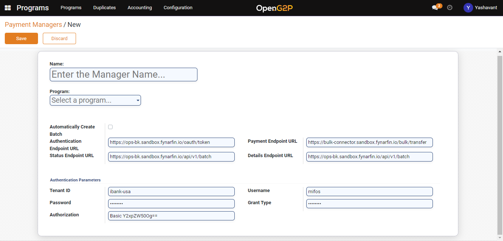
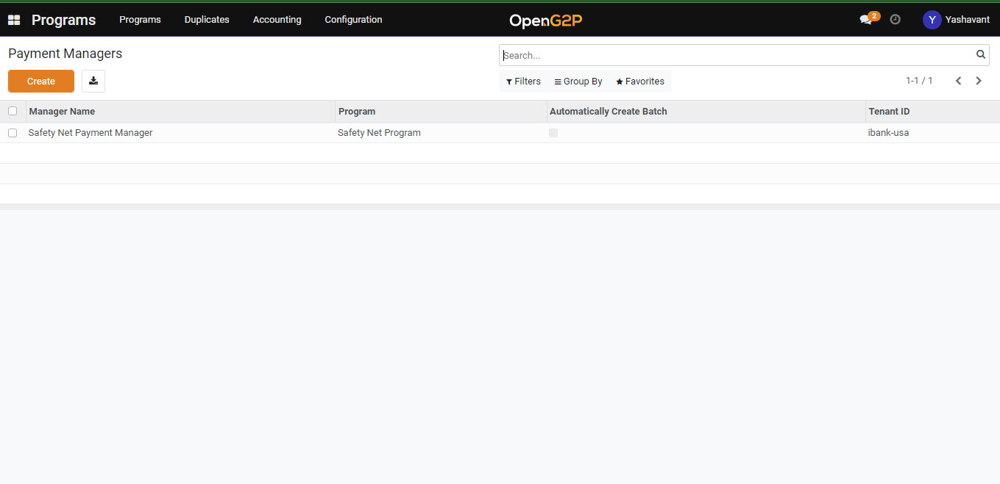

---
layout:
  title:
    visible: true
  description:
    visible: false
  tableOfContents:
    visible: true
  outline:
    visible: true
  pagination:
    visible: true
---

# Create Payment Hub EE Payment Manager

## Description

This guide provides the steps to create Payment Hub EE Payment Manager.

## Pre-requisites

The user should have a Program Manager role.

## Steps

1. Navigate to _Programs_ using the menu bar.

<figure><figcaption></figcaption></figure>

2. Click on Configuration and then on Payment Hub EE Payment Manager.

<figure><figcaption></figcaption></figure>

3. Click on _Create_ button which will navigate to the Payment Hub EE Payment Manager creation page.

<figure><figcaption></figcaption></figure>

4. In the payment manager creation page provide a name for the payment manager, select the program name, select Automatically Create batch if needed, and all the other configurations will auto-populate and can be changed accordingly.

<figure><figcaption></figcaption></figure>

5. Once the payment manager is saved it will be listed under the payment manager list view page which further can be used under the program configuration for which it was created.

<figure><figcaption></figcaption></figure>
