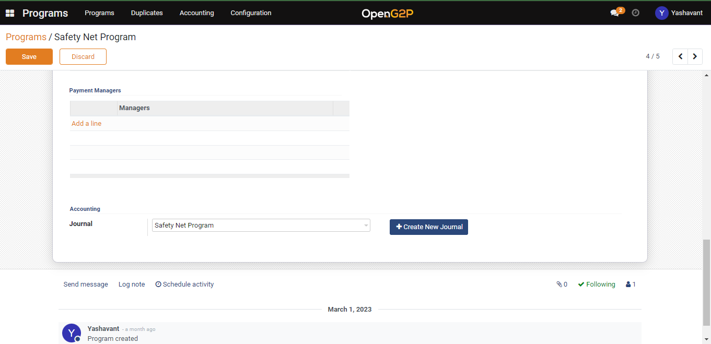
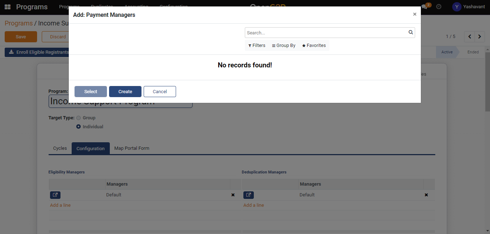
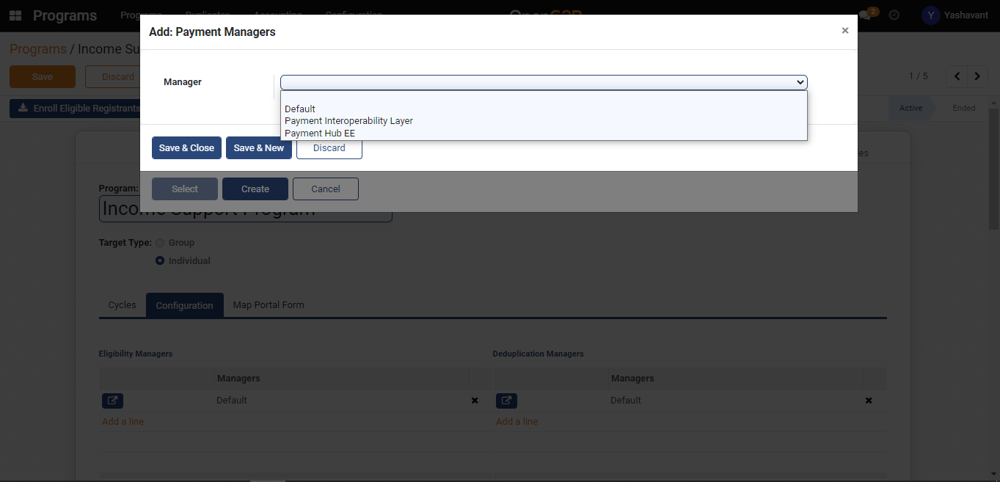
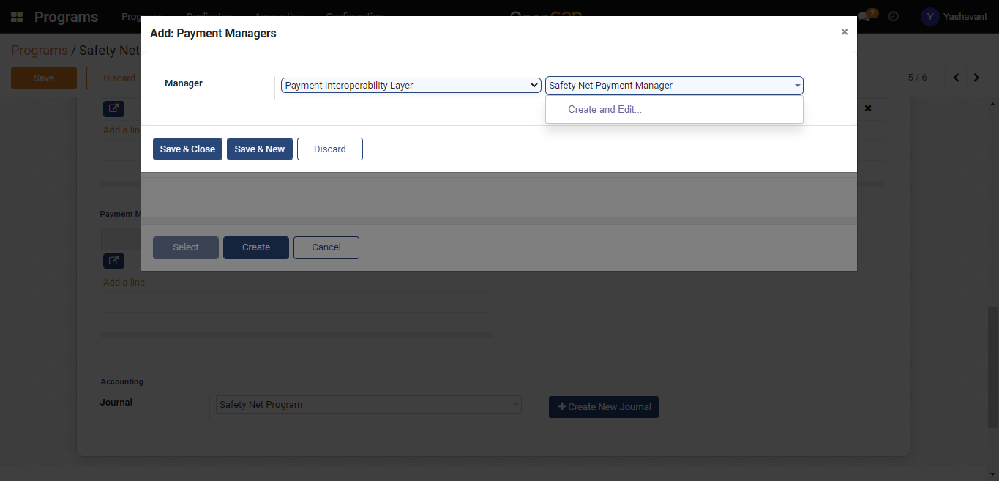
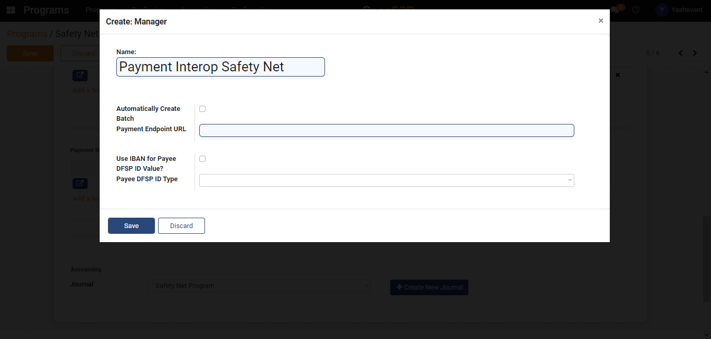
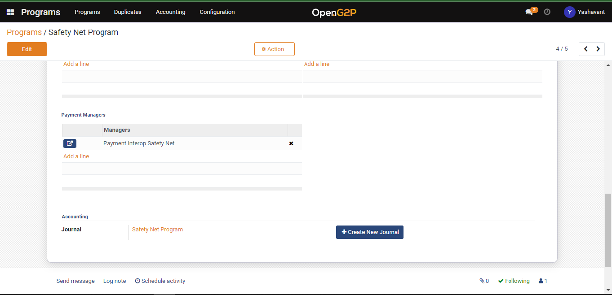

---
layout:
  title:
    visible: true
  description:
    visible: false
  tableOfContents:
    visible: true
  outline:
    visible: true
  pagination:
    visible: true
---

# 📔 Configure Payment Manager in Program

## Description

This guide provides steps to configure the payment manager in a program.

## Prerequisites

The user must have the Program Administrator role.

## Steps

1. Navigate to _Programs_ using the menu bar.

<figure><figcaption></figcaption></figure>

2. Click on the program name for which configuration to be done.

<figure><figcaption></figcaption></figure>

3. Navigate to the _Configuration_ section on the Program detailed view page.

<figure><figcaption></figcaption></figure>

4. Click on _Add a line_ in the _Payment Manager_ section.

<figure><figcaption></figcaption></figure>

5. Click on the _Create_ button on the Add: Payment Managers pop-up window.

<figure><figcaption></figcaption></figure>

6. Select the payment manager type.

<figure><figcaption></figcaption></figure>

7. If a payment manager is already created ([Create Payment Manager](create-manager-type/create-payment-manager-types/)), search and select the same or else once the name is provided to the program manager, _Create and Edit_ buttons will appear. Click on _Create and Edit_ to create a payment manager.

<figure><figcaption></figcaption></figure>

8. Provide the details in the payment manager creation manager.

<figure><figcaption></figcaption></figure>

9. Click on the _Save_ button and then click on the _Save & Close_ button which will save the payment manager to that program under configuration.

<figure><figcaption></figcaption></figure>
