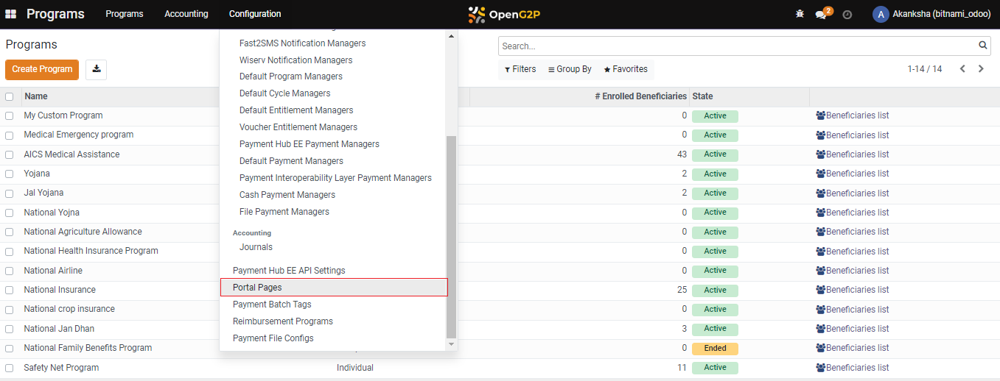
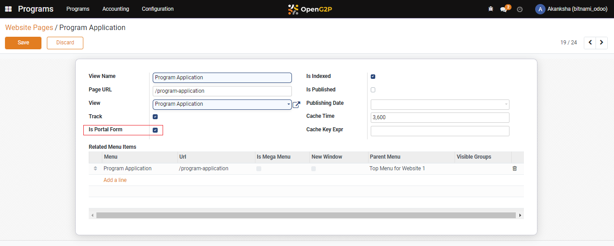
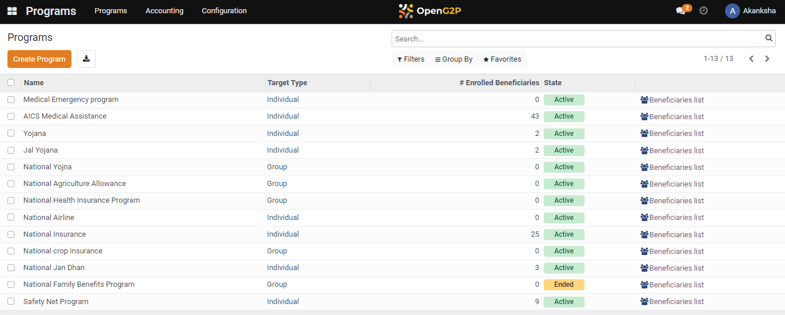
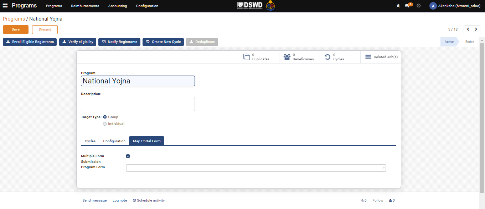
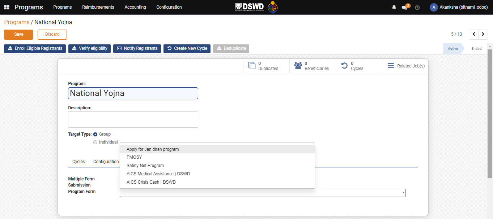

---
layout:
  title:
    visible: true
  description:
    visible: false
  tableOfContents:
    visible: true
  outline:
    visible: true
  pagination:
    visible: true
---

# 📔 Map Self-Service Portal Form

## Description

This guide provides steps to map the portal form for an existing program. This form will be used by the beneficiary on _Self-Service Portal_ to apply for the program.

## Prerequisites

The user must have a _Program Manager_ role and the program has been created using the steps from the [Create Program](create-a-program.md) guide.

## Steps

1. Navigate to _Programs_ from the main menu.

<figure><figcaption></figcaption></figure>

2. Click on _Configuration_.

<figure><figcaption></figcaption></figure>

3. Select _Portal Pages_ from the dropdown.

<figure><figcaption></figcaption></figure>

4. Select the desired form and check the box _Is Portal Form._

<figure><figcaption></figcaption></figure>

5. The previous step will take you to the _Website Pages/Program Application_. Check the box _Is Portal Form_ and click on _Save_.

<figure><figcaption></figcaption></figure>

6. Navigate to _Programs_ from the main menu.

<figure><figcaption></figcaption></figure>

7. Click on the desired program.

<figure><figcaption></figcaption></figure>

8. In the selected program view, select _Map Portal Form_ tab\_.\_

<figure><figcaption></figcaption></figure>

9. Check the box _Multiple Form Submissions_ and select the desired portal form from the _Program Form_ dropdown. Click on _Save_.

<figure><figcaption></figcaption></figure>

10. The portal form is now mapped to the program.

<figure><figcaption></figcaption></figure>
