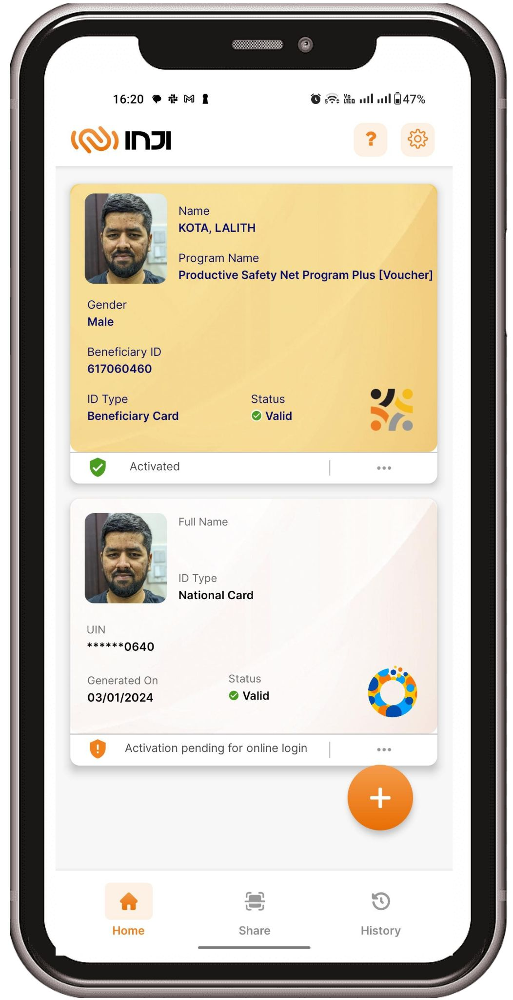

# Verifiable Credentials Issuance

* Digital signed credentials in [VC](https://www.w3.org/TR/vc-data-model/) format
* Application like beneficiary e-card
* Download on mobile wallet like [Inji](https://docs.mosip.io/inji)
* Share e-card to avail services
* Tamper proof

<figure><figcaption></figcaption></figure>

