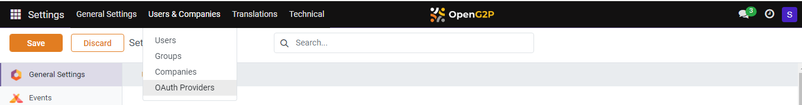
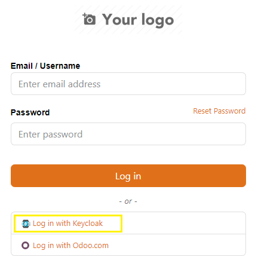

---
layout:
  title:
    visible: true
  description:
    visible: false
  tableOfContents:
    visible: true
  outline:
    visible: true
  pagination:
    visible: true
---

# 📔 Configure Keycloak Authentication Provider for User Log in

This document provides instructions on how to configure Keycloak Authentication Provider in PBMS to help the end-users to utilise the Keycloak option to log into PBMS.

## Prerequisites

* Create a Keycloak client for PBMS/Social Registry as given in [Keycloak Client Creation](../../../../../deployment/deployment-guide/keycloak-client-creation.md) guide.
* Install the OpenID Connect Authentication module.&#x20;

Note:

* OAuth providers can be created from Odoo Settings (debug mode).
* For configuration reference refer the [OpenID Connect Authentication](../../../../development/odoo-modules/openid-connect-authentication.md) documentation.

## Procedure

1. Click the main menu icon  and select _**Settings**_.

<figure><figcaption></figcaption></figure>

The _**Settings**_ screen is displayed.

2. Select the tab _**Users & Companies**_, and click the option _**OAUTH Providers**_.

<figure><figcaption></figcaption></figure>

_**Providers**_ screen is displayed.

<figure><figcaption></figcaption></figure>

3. Click the _**New**_ button.

_**Providers New**_ screen is displayed.

<figure><figcaption></figcaption></figure>

4. Enter the values in the respective fields.

For example, the fields, their descriptions, and sample values are given below.

<table><thead><tr><th width="230">Feature</th><th width="281">Description</th><th>Value</th></tr></thead><tbody><tr><td>Provider name</td><td>Enter the provider name.</td><td>For example: Keycloak for PBMS Login</td></tr><tr><td>Auth Flow</td><td>Select the option <em><strong>OpenID Connect Authorization Code Flow</strong></em> from the drop-down.</td><td></td></tr><tr><td>Token Map</td><td>You can find a default value. In the default value change <code>groups:groups</code> to <code>client_roles:groups</code> .</td><td></td></tr><tr><td>Client ID</td><td>
The ID of the Keycloak client.

To learn more refer to <a href="../../../../../deployment/deployment-guide/keycloak-client-creation.md">Keycloak Client Creation</a>.
</td><td></td></tr><tr><td>Client Authentication Method</td><td>Select the option <em><strong>Client Secret (Post)</strong></em> from the drop-down.</td><td></td></tr><tr><td>Client Secret</td><td>The <em><strong>Client Secret</strong></em> of the Keycloak client. To learn more, refer to <a href="https://docs.openg2p.org/deployment/deployment-guide/keycloak-client-creation">Keycloak Client Creation</a>.</td><td></td></tr><tr><td>Allowed</td><td>Check the box to enable the option <em><strong>Allowed</strong></em>.  </td><td></td></tr><tr><td>Allowed in Self Service Portal</td><td>Uncheck the box. </td><td></td></tr><tr><td>Allowed in Service Provider Portal</td><td>Uncheck the box.</td><td></td></tr><tr><td>Login button label</td><td>Enter the label name for the Keycloak Login button.</td><td>
For example:  <code>Login with Keycloak.</code>

Note: This text with the button name will appear on login page. 
</td></tr><tr><td>Image Icon URL</td><td>Enter the URL of an image for the Keycloak Login button.</td><td></td></tr><tr><td>Authorization URL, Userinfo URL, Token Endpoint, JWKS URL</td><td>
These are to be configured as available in the well-known config of Keycloak. 

Note:

Keycloak OIDC well-known configuration can be found in Keycloak Admin Console -> Realm Settings -> (Bottom of Page) Endpoints -> OIDC Endpoint Configuration)
</td><td></td></tr><tr><td>Verify Access Token Hash</td><td>Check the box to enable the option <em><strong>Verify Access Token</strong></em>.</td><td></td></tr><tr><td>Allow Signup</td><td>Select the option <em><strong>Allows user signup</strong></em> from the drop-down. </td><td></td></tr><tr><td>Signup Default Groups</td><td>Select the option <em><strong>User types/Portal</strong></em> from the drop-down. </td><td></td></tr><tr><td>Sync User Groups</td><td>Select the option <em><strong>On every Login</strong></em> from the drop-down. </td><td></td></tr></tbody></table>

Note:

The rest of the fields have the default values.

5. Click the icon  to save the changes.

If you have configured the _**Keycloak Authentication Provider**_ successfully, you can find the _**Log in Keycloak**_ button in the PBMS log in page.&#x20;

<figure><figcaption></figcaption></figure>

This completes the configuration of _**Keycloak Authentication Provider**_ in PBMS for user log in.
