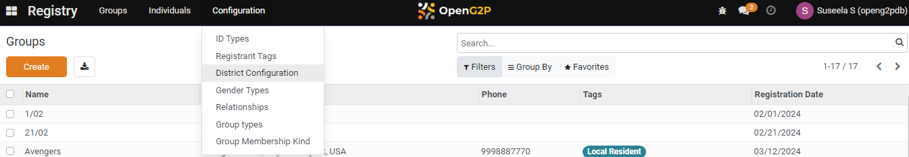
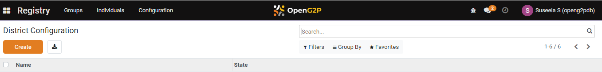
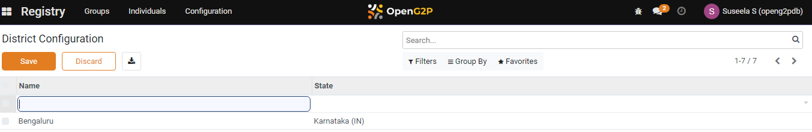
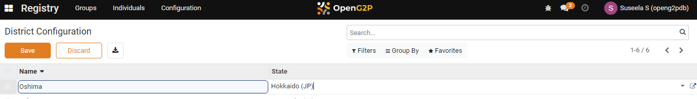

---
layout:
  title:
    visible: true
  description:
    visible: false
  tableOfContents:
    visible: true
  outline:
    visible: true
  pagination:
    visible: true
---

# 📔 Configure District

This document provides instructions to configure district in the _**Beneficiary Registry**_ module.

## Prerequisites

* The user must have Registrar and Administrator role.
* The user must have access to the Beneficiary Registry module in OpenG2P systems.

## Procedure

1. Click the main menu icon  and select _**Registry**_.

<figure><figcaption></figcaption></figure>

_**Registry**_ screen is displayed.

<figure><figcaption></figcaption></figure>

2. Click the _**Configuration**_ in the menu bar and then select _**District Configuration**_.

<figure><figcaption></figcaption></figure>

_**District Configuration**_ screen is displayed.

<figure><figcaption></figcaption></figure>

3. Click the _**Create**_ button. It enables an empty field.

<figure><figcaption></figcaption></figure>

4. Enter the name of the district in the _**Name**_ field.&#x20;
5. Choose the state name from the _**State**_ drop-down.

For example, here, enter the name as Oshima and select the state as Hokkaido in the drop-down.

<figure><figcaption></figcaption></figure>

6. Click the _**Save**_ button to save the district configuration.
7. Click the _**Discard**_ button to exit from the screen.

The newly created district is added to the district configuration list.

<figure><figcaption></figcaption></figure>

8. Repeat the steps 3, 4, 5 and 6 to add the relevant district name.

This completes the configuration of district in Beneficiary Registry module.

## Delete District configuration

Refer to the user guide's [Configure Registrant Tags](configure-registrant-tags.md#delete-registrant-tags) section to delete district configuration.
