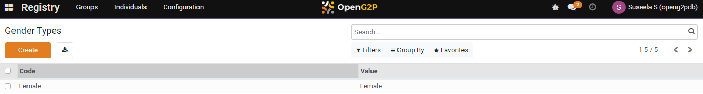
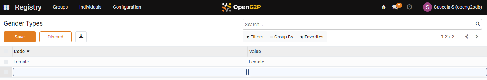
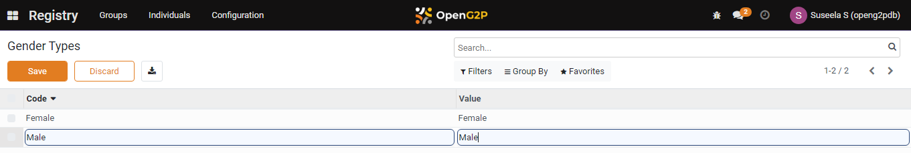
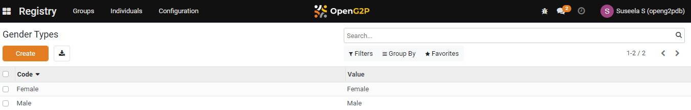

---
layout:
  title:
    visible: true
  description:
    visible: false
  tableOfContents:
    visible: true
  outline:
    visible: true
  pagination:
    visible: true
---

# 📔 Configure Gender Types

This document provides instructions to configure gender types in the _**Beneficiary Registry**_ module.

## Prerequisites

* The user must have Registrar and Administrator role.
* The user must have access to the Beneficiary Registry module in OpenG2P systems.

## Procedure

1. Click the main menu icon  and select _**Registry**_.

<figure><figcaption></figcaption></figure>

_**Registry**_ screen is displayed.

<figure><figcaption></figcaption></figure>

2. Click the _**Configuration**_ in the menu bar and then select _**Gender Types**_.

<figure><figcaption></figcaption></figure>

_**Gender Types**_ screen is displayed.

<figure><figcaption></figcaption></figure>

3. Click the _**Create**_ button. It enables an empty field.\<image>

<figure><figcaption></figcaption></figure>

For example, here, enter the Male in the _**Code**_ field and Male in the _**Value**_ field.

<figure><figcaption></figcaption></figure>

4. Click the _**Save**_ button to save the gender types.
5. Click the _**Discard**_ button to exit from the screen.

The newly created gender types is added to the gender types list.

<figure><figcaption></figcaption></figure>

8. Repeat the steps 3 and 4 to add the relevant gender types.

This completes the configuration of gender types in Beneficiary Registry module.

## Delete Gender Types

Refer to the user guide's [Configure Registrant Tags](configure-registrant-tags.md#delete-registrant-tags) section to delete gender types.
